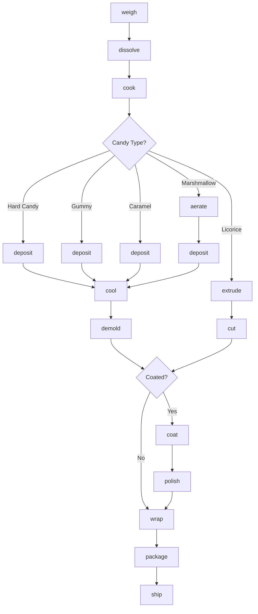
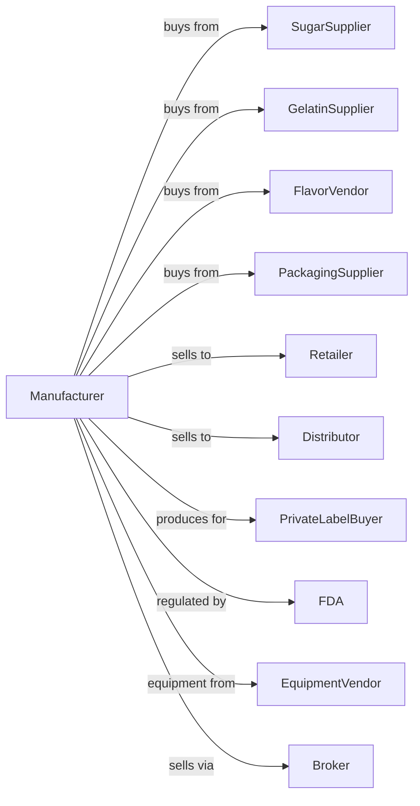

# Nonchocolate Confectionery Manufacturing

> Business-as-Code definition for nonchocolate candy manufacturing operations. Models production of hard candies, gummies, caramels, licorice, mints, and other sugar confections from cooking through packaging.

## Overview

This industry comprises establishments primarily engaged in manufacturing nonchocolate confectioneries including hard candies, gummies, chewy candies, caramels, taffy, marshmallows, licorice, mints, and breath fresheners. This definition exposes actions for sugar cooking, molding, cooling, coating, and packaging.

## Actors

| Actor | Description |
|-------|-------------|
| SugarSupplier | Provides granulated sugar and corn syrup |
| GelatinSupplier | Supplies gelatin and pectin for gummies |
| FlavorVendor | Provides flavors, colors, and acids |
| PackagingSupplier | Supplies wrappers, bags, and display boxes |
| Retailer | Purchases candy for consumer sale |
| Distributor | Warehouses and delivers to retail channels |
| PrivateLabelBuyer | Contracts for store-brand candy production |
| FDA | Regulates food safety and labeling |
| EquipmentVendor | Supplies cooking and molding equipment |
| Broker | Facilitates sales to retailers and distributors |

## Roles

| Role | Description |
|------|-------------|
| PlantManager | Oversees candy production operations |
| CandyMaker | Controls cooking and batch processing |
| QualityManager | Ensures product safety and consistency |
| FlavorTechnologist | Develops flavors and recipes |
| CookingOperator | Operates batch cookers and continuous cookers |
| MoldingOperator | Runs depositors and forming equipment |
| CoatingOperator | Applies coatings and polishes |
| PackagingOperator | Runs wrapping and bagging lines |

## Entities

| Entity | Description |
|--------|-------------|
| Batch | Sugar mixture cooked to specific temperature |
| HardCandy | Clear sugar candy cooked to hard crack stage |
| Gummy | Gelatin or pectin-based chewy candy |
| Caramel | Cooked sugar, dairy, and fat mixture |
| Marshmallow | Aerated sugar and gelatin confection |
| Licorice | Extruded candy with licorice flavor |
| Mint | Peppermint or spearmint flavored candy |
| Mold | Cavity form for shaping candies |
| Coating | Sugar shell, sour coating, or polish |
| Recipe | Formula specifying ingredients and process |

## Actions

| Action | Description |
|--------|-------------|
| weigh | Measure ingredients per recipe |
| dissolve | Combine sugar and corn syrup with water |
| cook | Heat mixture to target temperature |
| aerate | Whip air into mixture for marshmallows |
| deposit | Pour or inject mixture into molds |
| extrude | Force mixture through die for licorice |
| cool | Set candy to solid state |
| demold | Remove candies from molds |
| coat | Apply sugar, sour, or wax coating |
| polish | Tumble in pan for glossy finish |
| cut | Portion continuous candy into pieces |
| wrap | Apply individual wrappers |
| package | Fill bags, boxes, or display containers |
| ship | Dispatch orders to customers |

## Events

| Event | Description |
|-------|-------------|
| batchWeighed | Ingredients measured and ready |
| batchCooked | Candy cooked to target temperature |
| batchAerated | Mixture whipped to target density |
| batchDeposited | Candy deposited into molds |
| batchExtruded | Candy extruded and cut |
| batchCooled | Candy solidified |
| batchDemolded | Candy removed from molds |
| batchCoated | Coating applied |
| batchPolished | Candy polished and finished |
| batchPackaged | Candy packaged for shipment |
| qualityApproved | Batch passed testing |
| orderShipped | Product dispatched to customer |

## Searches

| Search | Description |
|--------|-------------|
| findBatches | List batches by product, date, or status |
| getRecipes | Retrieve candy recipes by type |
| checkInventory | Get ingredient and finished goods stock |
| getOrders | Retrieve orders by customer or ship date |
| getMoldSchedule | View mold cleaning and changeover schedule |
| getQualityReports | Retrieve test results by batch |
| findCustomers | List customers by product preference |
| getProductionSchedule | View planned production runs |

## Workflow



## Actor Relationships



## Usage

### Calling Actions

```typescript
import { manufactureNonchocolateConfectionery } from '@headlessly/manufacture-nonchocolate-confectionery'

const plant = manufactureNonchocolateConfectionery()

// Make gummy bears
const batch = await plant.weigh({
  recipe: 'gummy-bear',
  batchSize: 500,
  unit: 'pounds',
  ingredients: [
    { id: 'sugar', quantity: 200 },
    { id: 'corn-syrup', quantity: 150 },
    { id: 'gelatin', quantity: 50 },
    { id: 'citric-acid', quantity: 5 }
  ]
})

await plant.dissolve({ batchId: batch.id })
await plant.cook({
  batchId: batch.id,
  targetTemperature: 240,
  holdTime: 5
})

await plant.deposit({
  batchId: batch.id,
  moldType: 'gummy-bear',
  depositorSpeed: 40
})
```

### Event-Driven Automation

```typescript
// Auto-coat sour gummies
plant.batchDemolded(async ({ batchId, product }) => {
  if (product.includes('sour')) {
    await plant.coat({
      batchId,
      coatingType: 'citric-acid',
      applicationRate: 8
    })
  }
})

// Auto-package when quality approved
plant.qualityApproved(async ({ batchId, product }) => {
  const orders = await plant.getOrders({
    product,
    status: 'pending'
  })

  if (orders.length > 0) {
    await plant.package({
      batchId,
      orderId: orders[0].id,
      packageFormat: orders[0].packageFormat
    })
  }
})
```
