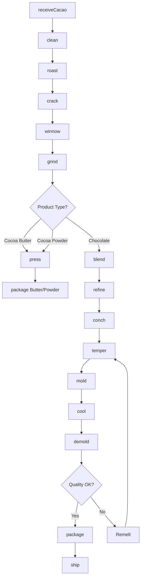
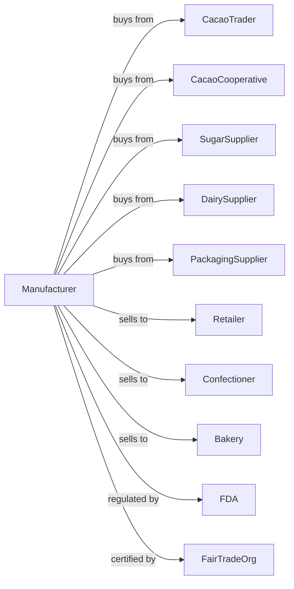

# Chocolate and Confectionery Manufacturing from Cacao Beans

> Business-as-Code definition for bean-to-bar chocolate manufacturing operations. Models cacao processing from roasting through grinding, conching, tempering, and molding into chocolate products.

## Overview

This U.S. industry comprises establishments primarily engaged in shelling, roasting, and grinding cacao beans and making chocolate cacao products and chocolate confectioneries. This definition exposes actions for cacao selection, roasting, winnowing, grinding, conching, tempering, and molding into bars, chips, and confections.

## Actors

| Actor | Description |
|-------|-------------|
| CacaoTrader | Supplies cacao beans from origin countries |
| CacaoCooperative | Provides direct-trade certified cacao |
| SugarSupplier | Supplies sugar and sweeteners |
| DairySupplier | Provides milk powder and butter |
| PackagingSupplier | Supplies foil, wrappers, and boxes |
| Retailer | Purchases chocolate for consumer sale |
| Confectioner | Uses chocolate couverture for making candies |
| Bakery | Purchases chocolate chips and coatings |
| FDA | Regulates food safety and chocolate standards |
| FairTradeOrg | Certifies ethical sourcing practices |

## Roles

| Role | Description |
|------|-------------|
| PlantManager | Oversees chocolate production operations |
| MasterChocolatier | Controls roasting, conching, and flavor development |
| QualityManager | Ensures chocolate meets standards |
| RoastingOperator | Controls bean roasting process |
| GrindingOperator | Operates refining and conching equipment |
| TemperingOperator | Controls tempering and molding lines |
| PackagingOperator | Runs wrapping and boxing lines |
| SourcingManager | Procures cacao beans from origins |

## Entities

| Entity | Description |
|--------|-------------|
| CacaoBean | Fermented and dried cacao seeds |
| Nib | Shelled and broken cacao bean pieces |
| CacaoLiquor | Ground nibs in liquid form |
| CocoaButter | Fat extracted from cacao liquor |
| CocoaPowder | Defatted cacao solite |
| DarkChocolate | Chocolate with cacao, sugar, and cocoa butter |
| MilkChocolate | Chocolate with added milk solids |
| Couverture | High-quality chocolate for coating |
| Bar | Molded chocolate in consumer package |
| Batch | Traceable production lot |

## Actions

| Action | Description |
|--------|-------------|
| receiveCacao | Accept and sample incoming cacao beans |
| clean | Remove debris and defective beans |
| roast | Apply heat to develop flavor compounds |
| crack | Break roasted beans into pieces |
| winnow | Separate nibs from shells |
| grind | Mill nibs into cacao liquor |
| press | Extract cocoa butter from liquor |
| blend | Combine liquor, butter, sugar, and milk |
| refine | Reduce particle size through roller mills |
| conch | Agitate and aerate for flavor development |
| temper | Control crystallization for snap and shine |
| mold | Pour tempered chocolate into molds |
| cool | Set chocolate in cooling tunnel |
| demold | Remove chocolate from molds |
| package | Wrap bars and package products |

## Events

| Event | Description |
|-------|-------------|
| cacaoReceived | Cacao beans sampled and accepted |
| cacaoRoasted | Beans roasted to target profile |
| nibsWinnowed | Nibs separated from shells |
| liquorGround | Nibs processed into liquor |
| butterPressed | Cocoa butter extracted |
| batchBlended | Chocolate recipe combined |
| batchRefined | Particle size reduced |
| batchConched | Flavor developed through conching |
| chocolateTempered | Crystal structure achieved |
| chocolateMolded | Chocolate poured into molds |
| chocolateDemolded | Bars removed from molds |
| chocolatePackaged | Products wrapped and boxed |
| qualityApproved | Chocolate met specifications |
| orderShipped | Product dispatched to customer |

## Searches

| Search | Description |
|--------|-------------|
| findCacaoLots | List cacao inventory by origin and variety |
| getLiquorInventory | Check cacao liquor and butter stock |
| getChocolateInventory | Check finished chocolate stock |
| getOrders | Retrieve orders by customer or product |
| getRoastProfiles | Retrieve roasting profiles by origin |
| getQualityReports | Retrieve flavor and texture test results |
| getConchingSchedule | View conching batch timing |
| findSuppliers | List cacao suppliers by certification |

## Workflow



## Actor Relationships



## Usage

### Calling Actions

```typescript
import { manufactureChocolateConfectionery } from '@headlessly/manufacture-chocolate-confectionery'

const plant = manufactureChocolateConfectionery()

// Receive single-origin cacao
const cacao = await plant.receiveCacao({
  origin: 'ecuador-arriba',
  quantity: 5000,
  unit: 'kilograms',
  fermentationDays: 6,
  moistureContent: 7.5
})

// Process through roasting
await plant.clean({ lotId: cacao.lotId })
await plant.roast({
  lotId: cacao.lotId,
  profile: 'medium',
  temperature: 130,
  duration: 25
})

await plant.crack({ lotId: cacao.lotId })
await plant.winnow({ lotId: cacao.lotId })

// Grind to liquor
const liquor = await plant.grind({
  lotId: cacao.lotId,
  targetParticleSize: 20
})
```

### Event-Driven Automation

```typescript
// Auto-blend after grinding
plant.liquorGround(async ({ lotId, origin, flavor }) => {
  const recipe = await plant.getRecipes({
    type: 'dark-70',
    origin
  })

  await plant.blend({
    lotId,
    recipe: recipe.id,
    components: [
      { ingredient: 'cacao-liquor', percentage: 70 },
      { ingredient: 'cocoa-butter', percentage: 10 },
      { ingredient: 'sugar', percentage: 20 }
    ]
  })
})

// Auto-mold when tempered correctly
plant.chocolateTempered(async ({ batchId, temperCurve }) => {
  if (temperCurve.withinSpec) {
    await plant.mold({
      batchId,
      moldType: '100g-bar',
      vibrationIntensity: 'medium'
    })
  }
})
```
