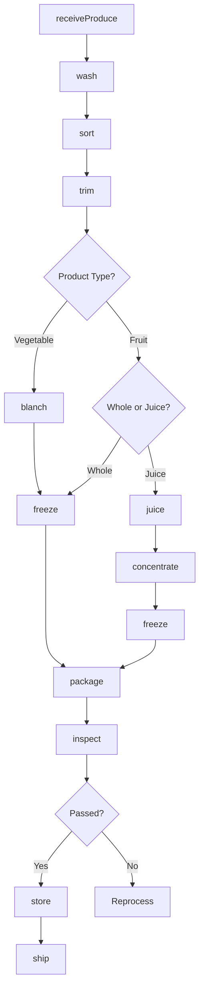
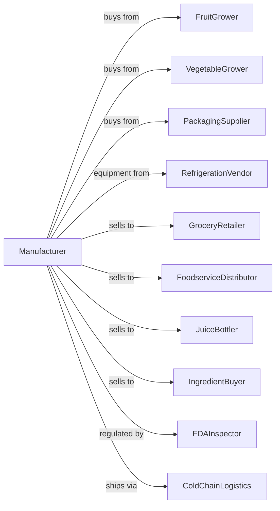

# Frozen Fruit, Juice, and Vegetable Manufacturing

> Business-as-Code definition for frozen fruit, juice, and vegetable production. Models receiving fresh produce, washing, sorting, blanching, IQF freezing, and packaging for retail and foodservice channels.

## Overview

This U.S. industry comprises establishments primarily engaged in manufacturing frozen fruits; frozen vegetables; and frozen fruit juices, ades, drinks, cocktail mixes and concentrates. Cross-References.

## Actors

| Actor | Description |
|-------|-------------|
| FruitGrower | Supplies fresh fruits for freezing |
| VegetableGrower | Provides fresh vegetables for processing |
| PackagingSupplier | Provides bags, cartons, and film |
| RefrigerationVendor | Supplies freezing equipment and cold storage |
| GroceryRetailer | Purchases frozen products for consumer sale |
| FoodserviceDistributor | Buys frozen items for restaurants and institutions |
| JuiceBottler | Purchases frozen concentrates for reconstitution |
| IngredientBuyer | Uses frozen fruit and vegetables in processed foods |
| FDAInspector | Ensures compliance with food safety regulations |
| ColdChainLogistics | Provides frozen transportation and storage |

## Roles

| Role | Description |
|------|-------------|
| PlantManager | Oversees all freezing operations |
| QualityManager | Ensures product safety and specifications |
| ProductionSupervisor | Coordinates processing line activities |
| ReceivingClerk | Inspects and accepts incoming produce |
| LineOperator | Runs washing, blanching, and freezing equipment |
| PackagingOperator | Operates bagging and cartoning machinery |
| ColdStorageManager | Manages frozen inventory and warehouse |
| LabTechnician | Tests product quality and safety |

## Entities

| Entity | Description |
|--------|-------------|
| RawProduce | Fresh fruits or vegetables received |
| Batch | Traceable lot through processing |
| IQFProduct | Individually quick frozen pieces |
| BlockFrozen | Solid frozen product blocks |
| Concentrate | Frozen juice concentrate |
| Blend | Mixed fruit or vegetable product |
| Package | Final consumer or bulk package |
| Specification | Quality and size requirements |
| COA | Certificate of analysis for shipment |
| Inventory | Frozen stock in cold storage |

## Actions

| Action | Description |
|--------|-------------|
| receiveProduce | Accept and inspect fresh incoming produce |
| wash | Clean produce to remove dirt and contaminants |
| sort | Grade by size, ripeness, and quality |
| trim | Remove stems, pits, peels, and defects |
| blanch | Heat-treat vegetables to preserve quality |
| freeze | Apply IQF or blast freezing |
| juice | Extract juice from fruit |
| concentrate | Remove water from juice |
| blend | Mix varieties or products |
| package | Fill bags, cartons, or bulk containers |
| store | Place in cold storage at required temperature |
| inspect | Test for quality and food safety |
| ship | Dispatch via refrigerated transport |
| trace | Track lot through supply chain |

## Events

| Event | Description |
|-------|-------------|
| produceReceived | Fresh produce accepted and logged |
| produceWashed | Cleaning completed |
| produceSorted | Grading completed |
| produceBlanched | Heat treatment applied |
| productFrozen | Freezing cycle completed |
| juiceExtracted | Juice removed from fruit |
| juiceConcentrated | Water removal completed |
| productBlended | Mixing completed |
| productPackaged | Final packaging completed |
| qualityApproved | Product passed all tests |
| qualityFailed | Product did not meet specifications |
| orderShipped | Frozen product dispatched |

## Searches

| Search | Description |
|--------|-------------|
| findProduce | List incoming produce by supplier and variety |
| getInventory | Check frozen stock by product and location |
| getBatches | Retrieve batch records by date or lot |
| getOrders | List orders by customer and status |
| getQualityReports | Retrieve test results and COAs |
| getYieldData | Analyze yield by variety and process |
| getCapacity | Check freezing and storage capacity |
| traceProduct | Track product through supply chain |

## Workflow



## Actor Relationships



## Usage

### Calling Actions

```typescript
import { preserveFrozenFruit } from '@headlessly/preserve-frozen-fruit'

const plant = preserveFrozenFruit()

// Receive fresh strawberries
const batch = await plant.receiveProduce({
  supplier: 'berry-farms-ca',
  product: 'strawberries',
  variety: 'albion',
  quantity: 20000,
  unit: 'lbs',
  temperature: 38
})

// Process through IQF line
await plant.wash({ batchId: batch.id })
await plant.sort({ batchId: batch.id, gradeSpec: 'premium' })
await plant.trim({ batchId: batch.id, method: 'hull' })

await plant.freeze({
  batchId: batch.id,
  method: 'IQF',
  targetTemp: -10,
  unit: 'fahrenheit'
})

await plant.package({
  batchId: batch.id,
  format: 'retail-bag',
  size: 16,
  unit: 'oz'
})
```

### Event-Driven Automation

```typescript
// Auto-blanch vegetables after sorting
plant.produceSorted(async ({ batchId, productType }) => {
  if (productType === 'vegetable') {
    await plant.blanch({
      batchId,
      temperature: 200,
      duration: 90,
      unit: 'seconds'
    })
  }
})

// Alert on quality issues
plant.qualityFailed(async ({ batchId, issue, severity }) => {
  if (severity === 'critical') {
    await plant.quarantine({ batchId })
    await notifyQualityTeam({ batchId, issue })
  }
})

// Auto-ship when order ready
plant.productPackaged(async ({ batchId, orderId }) => {
  const qa = await plant.inspect({ batchId })

  if (qa.passed) {
    await plant.ship({
      batchId,
      orderId,
      carrier: 'frozen-logistics-inc'
    })
  }
})
```
