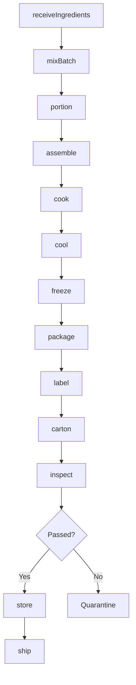
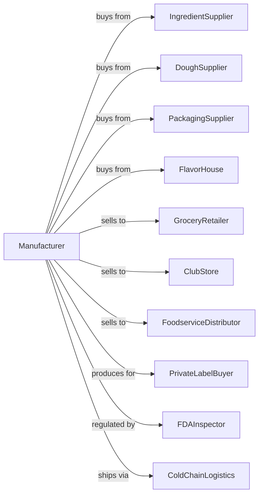

# Frozen Specialty Food Manufacturing

> Business-as-Code definition for frozen specialty food production. Models manufacturing of frozen dinners, entrees, pizza, waffles, and prepared meals through ingredient assembly, cooking, freezing, and packaging operations.

## Overview

This U.S. industry comprises establishments primarily engaged in manufacturing frozen specialty foods (except seafood), such as frozen dinners, entrees, and side dishes; frozen pizza; frozen whipped topping; and frozen waffles, pancakes, and French toast. Cross-References. Establishments primarily engaged in--

## Actors

| Actor | Description |
|-------|-------------|
| IngredientSupplier | Provides meats, vegetables, sauces, and components |
| DoughSupplier | Supplies pizza dough, waffle batter, and pastry |
| PackagingSupplier | Provides trays, films, cartons, and boxes |
| FlavorHouse | Develops and supplies seasonings and sauces |
| GroceryRetailer | Purchases frozen meals for consumer sale |
| ClubStore | Buys bulk frozen food packages |
| FoodserviceDistributor | Supplies restaurants and institutions |
| PrivateLabelBuyer | Contracts manufacturing under store brands |
| FDAInspector | Ensures food safety compliance |
| ColdChainLogistics | Provides frozen storage and transportation |

## Roles

| Role | Description |
|------|-------------|
| PlantManager | Oversees frozen meal production facility |
| ProductDeveloper | Creates new recipes and products |
| QualityManager | Ensures food safety and consistency |
| ProductionSupervisor | Manages assembly and cooking lines |
| BatchMixer | Prepares sauces, fillings, and batters |
| AssemblyOperator | Builds meals on production line |
| OvenOperator | Controls cooking and baking equipment |
| PackagingOperator | Runs filling and sealing machinery |

## Entities

| Entity | Description |
|--------|-------------|
| Recipe | Formula for meal or component |
| Ingredient | Raw material for meal assembly |
| Batch | Traceable production lot |
| Entree | Main dish component |
| SideDish | Accompanying vegetable or starch |
| Sauce | Prepared liquid component |
| Tray | Microwaveable meal container |
| Carton | Retail or bulk outer packaging |
| Specification | Product requirements and standards |
| NutritionLabel | Nutritional information panel |

## Actions

| Action | Description |
|--------|-------------|
| receiveIngredients | Accept and inspect incoming materials |
| mixBatch | Prepare sauces, batters, and fillings |
| portion | Measure ingredients for assembly |
| assemble | Build meals in trays or on lines |
| cook | Bake, fry, or heat products |
| cool | Reduce temperature before freezing |
| freeze | Apply blast or spiral freezing |
| package | Seal trays and apply overwrap |
| carton | Place packages in retail or bulk cartons |
| label | Apply nutrition and product labels |
| inspect | Test for quality and safety |
| store | Place in frozen warehouse |
| ship | Dispatch to customers |
| develop | Create new products and recipes |

## Events

| Event | Description |
|-------|-------------|
| ingredientsReceived | Materials accepted and inventoried |
| batchMixed | Sauce or filling prepared |
| mealAssembled | Components placed in tray |
| productCooked | Cooking cycle completed |
| productCooled | Temperature reduced |
| productFrozen | Freezing completed |
| productPackaged | Tray sealed and overwrapped |
| productCartoned | Placed in shipping carton |
| qualityApproved | Product passed inspection |
| qualityFailed | Product did not meet standards |
| orderShipped | Frozen meals dispatched |
| productLaunched | New product released to market |

## Searches

| Search | Description |
|--------|-------------|
| findIngredients | List ingredient inventory by type |
| getRecipes | Retrieve product formulas |
| getBatches | List batches by product and date |
| getInventory | Check frozen stock levels |
| getOrders | Retrieve orders by customer |
| getProductionSchedule | View line assignments |
| getQualityReports | Retrieve test results |
| getNutritionData | Get nutritional information |

## Workflow



## Actor Relationships



## Usage

### Calling Actions

```typescript
import { preserveFrozenSpecialty } from '@headlessly/preserve-frozen-specialty'

const plant = preserveFrozenSpecialty()

// Prepare frozen pizza production
const sauce = await plant.mixBatch({
  recipe: 'marinara-001',
  quantity: 500,
  unit: 'gallons'
})

// Assemble pizzas
const batch = await plant.assemble({
  product: 'pepperoni-pizza-12inch',
  components: [
    { ingredient: 'dough-12', quantity: 1 },
    { ingredient: sauce.batchId, quantity: 4, unit: 'oz' },
    { ingredient: 'mozzarella-shred', quantity: 8, unit: 'oz' },
    { ingredient: 'pepperoni-sliced', quantity: 2, unit: 'oz' }
  ],
  quantity: 5000
})

// Cook and freeze
await plant.cook({
  batchId: batch.id,
  method: 'conveyor-oven',
  temperature: 425,
  duration: 8,
  unit: 'minutes'
})

await plant.freeze({
  batchId: batch.id,
  method: 'spiral-freezer',
  targetTemp: -10
})
```

### Event-Driven Automation

```typescript
// Auto-package after freezing
plant.productFrozen(async ({ batchId, product }) => {
  const spec = await plant.getRecipes({ product })

  await plant.package({
    batchId,
    trayType: spec.packaging.tray,
    filmType: spec.packaging.film
  })
})

// Quality check before shipping
plant.productCartoned(async ({ batchId }) => {
  const result = await plant.inspect({
    batchId,
    tests: ['weight', 'temperature', 'appearance', 'metal-detection']
  })

  if (result.passed) {
    await plant.store({ batchId, location: 'outbound-staging' })
  }
})

// Alert on ingredient shortage
plant.ingredientsReceived(async ({ ingredient, quantity }) => {
  const schedule = await plant.getProductionSchedule({ days: 7 })
  const required = calculateRequirement(schedule, ingredient)

  if (quantity < required) {
    await alertProcurement({ ingredient, shortfall: required - quantity })
  }
})
```
