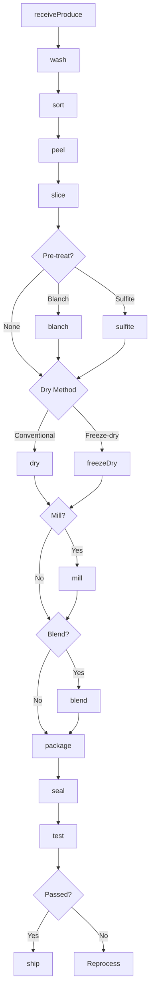
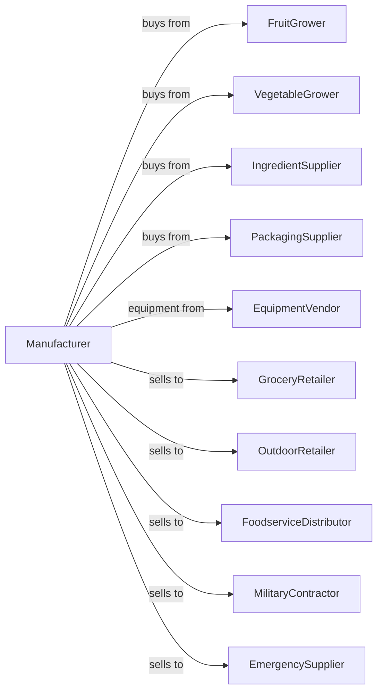

# Dried and Dehydrated Food Manufacturing

> Business-as-Code definition for dried and dehydrated food production. Models drying, freeze-drying, and dehydrating fruits, vegetables, soup mixes, and meal kits through washing, slicing, drying, and packaging operations.

## Overview

This U.S. industry comprises establishments primarily engaged in (1) drying (including freeze-dried) and/or dehydrating fruits, vegetables, and soup mixes and bouillon and/or (2) drying and/or dehydrating ingredients and packaging them with other purchased ingredients, such as rice and dry pasta. Cross-References. Establishments primarily engaged in--

## Actors

| Actor | Description |
|-------|-------------|
| FruitGrower | Supplies fresh fruits for drying |
| VegetableGrower | Provides fresh vegetables for dehydration |
| IngredientSupplier | Supplies seasonings, pasta, and rice |
| PackagingSupplier | Provides pouches, bags, and cartons |
| EquipmentVendor | Supplies drying and freeze-drying equipment |
| GroceryRetailer | Purchases dried foods for consumer sale |
| OutdoorRetailer | Sells backpacking and camping food |
| FoodserviceDistributor | Buys dried ingredients for restaurants |
| MilitaryContractor | Purchases MRE and field ration components |
| EmergencySupplier | Buys long-term storage foods |

## Roles

| Role | Description |
|------|-------------|
| PlantManager | Oversees dehydration facility |
| ProcessEngineer | Optimizes drying parameters |
| QualityManager | Ensures product safety and shelf life |
| ProductionSupervisor | Manages drying line operations |
| PrepOperator | Runs washing, slicing, and blanching |
| DryerOperator | Controls tunnel and drum dryers |
| FreezeDryerOperator | Operates freeze-drying chambers |
| PackagingOperator | Runs filling and sealing equipment |

## Entities

| Entity | Description |
|--------|-------------|
| RawProduce | Fresh fruits or vegetables |
| DriedProduct | Dehydrated fruit or vegetable |
| FreezeDried | Sublimation-dried product |
| SoupMix | Dry soup and bouillon blend |
| MealKit | Packaged dry meal with instructions |
| Batch | Traceable production lot |
| MoistureSpec | Target moisture content |
| ShelfLife | Expected product longevity |
| Pouch | Flexible packaging for products |
| Case | Shipping container |

## Actions

| Action | Description |
|--------|-------------|
| receiveProduce | Accept and inspect fresh materials |
| wash | Clean produce thoroughly |
| sort | Grade by quality and ripeness |
| peel | Remove skins as needed |
| slice | Cut to uniform pieces |
| blanch | Pre-treat to preserve quality |
| sulfite | Apply preservative treatment |
| dry | Remove moisture using heat or air |
| freezeDry | Sublimate moisture under vacuum |
| mill | Grind to powder or flakes |
| blend | Mix dried ingredients |
| package | Fill pouches or bags |
| seal | Apply moisture barrier closure |
| test | Analyze moisture and quality |
| ship | Dispatch to customers |

## Events

| Event | Description |
|-------|-------------|
| produceReceived | Fresh materials accepted |
| produceWashed | Cleaning completed |
| produceSliced | Cutting completed |
| produceBlanched | Pre-treatment applied |
| productDried | Moisture removed |
| productFreezeDried | Sublimation completed |
| productMilled | Grinding completed |
| productBlended | Mixing completed |
| productPackaged | Filling completed |
| productSealed | Packaging closed |
| qualityApproved | Product passed testing |
| qualityFailed | Product did not meet standards |
| orderShipped | Products dispatched |

## Searches

| Search | Description |
|--------|-------------|
| findProduce | List incoming produce inventory |
| getInventory | Check dried product stock |
| getBatches | Retrieve batch records |
| getRecipes | List blend formulas |
| getMoistureReports | Get moisture test results |
| getOrders | Retrieve orders by customer |
| getProductionSchedule | View drying line schedule |
| getShelfLifeData | Access stability test results |

## Workflow



## Actor Relationships



## Usage

### Calling Actions

```typescript
import { preserveDriedDehydrated } from '@headlessly/preserve-dried-dehydrated'

const plant = preserveDriedDehydrated()

// Process apples for dried apple slices
const batch = await plant.receiveProduce({
  supplier: 'orchard-valley',
  product: 'gala-apples',
  quantity: 10000,
  unit: 'lbs'
})

await plant.wash({ batchId: batch.id })
await plant.sort({ batchId: batch.id, gradeSpec: 'premium' })
await plant.peel({ batchId: batch.id, method: 'mechanical' })
await plant.slice({ batchId: batch.id, thickness: 4, unit: 'mm' })

await plant.sulfite({
  batchId: batch.id,
  concentration: 2000,
  unit: 'ppm'
})

await plant.dry({
  batchId: batch.id,
  method: 'tunnel-dryer',
  temperature: 135,
  duration: 8,
  unit: 'hours',
  targetMoisture: 10
})

await plant.package({
  batchId: batch.id,
  format: 'stand-up-pouch',
  size: 8,
  unit: 'oz'
})
```

### Event-Driven Automation

```typescript
// Auto-seal with oxygen absorber for long shelf life
plant.productPackaged(async ({ batchId, productType }) => {
  const shelfLife = getTargetShelfLife(productType)

  await plant.seal({
    batchId,
    method: shelfLife > 12 ? 'nitrogen-flush' : 'standard',
    oxygenAbsorber: shelfLife > 24
  })
})

// Test moisture after drying
plant.productDried(async ({ batchId }) => {
  const result = await plant.test({
    batchId,
    tests: ['moisture', 'water-activity', 'color']
  })

  if (result.moisture > 12) {
    await plant.dry({
      batchId,
      additionalTime: 2,
      unit: 'hours'
    })
  }
})

// Blend soup mixes automatically
plant.productMilled(async ({ batchId, product }) => {
  if (product.category === 'soup-base') {
    const recipe = await plant.getRecipes({ product: product.name })

    await plant.blend({
      components: recipe.ingredients,
      targetBatch: batchId
    })
  }
})
```
