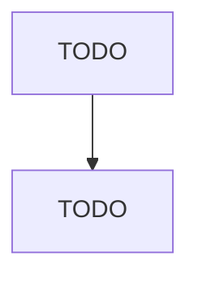

# Fluid Milk Manufacturing

> TODO: Business-as-Code definition

## Overview

This U.S. industry comprises establishments primarily engaged in (1) manufacturing processed milk products, such as pasteurized milk or cream and sour cream and/or (2) manufacturing fluid milk dairy substitutes from soybeans and other nondairy substances. Cross-References. Establishments primarily engaged in--

## Actors

| Actor | Description |
|-------|-------------|
| TODO | TODO |

## Roles

| Role | Description |
|------|-------------|
| TODO | TODO |

## Entities

| Entity | Description |
|--------|-------------|
| TODO | TODO |

## Actions

| Action | Description |
|--------|-------------|
| TODO | TODO |

## Events

| Event | Description |
|-------|-------------|
| TODO | TODO |

## Searches

| Search | Description |
|--------|-------------|
| TODO | TODO |

## Workflow

## Actor Relationships

