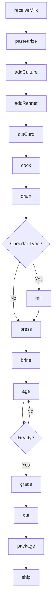
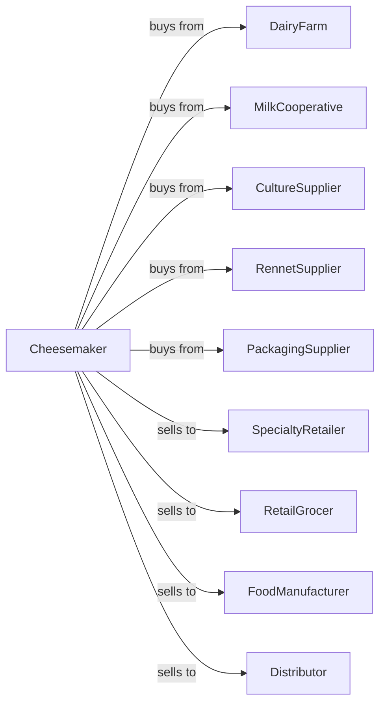

# Cheese Manufacturing

> Business-as-Code definition for cheese manufacturing operations. Models milk coagulation, curd processing, aging, and packaging for natural and processed cheese products.

## Overview

This U.S. industry comprises establishments primarily engaged in (1) manufacturing cheese products (except cottage cheese) from raw milk and/or processed milk products and/or (2) manufacturing cheese substitutes from soybean and other nondairy substances. This definition exposes actions for curdling, pressing, aging, and packaging cheese varieties.

## Actors

| Actor | Description |
|-------|-------------|
| DairyFarm | Supplies raw milk for cheesemaking |
| MilkCooperative | Aggregates milk from member farms |
| CultureSupplier | Provides starter cultures and molds |
| RennetSupplier | Supplies coagulants for curd formation |
| PackagingSupplier | Provides wax, wraps, and containers |
| SpecialtyRetailer | Purchases artisan and specialty cheeses |
| RetailGrocer | Purchases cheese for retail sale |
| FoodManufacturer | Uses cheese as ingredient |
| Distributor | Handles wholesale distribution |

## Roles

| Role | Description |
|------|-------------|
| MasterCheesemaker | Oversees cheese production and quality |
| PlantManager | Manages daily operations |
| VatOperator | Runs coagulation and curd processing |
| PressingOperator | Operates cheese presses |
| AgingSpecialist | Manages cave and aging room conditions |
| QualityGrader | Evaluates cheese quality and grade |
| PackagingOperator | Cuts, wraps, and labels cheese |

## Entities

| Entity | Description |
|--------|-------------|
| Milk | Raw material for cheesemaking |
| Culture | Bacterial starter for acidification |
| Rennet | Enzyme for milk coagulation |
| Curd | Solidified milk proteins |
| Whey | Liquid byproduct of curdling |
| Wheel | Formed cheese ready for aging |
| Block | Large cheese for cutting |
| Wedge | Cut portion for retail |
| Cave | Aging environment with controlled conditions |
| AffineGrade | Quality rating for aged cheese |

## Actions

| Action | Description |
|--------|-------------|
| receiveMilk | Accept and test incoming milk |
| pasteurize | Heat treat milk for safety |
| addCulture | Inoculate with starter bacteria |
| addRennet | Introduce coagulant for curdling |
| cutCurd | Slice curd mass to release whey |
| cook | Heat curds to expel moisture |
| drain | Separate curds from whey |
| mill | Break curds for cheddar types |
| press | Compact curds into wheel or block |
| brine | Salt cheese in brine solution |
| age | Store under controlled conditions |
| grade | Evaluate quality and assign rating |
| cut | Portion into retail sizes |
| package | Wrap and label for sale |

## Events

| Event | Description |
|-------|-------------|
| milkReceived | Milk tested and accepted |
| cultureAdded | Starter bacteria introduced |
| curdSet | Coagulation complete |
| curdCut | Curd mass sliced |
| wheyDrained | Liquid separated |
| cheesePressed | Wheels or blocks formed |
| cheeseBrined | Salt absorbed |
| agingStarted | Cheese entered aging storage |
| agingComplete | Target age reached |
| cheeseGraded | Quality evaluated |
| orderShipped | Product dispatched |

## Searches

| Search | Description |
|--------|-------------|
| findMilkLots | List available milk inventory |
| getAgingInventory | Check cheese in aging storage |
| getByAge | Find cheese by aging duration |
| getByVariety | List cheese by type |
| getOrders | Retrieve orders by customer |
| getCaveConditions | View temperature and humidity |
| getGradeHistory | Review quality grades |
| findReadyToShip | List aged cheese ready for sale |

## Workflow



## Actor Relationships



## Usage

### Calling Actions

```typescript
import { processCheese } from '@headlessly/process-cheese'

const plant = processCheese()

// Start cheddar production
const milk = await plant.receiveMilk({
  farmId: 'green-pastures',
  volume: 5000,
  unit: 'gallons',
  butterfatPercent: 3.5
})

await plant.pasteurize({
  batchId: milk.batchId,
  temperature: 161,
  holdTime: 15
})

await plant.addCulture({
  batchId: milk.batchId,
  cultureType: 'mesophilic',
  strains: ['lactococcus-lactis']
})

await plant.addRennet({
  batchId: milk.batchId,
  rennetType: 'microbial',
  amount: 2.5,
  unit: 'ml-per-gallon'
})
```

### Event-Driven Automation

```typescript
// Auto-flip cheese during aging
plant.agingStarted(async ({ wheelId, variety }) => {
  const schedule = getFlipSchedule(variety)

  for (const day of schedule) {
    await plant.scheduleTask({
      wheelId,
      task: 'flip',
      dueDate: addDays(new Date(), day)
    })
  }
})

// Auto-notify when aging complete
plant.agingComplete(async ({ wheelId, variety, ageMonths }) => {
  await plant.grade({ wheelId })
  await plant.notifySales({
    message: `${variety} wheel ${wheelId} ready after ${ageMonths} months`
  })
})
```
