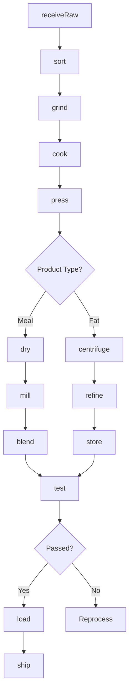
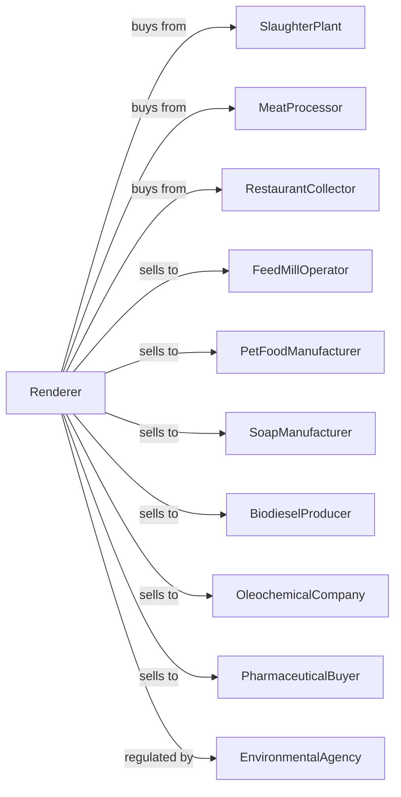

# Rendering and Meat Byproduct Processing

> Business-as-Code definition for rendering and meat byproduct operations. Models collection, cooking, pressing, and refining of animal fats, proteins, and byproducts for feed, industrial, and food applications.

## Overview

This U.S. industry comprises establishments primarily engaged in rendering animal fat, bones, and meat scraps. Cross-References. Establishments primarily engaged in--

## Actors

| Actor | Description |
|-------|-------------|
| SlaughterPlant | Supplies raw materials from processing |
| MeatProcessor | Provides trimmings and fat |
| RestaurantCollector | Gathers used cooking oil and grease |
| FeedMillOperator | Purchases meat and bone meal |
| PetFoodManufacturer | Buys rendered proteins for pet food |
| SoapManufacturer | Uses tallow for soap production |
| BiodieselProducer | Converts fats to renewable fuel |
| OleochemicalCompany | Uses fats for industrial chemicals |
| PharmaceuticalBuyer | Purchases pharmaceutical-grade gelatin |
| EnvironmentalAgency | Regulates emissions and waste |

## Roles

| Role | Description |
|------|-------------|
| PlantManager | Oversees rendering operations |
| ProcessEngineer | Optimizes cooking and separation processes |
| QualityManager | Ensures product specifications |
| ReceivingOperator | Handles raw material intake |
| CookerOperator | Runs continuous or batch cookers |
| PressOperator | Controls mechanical separation |
| RefineryOperator | Manages fat purification |
| ShippingCoordinator | Manages bulk and packaged shipments |

## Entities

| Entity | Description |
|--------|-------------|
| RawMaterial | Animal fat, bones, and scraps |
| Tallow | Rendered beef or mutton fat |
| Lard | Rendered pork fat |
| MeatMeal | Dried protein from cooking |
| BoneMeal | Ground bone product |
| BloodMeal | Dried blood protein |
| FeatherMeal | Processed poultry feathers |
| Cracklings | Solid residue after rendering |
| Grease | Yellow or brown restaurant grease |
| Batch | Traceable production lot |

## Actions

| Action | Description |
|--------|-------------|
| receiveRaw | Accept and weigh incoming materials |
| sort | Separate by material type and source |
| grind | Reduce size for processing |
| cook | Heat to release fat and sterilize |
| press | Mechanically separate fat from solids |
| centrifuge | Further separate fat and water |
| refine | Purify fat through bleaching and filtering |
| dry | Remove moisture from protein meal |
| mill | Grind dried solids to meal |
| blend | Combine products to specification |
| test | Analyze fat, protein, and moisture |
| store | Hold in tanks or silos |
| load | Fill trucks or railcars |
| ship | Dispatch to customers |

## Events

| Event | Description |
|-------|-------------|
| rawReceived | Materials accepted and logged |
| materialsSorted | Separation by type completed |
| materialGround | Size reduction completed |
| batchCooked | Cooking cycle finished |
| fatPressed | Mechanical separation done |
| fatRefined | Purification completed |
| mealDried | Moisture removed |
| mealMilled | Grinding to meal completed |
| qualityApproved | Product met specifications |
| qualityFailed | Product out of specification |
| tankLoaded | Fat transferred to storage |
| orderShipped | Product dispatched |

## Searches

| Search | Description |
|--------|-------------|
| findRawMaterials | List incoming material inventory |
| getTankLevels | Check fat storage tank capacities |
| getSiloLevels | Monitor meal silo inventory |
| getOrders | Retrieve orders by customer and product |
| getQualityReports | Access fat and protein test results |
| getProductionSchedule | View cooking schedule |
| getEmissionsData | Monitor environmental metrics |
| getBySource | Track materials by supplier |

## Workflow



## Actor Relationships



## Usage

### Calling Actions

```typescript
import { processRenderingMeat } from '@headlessly/process-rendering-meat'

const plant = processRenderingMeat()

// Receive slaughterhouse byproducts
const batch = await plant.receiveRaw({
  supplier: 'regional-packing',
  materialType: 'beef-fat-and-bone',
  quantity: 40000,
  unit: 'lbs'
})

await plant.sort({
  batchId: batch.id,
  categories: ['fat', 'bone', 'offal']
})

await plant.grind({
  batchId: batch.id,
  targetSize: 2,
  unit: 'inches'
})

// Cook to render fat
await plant.cook({
  batchId: batch.id,
  method: 'continuous-dry',
  temperature: 280,
  duration: 90,
  unit: 'minutes'
})

await plant.press({
  batchId: batch.id,
  pressure: 3000,
  unit: 'psi'
})
```

### Event-Driven Automation

```typescript
// Auto-refine edible tallow
plant.fatPressed(async ({ batchId, grade }) => {
  if (grade === 'edible') {
    await plant.centrifuge({ batchId })
    await plant.refine({
      batchId,
      bleaching: true,
      filtering: true,
      targetFFA: 0.5
    })
  }
})

// Auto-process meal after drying
plant.mealDried(async ({ batchId, proteinContent }) => {
  await plant.mill({
    batchId,
    screenSize: 10,
    unit: 'mesh'
  })

  // Blend to customer specification
  const orders = await plant.getOrders({ product: 'meat-bone-meal' })
  if (orders.length > 0) {
    await plant.blend({
      batchId,
      targetProtein: orders[0].proteinSpec
    })
  }
})

// Quality alert on out-of-spec product
plant.qualityFailed(async ({ batchId, parameter, value, spec }) => {
  await alertQuality({
    batchId,
    issue: `${parameter} at ${value}, spec is ${spec}`,
    action: 'evaluate-reprocessing'
  })
})
```
