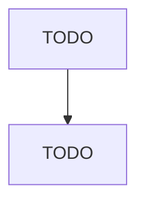

# Seafood Product Preparation and Packaging

> TODO: Business-as-Code definition

## Overview

This industry comprises establishments primarily engaged in one or more of the following: (1) canning seafood (including soup); (2) smoking, salting, and drying seafood; (3) eviscerating fresh fish by removing heads, fins, scales, bones, and entrails; (4) shucking and packing fresh shellfish; (5) processing marine fats and oils; and (6) freezing seafood. Establishments known as "floating factory ships" that are engaged in the gathering and processing of seafood into canned seafood products are i

## Actors

| Actor | Description |
|-------|-------------|
| TODO | TODO |

## Roles

| Role | Description |
|------|-------------|
| TODO | TODO |

## Entities

| Entity | Description |
|--------|-------------|
| TODO | TODO |

## Actions

| Action | Description |
|--------|-------------|
| TODO | TODO |

## Events

| Event | Description |
|-------|-------------|
| TODO | TODO |

## Searches

| Search | Description |
|--------|-------------|
| TODO | TODO |

## Workflow

## Actor Relationships

