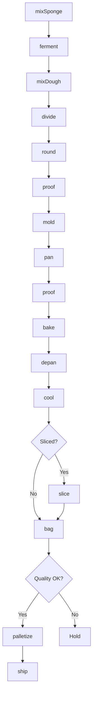
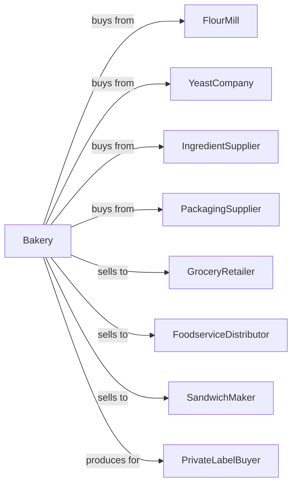

# Commercial Bakeries

> Business-as-Code definition for commercial bakery operations. Models high-volume production of bread, rolls, buns, and baked goods for wholesale distribution to retail and foodservice.

## Overview

This U.S. industry comprises establishments primarily engaged in manufacturing fresh and frozen bread and bread-type rolls and other fresh bakery (except cookies and crackers) products. This definition exposes actions for industrial-scale mixing, fermentation, baking, and packaging.

## Actors

| Actor | Description |
|-------|-------------|
| FlourMill | Supplies bulk flour and ingredients |
| YeastCompany | Provides commercial yeast products |
| IngredientSupplier | Supplies oils, sugars, and additives |
| PackagingSupplier | Provides bags, wrappers, and boxes |
| GroceryRetailer | Purchases bread for store shelves |
| FoodserviceDistributor | Distributes to restaurants |
| SandwichMaker | Uses bread for prepared foods |
| PrivateLabelBuyer | Contracts for store-brand production |

## Roles

| Role | Description |
|------|-------------|
| PlantManager | Oversees bakery production facility |
| ProductionManager | Manages daily baking operations |
| QualityManager | Ensures product consistency |
| MixerOperator | Runs industrial dough mixing |
| DividerOperator | Controls portioning equipment |
| OvenOperator | Manages continuous baking ovens |
| PackagingOperator | Runs bagging and slicing lines |
| MaintenanceTechnician | Maintains bakery equipment |

## Entities

| Entity | Description |
|--------|-------------|
| Sponge | Pre-ferment dough component |
| Dough | Mixed bread base |
| Bread | Baked loaf product |
| Bun | Individual round product |
| Roll | Small bread portion |
| BreadSlice | Individual portioned slice |
| Batch | Traceable production quantity |
| Recipe | Product formulation |
| Package | Consumer retail unit |
| Pallet | Shipping unit load |

## Actions

| Action | Description |
|--------|-------------|
| mixSponge | Prepare pre-ferment |
| mixDough | Combine all ingredients |
| ferment | Bulk fermentation in troughs |
| divide | Portion dough mechanically |
| round | Initial shaping of portions |
| proof | Intermediate and final proofing |
| mold | Final shape formation |
| pan | Place in baking pans |
| bake | Continuous oven baking |
| depan | Remove from pans |
| cool | Reduce temperature for slicing |
| slice | Cut into uniform slices |
| bag | Package for retail |
| palletize | Stack for distribution |

## Events

| Event | Description |
|-------|-------------|
| spongeMixed | Pre-ferment prepared |
| doughMixed | Main dough completed |
| doughFermented | Bulk fermentation done |
| doughDivided | Portions created |
| doughProofed | Rise completed |
| breadBaked | Baking finished |
| breadCooled | Ready for slicing |
| breadSliced | Cutting completed |
| breadBagged | Packaging finished |
| batchReleased | Quality approved |
| orderShipped | Product dispatched |

## Searches

| Search | Description |
|--------|-------------|
| getInventory | Check bread stock by SKU |
| getOrders | Retrieve orders by customer |
| getProductionSchedule | View baking schedule |
| getRecipes | List product formulas |
| getYieldData | Analyze production yields |
| getQualityReports | View quality test results |
| getShippingSchedule | View outbound loads |

## Workflow



## Actor Relationships



## Usage

### Calling Actions

```typescript
import { bakeCommercialBread } from '@headlessly/bake-commercial-bread'

const plant = bakeCommercialBread()

// Produce white sandwich bread
const sponge = await plant.mixSponge({
  recipe: 'white-bread-sponge',
  flourWeight: 500,
  unit: 'lbs',
  yeastPercent: 2.5
})

await plant.ferment({
  batchId: sponge.batchId,
  duration: 4,
  unit: 'hours',
  temperature: 80
})

const dough = await plant.mixDough({
  spongeId: sponge.batchId,
  additionalFlour: 500,
  salt: 2.5,
  sugar: 6,
  shortening: 3
})

await plant.divide({
  batchId: dough.batchId,
  targetWeight: 22,
  unit: 'oz'
})

await plant.bake({
  batchId: dough.batchId,
  temperature: 400,
  duration: 22,
  unit: 'minutes'
})
```

### Event-Driven Automation

```typescript
// Auto-slice after cooling
plant.breadCooled(async ({ batchId, productType }) => {
  if (productType === 'sandwich-bread') {
    await plant.slice({
      batchId,
      thickness: 0.5,
      unit: 'inches'
    })
  }
})

// Auto-ship based on orders
plant.batchReleased(async ({ batchId }) => {
  const orders = await plant.getOrders({ batchId })

  for (const order of orders) {
    await plant.ship({
      batchId,
      orderId: order.id,
      carrier: order.preferredCarrier
    })
  }
})
```
