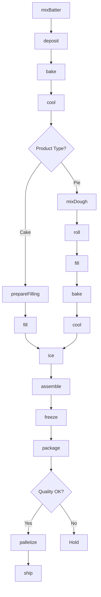
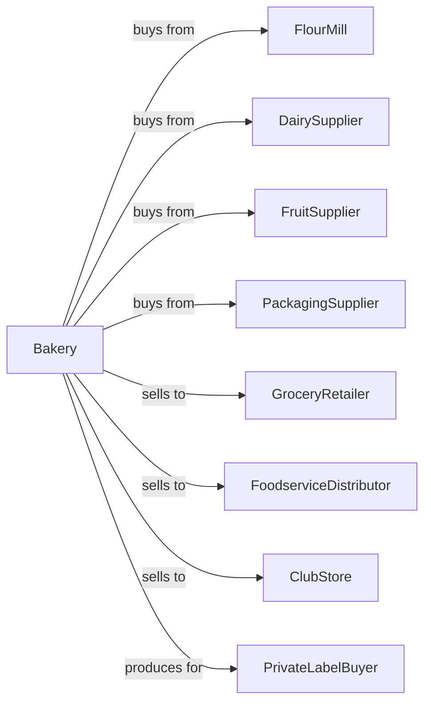

# Frozen Cakes, Pies, and Other Pastries Manufacturing

> Business-as-Code definition for frozen bakery product manufacturing. Models production of frozen cakes, pies, cheesecakes, doughnuts, and pastries through mixing, baking, decorating, and blast freezing.

## Overview

This U.S. industry comprises establishments primarily engaged in manufacturing frozen bakery products (except bread), such as cakes, pies, and doughnuts. This definition exposes actions for batter preparation, baking, finishing, and frozen packaging.

## Actors

| Actor | Description |
|-------|-------------|
| FlourMill | Supplies flour and baking mixes |
| DairySupplier | Provides butter, cream, and eggs |
| FruitSupplier | Supplies fruit fillings and toppings |
| PackagingSupplier | Provides boxes, trays, and films |
| GroceryRetailer | Purchases frozen desserts for retail |
| FoodserviceDistributor | Distributes to restaurants |
| ClubStore | Buys bulk frozen desserts |
| PrivateLabelBuyer | Contracts store-brand production |

## Roles

| Role | Description |
|------|-------------|
| PlantManager | Oversees frozen bakery operations |
| ProductionManager | Manages daily baking schedules |
| QualityManager | Ensures product consistency |
| MixerOperator | Prepares batters and doughs |
| OvenOperator | Controls baking equipment |
| DecoratingOperator | Applies icings and toppings |
| FreezingOperator | Manages blast freezing |
| PackagingOperator | Runs boxing and cartoning lines |

## Entities

| Entity | Description |
|--------|-------------|
| Batter | Mixed cake or pastry base |
| Dough | Pie crust or pastry dough |
| Cake | Baked cake layer or finished cake |
| Pie | Filled and topped pie product |
| Cheesecake | Cream cheese-based dessert |
| Doughnut | Fried or baked ring pastry |
| Filling | Fruit, cream, or custard interior |
| Icing | Decorative frosting |
| Batch | Traceable production lot |
| Carton | Retail frozen package |

## Actions

| Action | Description |
|--------|-------------|
| mixBatter | Combine cake ingredients |
| mixDough | Prepare pie or pastry dough |
| deposit | Dispense batter into pans |
| roll | Sheet and cut dough |
| bake | Apply heat in oven |
| cool | Reduce temperature before finishing |
| prepareFilling | Make fruit or cream fillings |
| fill | Add filling to shells or layers |
| ice | Apply frosting and decoration |
| assemble | Build layered products |
| freeze | Blast freeze finished products |
| package | Box and seal for retail |
| palletize | Stack for frozen storage |
| ship | Dispatch frozen loads |

## Events

| Event | Description |
|-------|-------------|
| batterMixed | Batter prepared |
| doughMixed | Dough prepared |
| productBaked | Baking completed |
| productCooled | Ready for finishing |
| fillingPrepared | Filling ready |
| productFilled | Filling added |
| productIced | Frosting applied |
| productAssembled | Layers combined |
| productFrozen | Blast freezing complete |
| productPackaged | Boxed for sale |
| batchReleased | Quality approved |
| orderShipped | Frozen product dispatched |

## Searches

| Search | Description |
|--------|-------------|
| getInventory | Check frozen stock by product |
| getOrders | Retrieve orders by customer |
| getProductionSchedule | View baking schedule |
| getRecipes | List product formulas |
| getFreezerCapacity | Check freezer availability |
| getQualityReports | View quality test results |
| getShippingSchedule | View outbound frozen loads |

## Workflow



## Actor Relationships



## Usage

### Calling Actions

```typescript
import { bakeFrozenPastries } from '@headlessly/bake-frozen-pastries'

const plant = bakeFrozenPastries()

// Produce frozen cheesecake
const batter = await plant.mixBatter({
  recipe: 'new-york-cheesecake',
  creamCheese: 200,
  sugar: 50,
  eggs: 30,
  unit: 'lbs'
})

await plant.deposit({
  batchId: batter.batchId,
  panType: '9-inch-springform',
  quantity: 500
})

await plant.bake({
  batchId: batter.batchId,
  temperature: 325,
  duration: 55,
  unit: 'minutes'
})

await plant.cool({
  batchId: batter.batchId,
  targetTemp: 70,
  duration: 2,
  unit: 'hours'
})

await plant.freeze({
  batchId: batter.batchId,
  method: 'blast',
  targetTemp: -10
})
```

### Event-Driven Automation

```typescript
// Auto-ice after cooling
plant.productCooled(async ({ batchId, productType }) => {
  if (productType === 'layer-cake') {
    await plant.ice({
      batchId,
      icingType: 'buttercream',
      decoration: 'rosettes'
    })
  }
})

// Auto-package after freezing
plant.productFrozen(async ({ batchId }) => {
  await plant.package({
    batchId,
    boxType: 'retail-carton',
    includeInsert: true
  })
})
```
