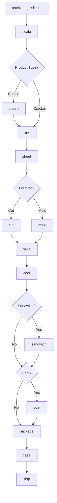
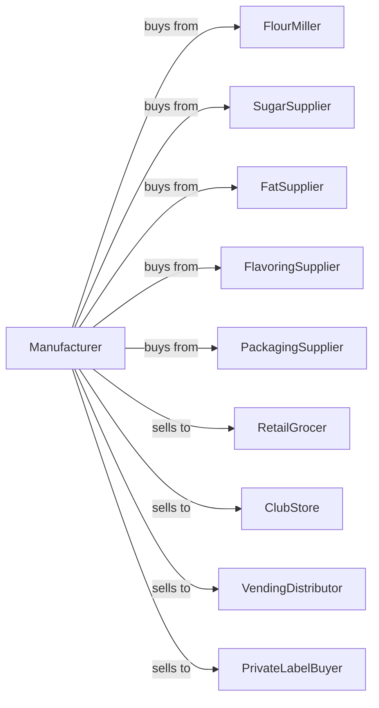

# Cookie and Cracker Manufacturing

> Business-as-Code definition for cookie and cracker manufacturing operations. Models high-speed production of cookies, crackers, wafers, and ice cream cones through mixing, forming, baking, and packaging.

## Overview

This U.S. industry comprises establishments primarily engaged in manufacturing cookies, crackers, and other products, such as ice cream cones. This definition exposes actions for dough preparation, forming, baking, filling, coating, and packaging of shelf-stable baked snacks.

## Actors

| Actor | Description |
|-------|-------------|
| FlourMiller | Supplies wheat flour and specialty flours |
| SugarSupplier | Provides granulated and powdered sugars |
| FatSupplier | Supplies shortening, butter, and oils |
| FlavoringSupplier | Provides extracts, chocolate, and inclusions |
| PackagingSupplier | Provides trays, sleeves, and cartons |
| RetailGrocer | Purchases packaged cookies and crackers |
| ClubStore | Orders bulk and multipack formats |
| VendingDistributor | Purchases single-serve packages |
| PrivateLabelBuyer | Contracts for store-brand production |

## Roles

| Role | Description |
|------|-------------|
| PlantManager | Oversees daily production operations |
| ProductDeveloper | Creates new cookie and cracker formulas |
| MixingOperator | Prepares doughs and batters |
| FormingOperator | Runs rotary molding and wire-cut equipment |
| OvenOperator | Monitors band oven baking |
| CoatingOperator | Applies chocolate and icing |
| PackagingOperator | Runs cartoning and case packing lines |
| QualityTechnician | Tests texture, moisture, and weight |

## Entities

| Entity | Description |
|--------|-------------|
| Dough | Mixed cookie or cracker base |
| Cookie | Sweet baked snack product |
| Cracker | Savory crisp baked product |
| Wafer | Thin crisp baked sheet |
| IceCreamCone | Molded or rolled cone product |
| Filling | Cream or flavored center |
| Coating | Chocolate or icing layer |
| Formula | Recipe with ingredient ratios |
| Batch | Traceable production quantity |
| ShelfLife | Product freshness duration |

## Actions

| Action | Description |
|--------|-------------|
| receiveIngredients | Accept flour, sugar, and other materials |
| scale | Weigh ingredients to formula |
| cream | Blend fats and sugars for cookies |
| mix | Combine all ingredients into dough |
| sheet | Roll dough to uniform thickness |
| cut | Stamp or wire-cut dough pieces |
| mold | Form in rotary molds |
| bake | Cook on band oven |
| cool | Reduce temperature on cooling conveyor |
| sandwich | Apply filling between cookies |
| coat | Apply chocolate or icing |
| package | Wrap in trays or sleeves |
| case | Pack packages into shipping cases |
| ship | Dispatch to customers |

## Events

| Event | Description |
|-------|-------------|
| ingredientsReceived | Raw materials accepted |
| doughMixed | Mixing completed |
| doughSheeted | Rolling completed |
| piecesFormed | Cutting or molding completed |
| productBaked | Baking completed |
| productCooled | Cooling completed |
| productSandwiched | Filling applied |
| productCoated | Coating applied |
| productPackaged | Primary packaging completed |
| casesPacked | Shipping cases filled |
| qualityApproved | Batch passed testing |
| orderShipped | Products dispatched |

## Searches

| Search | Description |
|--------|-------------|
| getIngredients | List ingredient inventory |
| getDoughBatches | Find active dough batches |
| getOvenStatus | View baking line status |
| getInventory | Check finished goods stock |
| getOrders | Retrieve orders by customer |
| getFormulas | List product recipes |
| getQualityData | Access test results |
| getProductionSchedule | View production plan |

## Workflow



## Actor Relationships



## Usage

### Calling Actions

```typescript
import { bakeCookieCracker } from '@headlessly/bake-cookie-cracker'

const plant = bakeCookieCracker()

// Make chocolate chip cookies
const dough = await plant.cream({
  formula: 'chocolate-chip',
  butter: 200,
  sugar: 150,
  brownSugar: 100,
  unit: 'pounds'
})

await plant.mix({
  batchId: dough.batchId,
  flour: 400,
  eggs: 50,
  chocolateChips: 200,
  bakingSoda: 4,
  salt: 6
})

await plant.sheet({
  batchId: dough.batchId,
  thickness: 8,
  unit: 'mm'
})

await plant.cut({
  batchId: dough.batchId,
  method: 'wire-cut',
  diameter: 65,
  unit: 'mm'
})

await plant.bake({
  batchId: dough.batchId,
  ovenTemp: 375,
  bakeTime: 11,
  unit: 'minutes'
})
```

### Event-Driven Automation

```typescript
// Auto-cool and package after baking
plant.productBaked(async ({ batchId }) => {
  await plant.cool({
    batchId,
    targetTemp: 85,
    unit: 'fahrenheit'
  })
})

plant.productCooled(async ({ batchId, productType }) => {
  const formula = await plant.getFormulas({ batchId })

  if (formula.hasFilling) {
    await plant.sandwich({
      batchId,
      fillingType: formula.fillingType
    })
  } else {
    await plant.package({ batchId })
  }
})
```
