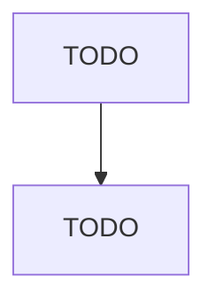

# Dry Pasta, Dough, and Flour Mixes Manufacturing from Purchased Flour

> TODO: Business-as-Code definition

## Overview

This U.S. industry comprises establishments primarily engaged in (1) manufacturing dry pasta and/or (2) manufacturing prepared flour mixes or dough from flour ground elsewhere. The establishments in this industry may package the dry pasta they manufacture with other ingredients. Cross-References. Establishments primarily engaged in--

## Actors

| Actor | Description |
|-------|-------------|
| TODO | TODO |

## Roles

| Role | Description |
|------|-------------|
| TODO | TODO |

## Entities

| Entity | Description |
|--------|-------------|
| TODO | TODO |

## Actions

| Action | Description |
|--------|-------------|
| TODO | TODO |

## Events

| Event | Description |
|-------|-------------|
| TODO | TODO |

## Searches

| Search | Description |
|--------|-------------|
| TODO | TODO |

## Workflow

## Actor Relationships

