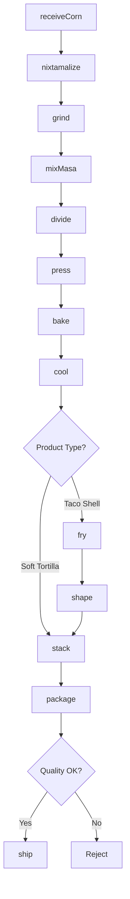
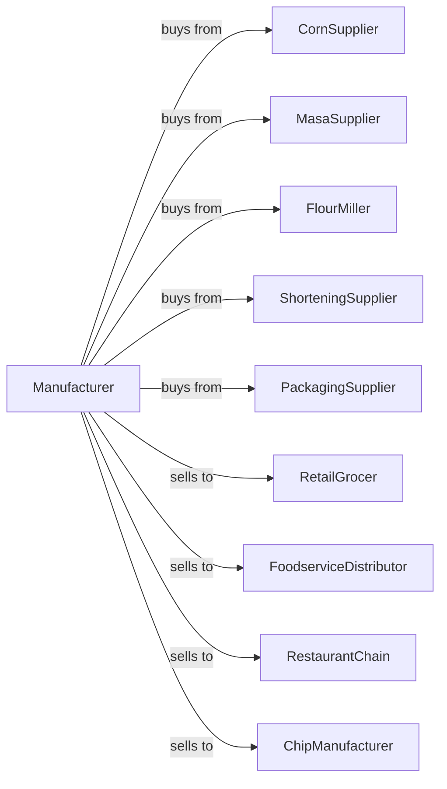

# Tortilla Manufacturing

> Business-as-Code definition for tortilla manufacturing operations. Models production of corn and flour tortillas, taco shells, and related products through mixing, pressing, baking, and packaging.

## Overview

This industry comprises establishments primarily engaged in manufacturing tortillas. This definition exposes actions for masa preparation, dough mixing, pressing, baking, and packaging of corn tortillas, flour tortillas, taco shells, and tortilla chips.

## Actors

| Actor | Description |
|-------|-------------|
| CornSupplier | Provides dried corn for nixtamalization |
| MasaSupplier | Supplies prepared masa flour |
| FlourMiller | Provides wheat flour for flour tortillas |
| ShorteningSupplier | Supplies fats and oils |
| PackagingSupplier | Provides bags, films, and boxes |
| RetailGrocer | Purchases packaged tortillas |
| FoodserviceDistributor | Supplies restaurants and fast food |
| RestaurantChain | Contracts for custom tortilla specifications |
| ChipManufacturer | Purchases tortillas for chip production |

## Roles

| Role | Description |
|------|-------------|
| PlantManager | Oversees daily tortilla production |
| NixtamalizationOperator | Runs corn cooking and grinding |
| MixingOperator | Prepares dough to specification |
| PressOperator | Runs tortilla press equipment |
| OvenOperator | Controls conveyor oven baking |
| PackagingOperator | Runs bagging and sealing lines |
| QualityTechnician | Tests moisture, thickness, and pliability |
| MaintenanceTechnician | Maintains press and oven equipment |

## Entities

| Entity | Description |
|--------|-------------|
| Corn | Dried corn for nixtamalization |
| Masa | Wet ground corn dough |
| MasaHarina | Dried masa flour |
| FlourDough | Wheat-based tortilla dough |
| Tortilla | Flat round unleavened bread |
| TacoShell | Fried or baked corn shell |
| Batch | Traceable production quantity |
| Diameter | Tortilla size specification |
| Thickness | Tortilla texture specification |
| ShelfLife | Product freshness duration |

## Actions

| Action | Description |
|--------|-------------|
| receiveCorn | Accept dried corn delivery |
| nixtamalize | Cook corn in lime water |
| grind | Process cooked corn into masa |
| mixMasa | Prepare corn tortilla dough |
| mixFlour | Prepare flour tortilla dough |
| divide | Portion dough into balls |
| press | Flatten dough into round shape |
| bake | Cook on hot griddle or conveyor |
| cool | Reduce temperature for packaging |
| fry | Deep fry for taco shells |
| shape | Form shells into U-shape |
| stack | Arrange tortillas for packaging |
| package | Bag and seal finished product |
| ship | Dispatch to customers |

## Events

| Event | Description |
|-------|-------------|
| cornReceived | Dried corn accepted |
| cornNixtamalized | Lime cooking completed |
| masaGround | Grinding completed |
| doughMixed | Dough prepared |
| doughDivided | Portions created |
| tortillaPressed | Flattening completed |
| tortillaBaked | Cooking completed |
| tortillaCooled | Temperature reduced |
| shellsFried | Taco shells prepared |
| productPackaged | Bagging completed |
| qualityApproved | Batch passed testing |
| orderShipped | Products dispatched |

## Searches

| Search | Description |
|--------|-------------|
| getCornInventory | Check corn and masa stock |
| getDoughBatches | List active dough batches |
| getOvenStatus | Monitor baking lines |
| getInventory | Check finished goods stock |
| getOrders | Retrieve orders by customer |
| getSpecifications | List product size and weight specs |
| getQualityData | View test results |
| getProductionSchedule | View daily production plan |

## Workflow



## Actor Relationships



## Usage

### Calling Actions

```typescript
import { bakeTortilla } from '@headlessly/bake-tortilla'

const plant = bakeTortilla()

// Produce corn tortillas from whole corn
const corn = await plant.receiveCorn({
  supplier: 'mexican-corn-co',
  variety: 'white-dent',
  quantity: 10000,
  unit: 'pounds'
})

await plant.nixtamalize({
  batchId: corn.batchId,
  limeRatio: 1,
  cookTime: 8,
  steepTime: 12,
  unit: 'hours'
})

await plant.grind({
  batchId: corn.batchId,
  millType: 'stone',
  textureSpec: 'medium'
})

await plant.mixMasa({
  batchId: corn.batchId,
  waterPercent: 55,
  salt: 1.5
})

await plant.divide({
  batchId: corn.batchId,
  portionWeight: 30,
  unit: 'grams'
})

await plant.press({
  batchId: corn.batchId,
  diameter: 6,
  unit: 'inches',
  pressure: 500
})

await plant.bake({
  batchId: corn.batchId,
  ovenTemp: 500,
  bakeTime: 45,
  unit: 'seconds'
})
```

### Event-Driven Automation

```typescript
// Auto-cool and stack after baking
plant.tortillaBaked(async ({ batchId }) => {
  await plant.cool({
    batchId,
    targetTemp: 85,
    unit: 'fahrenheit'
  })
})

plant.tortillaCooled(async ({ batchId, productType }) => {
  if (productType === 'taco-shell') {
    await plant.fry({
      batchId,
      oilTemp: 350,
      fryTime: 60,
      unit: 'seconds'
    })
  } else {
    await plant.stack({
      batchId,
      countPerStack: 10
    })
  }
})

// Auto-package after stacking
plant.productPackaged(async ({ batchId }) => {
  await plant.ship({ batchId })
})
```
