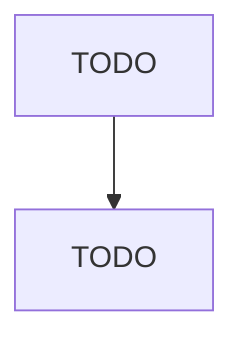

# Roasted Nuts and Peanut Butter Manufacturing

> TODO: Business-as-Code definition

## Overview

This U.S. industry comprises establishments primarily engaged in one or more of the following: (1) salting, roasting, drying, cooking, or canning nuts; (2) processing grains or seeds into snacks; and (3) manufacturing peanut butter and other nut butters. Cross-References. Establishments primarily engaged in--

## Actors

| Actor | Description |
|-------|-------------|
| TODO | TODO |

## Roles

| Role | Description |
|------|-------------|
| TODO | TODO |

## Entities

| Entity | Description |
|--------|-------------|
| TODO | TODO |

## Actions

| Action | Description |
|--------|-------------|
| TODO | TODO |

## Events

| Event | Description |
|-------|-------------|
| TODO | TODO |

## Searches

| Search | Description |
|--------|-------------|
| TODO | TODO |

## Workflow

## Actor Relationships

