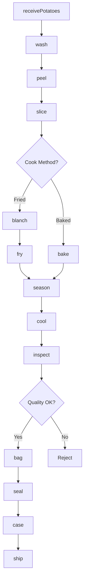
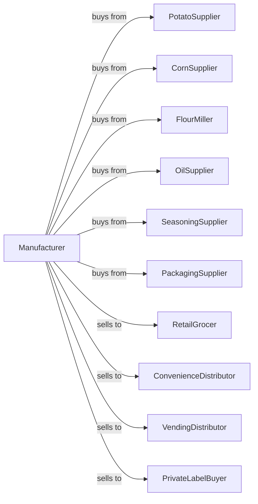

# Other Snack Food Manufacturing

> Business-as-Code definition for snack food manufacturing operations. Models production of potato chips, corn chips, tortilla chips, pretzels, popcorn, and pork rinds through frying, baking, and seasoning processes.

## Overview

This U.S. industry comprises establishments primarily engaged in manufacturing snack foods (except roasted nuts and peanut butter). This includes corn chips, potato chips, tortilla chips, pretzels, popcorn, and pork rinds. This definition exposes actions for slicing, frying, baking, seasoning, and packaging shelf-stable snacks.

## Actors

| Actor | Description |
|-------|-------------|
| PotatoSupplier | Provides potatoes for chip production |
| CornSupplier | Supplies corn for corn and tortilla chips |
| FlourMiller | Provides flour for pretzels |
| OilSupplier | Supplies frying oils |
| SeasoningSupplier | Provides salt, spices, and flavorings |
| PackagingSupplier | Supplies bags, boxes, and films |
| RetailGrocer | Purchases packaged snacks |
| ConvenienceDistributor | Supplies convenience stores |
| VendingDistributor | Stocks vending machines |
| PrivateLabelBuyer | Contracts store-brand production |

## Roles

| Role | Description |
|------|-------------|
| PlantManager | Oversees daily snack production |
| SlicingOperator | Runs potato slicing equipment |
| FryerOperator | Controls fryer temperature and time |
| OvenOperator | Manages baking equipment |
| SeasoningOperator | Applies flavorings to products |
| PackagingOperator | Runs bagging and case packing |
| QualityTechnician | Tests moisture, oil content, and texture |
| OilManager | Monitors oil quality and filtration |

## Entities

| Entity | Description |
|--------|-------------|
| Potato | Raw potatoes for chip production |
| CornMasa | Ground corn for corn snacks |
| Dough | Pretzel or extruded snack base |
| Chip | Fried or baked thin slice |
| Pretzel | Twisted baked dough snack |
| Popcorn | Popped corn kernels |
| PorkRind | Fried pork skin snack |
| Seasoning | Flavor coating blend |
| Batch | Traceable production lot |
| FryingOil | Oil for continuous fryers |

## Actions

| Action | Description |
|--------|-------------|
| receivePotatoes | Accept potato deliveries |
| wash | Clean produce |
| peel | Remove potato skins |
| slice | Cut to uniform thickness |
| blanch | Pre-treat for texture |
| fry | Cook in hot oil |
| bake | Cook in oven |
| pop | Expand popcorn kernels |
| extrude | Form shaped snacks |
| season | Apply salt and flavorings |
| cool | Reduce temperature |
| inspect | Check for defects |
| bag | Fill flexible packages |
| seal | Close packages with nitrogen |
| case | Pack into shipping cases |
| ship | Dispatch to customers |

## Events

| Event | Description |
|-------|-------------|
| potatoesReceived | Raw materials accepted |
| potatoesSliced | Slicing completed |
| productFried | Frying completed |
| productBaked | Baking completed |
| productSeasoned | Flavoring applied |
| productCooled | Temperature reduced |
| productBagged | Packaging completed |
| casesPacked | Shipping cases filled |
| qualityApproved | Batch passed testing |
| orderShipped | Products dispatched |

## Searches

| Search | Description |
|--------|-------------|
| getRawMaterials | Check potato and corn inventory |
| getFryerStatus | Monitor fryer oil quality |
| getOvenStatus | View baking line status |
| getInventory | Check finished goods stock |
| getOrders | Retrieve orders by customer |
| getSeasonings | List available flavoring blends |
| getQualityData | Access test results |
| getProductionSchedule | View daily production plan |

## Workflow



## Actor Relationships



## Usage

### Calling Actions

```typescript
import { manufactureSnackFood } from '@headlessly/manufacture-snack-food'

const plant = manufactureSnackFood()

// Produce kettle-style potato chips
const potatoes = await plant.receivePotatoes({
  supplier: 'idaho-farms',
  variety: 'russet',
  quantity: 40000,
  unit: 'pounds'
})

await plant.wash({ batchId: potatoes.batchId })
await plant.peel({ batchId: potatoes.batchId, method: 'steam' })

await plant.slice({
  batchId: potatoes.batchId,
  thickness: 1.5,
  unit: 'mm',
  style: 'kettle'
})

await plant.fry({
  batchId: potatoes.batchId,
  oilType: 'sunflower',
  temperature: 350,
  duration: 4,
  unit: 'minutes'
})

await plant.season({
  batchId: potatoes.batchId,
  seasoning: 'sea-salt',
  rate: 3,
  unit: 'percent'
})
```

### Event-Driven Automation

```typescript
// Auto-cool and bag after seasoning
plant.productSeasoned(async ({ batchId }) => {
  await plant.cool({
    batchId,
    targetTemp: 90,
    unit: 'fahrenheit'
  })
})

plant.productCooled(async ({ batchId }) => {
  await plant.inspect({ batchId })
})

// Auto-seal with nitrogen flush
plant.productBagged(async ({ batchId, bagSize }) => {
  await plant.seal({
    batchId,
    method: 'nitrogen-flush',
    targetOxygen: 2,
    unit: 'percent'
  })
})

// Monitor oil quality
plant.productFried(async ({ fryerId, oilAge }) => {
  if (oilAge > 48) {
    await plant.alertMaintenance({
      fryerId,
      message: 'Oil change required',
      priority: 'high'
    })
  }
})
```
