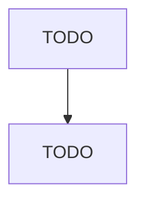

# Other Snack Food Manufacturing

> TODO: Business-as-Code definition

## Overview

This U.S. industry comprises establishments primarily engaged in manufacturing snack foods (except roasted nuts and peanut butter). Illustrative Examples: Corn chips and related corn snacks manufacturing Popped popcorn (except candy-covered) manufacturing Pork rinds manufacturing Potato chips manufacturing Pretzels (except soft) manufacturing Tortilla chips manufacturing Cross-References. Establishments primarily engaged in--

## Actors

| Actor | Description |
|-------|-------------|
| TODO | TODO |

## Roles

| Role | Description |
|------|-------------|
| TODO | TODO |

## Entities

| Entity | Description |
|--------|-------------|
| TODO | TODO |

## Actions

| Action | Description |
|--------|-------------|
| TODO | TODO |

## Events

| Event | Description |
|-------|-------------|
| TODO | TODO |

## Searches

| Search | Description |
|--------|-------------|
| TODO | TODO |

## Workflow

## Actor Relationships

