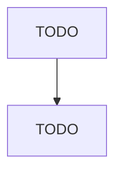

# Coffee and Tea Manufacturing

> TODO: Business-as-Code definition

## Overview

This industry comprises establishments primarily engaged in one or more of the following: (1) roasting coffee; (2) manufacturing coffee and tea concentrates (including instant and freeze-dried); (3) blending tea; (4) manufacturing herbal tea; and (5) manufacturing coffee extracts, flavorings, and syrups. Cross-References.

## Actors

| Actor | Description |
|-------|-------------|
| TODO | TODO |

## Roles

| Role | Description |
|------|-------------|
| TODO | TODO |

## Entities

| Entity | Description |
|--------|-------------|
| TODO | TODO |

## Actions

| Action | Description |
|--------|-------------|
| TODO | TODO |

## Events

| Event | Description |
|-------|-------------|
| TODO | TODO |

## Searches

| Search | Description |
|--------|-------------|
| TODO | TODO |

## Workflow

## Actor Relationships

