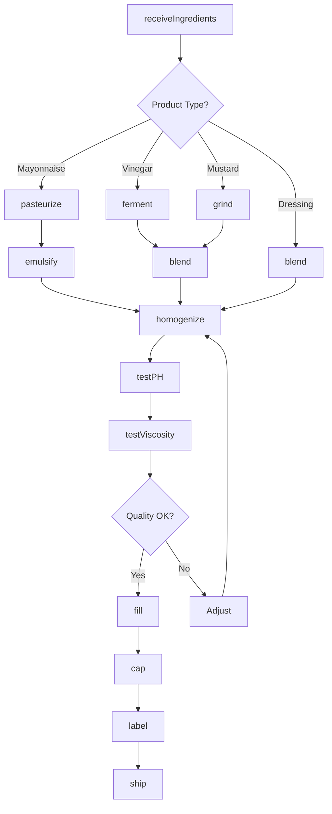
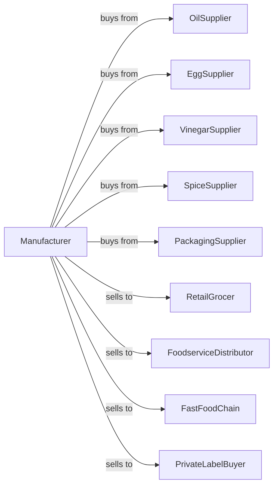

# Mayonnaise, Dressing, and Other Prepared Sauce Manufacturing

> Business-as-Code definition for mayonnaise, dressing, and sauce manufacturing. Models production of mayonnaise, salad dressings, vinegar, mustard, and specialty sauces through emulsification, blending, and packaging.

## Overview

This U.S. industry comprises establishments primarily engaged in manufacturing mayonnaise, salad dressing, vinegar, mustard, horseradish, soy sauce, tartar sauce, Worcestershire sauce, and other prepared sauces (except tomato-based and gravy). This definition exposes actions for emulsification, fermentation, blending, and packaging of condiments and dressings.

## Actors

| Actor | Description |
|-------|-------------|
| OilSupplier | Provides vegetable and specialty oils |
| EggSupplier | Supplies eggs and egg products |
| VinegarSupplier | Provides vinegar base ingredients |
| SpiceSupplier | Supplies seasonings and flavorings |
| PackagingSupplier | Provides bottles, jars, and sachets |
| RetailGrocer | Purchases bottled dressings and sauces |
| FoodserviceDistributor | Supplies restaurants and institutions |
| FastFoodChain | Contracts for custom sauce formulations |
| PrivateLabelBuyer | Orders store-brand production |

## Roles

| Role | Description |
|------|-------------|
| PlantManager | Oversees daily manufacturing operations |
| FlavorChemist | Develops and refines formulations |
| EmulsificationOperator | Runs high-shear mixing equipment |
| FermentationOperator | Manages vinegar production |
| BlendingOperator | Combines ingredients to specification |
| PackagingOperator | Operates filling and capping lines |
| QualityTechnician | Tests viscosity, pH, and flavor |
| RDChef | Creates new product concepts |

## Entities

| Entity | Description |
|--------|-------------|
| Oil | Base fat component for emulsions |
| Egg | Emulsifier for mayonnaise |
| Vinegar | Acid base for dressings |
| Mustard | Ground mustard seed product |
| Emulsion | Stable oil-water mixture |
| Dressing | Finished salad dressing product |
| Sauce | Prepared condiment |
| Formula | Recipe with ingredient ratios |
| Batch | Traceable production lot |
| Viscosity | Product thickness measurement |

## Actions

| Action | Description |
|--------|-------------|
| receiveIngredients | Accept oils, eggs, and seasonings |
| pasteurize | Heat treat eggs for safety |
| ferment | Produce vinegar from alcohol |
| grind | Mill mustard seeds |
| blend | Combine dry seasonings |
| emulsify | Create stable oil-water mixture |
| homogenize | Achieve uniform texture |
| heat | Warm for viscosity adjustment |
| cool | Reduce temperature before filling |
| testPH | Verify acidity level |
| testViscosity | Measure product thickness |
| fill | Dispense into containers |
| cap | Close bottles and jars |
| label | Apply product labels |
| ship | Dispatch to customers |

## Events

| Event | Description |
|-------|-------------|
| ingredientsReceived | Raw materials accepted |
| eggsPasteurized | Heat treatment completed |
| vinegarFermented | Fermentation completed |
| mustardGround | Grinding completed |
| productEmulsified | Emulsion formed |
| productHomogenized | Texture achieved |
| productFilled | Packaging completed |
| productCapped | Containers sealed |
| qualityApproved | Batch passed testing |
| qualityFailed | Batch out of specification |
| orderShipped | Products dispatched |

## Searches

| Search | Description |
|--------|-------------|
| getIngredients | Check raw material inventory |
| getBatches | List active production batches |
| getFormulas | View product recipes |
| getViscosityData | Review texture measurements |
| getPHHistory | Review acidity data |
| getInventory | Check finished goods stock |
| getOrders | Retrieve orders by customer |
| getProductionSchedule | View manufacturing schedule |

## Workflow



## Actor Relationships



## Usage

### Calling Actions

```typescript
import { manufactureMayonnaise } from '@headlessly/manufacture-mayonnaise'

const plant = manufactureMayonnaise()

// Produce mayonnaise
const batch = await plant.pasteurize({
  ingredient: 'egg-yolks',
  quantity: 500,
  unit: 'pounds',
  temperature: 140,
  duration: 3.5,
  timeUnit: 'minutes'
})

await plant.emulsify({
  batchId: batch.batchId,
  oil: 'soybean',
  oilQuantity: 2000,
  vinegar: 200,
  mustard: 50,
  salt: 30,
  unit: 'pounds',
  mixerSpeed: 3000,
  speedUnit: 'rpm'
})

await plant.homogenize({
  batchId: batch.batchId,
  pressure: 2500,
  unit: 'psi'
})

await plant.testPH({
  batchId: batch.batchId,
  targetPH: 4.0
})

await plant.testViscosity({
  batchId: batch.batchId,
  targetViscosity: 80000,
  unit: 'centipoise'
})
```

### Event-Driven Automation

```typescript
// Auto-fill after quality approval
plant.qualityApproved(async ({ batchId, productType }) => {
  const format = productType === 'foodservice' ? 'gallon-jug' : 'retail-jar'

  await plant.fill({
    batchId,
    format,
    fillWeight: format === 'gallon-jug' ? 128 : 30,
    unit: 'oz'
  })
})

// Auto-cap after filling
plant.productFilled(async ({ batchId, containerType }) => {
  await plant.cap({
    batchId,
    capType: containerType === 'squeeze' ? 'flip-top' : 'twist-off'
  })
})

// Alert on quality failure
plant.qualityFailed(async ({ batchId, parameter, value, spec }) => {
  await plant.alertQuality({
    batchId,
    issue: `${parameter} at ${value}, spec is ${spec}`,
    action: 'blend-adjustment-required'
  })
})
```
