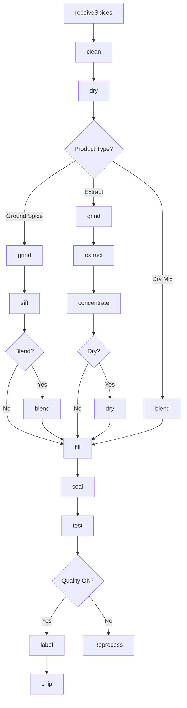
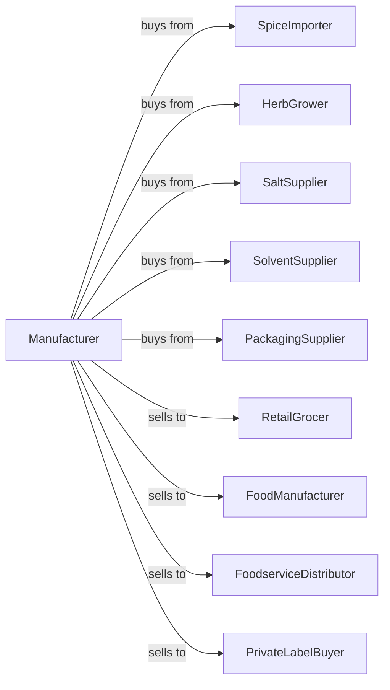

# Spice and Extract Manufacturing

> Business-as-Code definition for spice and extract manufacturing. Models grinding, blending, and extraction of spices, seasonings, flavoring extracts, and dry mix preparations.

## Overview

This U.S. industry comprises establishments primarily engaged in (1) manufacturing spices, table salt, seasonings, flavoring extracts (except coffee and meat), and natural food colorings and/or (2) manufacturing dry mix food preparations, such as salad dressing mixes, gravy and sauce mixes, frosting mixes, and other dry mix preparations. This definition exposes actions for cleaning, grinding, blending, extracting, and packaging.

## Actors

| Actor | Description |
|-------|-------------|
| SpiceImporter | Supplies whole spices from origin countries |
| HerbGrower | Provides fresh and dried herbs |
| SaltSupplier | Supplies table salt and specialty salts |
| SolventSupplier | Provides extraction solvents |
| PackagingSupplier | Provides jars, pouches, and shakers |
| RetailGrocer | Purchases consumer spice products |
| FoodManufacturer | Uses spices as ingredients |
| FoodserviceDistributor | Supplies restaurants |
| PrivateLabelBuyer | Contracts store-brand production |

## Roles

| Role | Description |
|------|-------------|
| PlantManager | Oversees daily manufacturing operations |
| FlavorChemist | Develops blends and extracts |
| GrindingOperator | Runs spice grinding equipment |
| BlendingOperator | Combines spices to formula |
| ExtractionOperator | Runs extraction equipment |
| PackagingOperator | Operates filling and sealing lines |
| QualityTechnician | Tests potency, color, and purity |
| SourcingManager | Procures and evaluates spices |

## Entities

| Entity | Description |
|--------|-------------|
| WholeSpice | Unground spice seed, bark, or root |
| GroundSpice | Milled spice product |
| Herb | Dried or fresh plant leaves |
| SeasoningBlend | Mixed spice formulation |
| Extract | Concentrated flavor solution |
| Oleoresin | Oil-soluble spice concentrate |
| DryMix | Packaged seasoning mix |
| Batch | Traceable production lot |
| Potency | Flavor strength measurement |
| MeshSize | Grind particle specification |

## Actions

| Action | Description |
|--------|-------------|
| receiveSpices | Accept whole spices from suppliers |
| clean | Remove stems, debris, and foreign matter |
| dry | Reduce moisture for grinding |
| grind | Mill to specified particle size |
| sift | Separate particles by size |
| blend | Combine spices to formula |
| extract | Remove flavors using solvents |
| concentrate | Reduce extract volume |
| dry | Remove solvent from extract |
| test | Analyze potency and purity |
| fill | Dispense into containers |
| seal | Close packages |
| label | Apply product labels |
| ship | Dispatch to customers |

## Events

| Event | Description |
|-------|-------------|
| spicesReceived | Raw materials accepted |
| spicesCleaned | Cleaning completed |
| spicesDried | Moisture reduced |
| spicesGround | Grinding completed |
| spicesSifted | Particle size verified |
| blendMixed | Seasoning blend created |
| extractProduced | Extraction completed |
| extractConcentrated | Concentration achieved |
| productFilled | Packaging completed |
| qualityApproved | Batch passed testing |
| qualityFailed | Batch out of specification |
| orderShipped | Products dispatched |

## Searches

| Search | Description |
|--------|-------------|
| getSpiceInventory | Check raw spice stock by origin |
| getBlendFormulas | List seasoning recipes |
| getGrindingQueue | View grinding schedule |
| getExtractionBatches | List active extraction runs |
| getInventory | Check finished goods stock |
| getOrders | Retrieve orders by customer |
| getPotencyData | View flavor strength tests |
| getProductionSchedule | View manufacturing schedule |

## Workflow



## Actor Relationships



## Usage

### Calling Actions

```typescript
import { manufactureSpiceExtract } from '@headlessly/manufacture-spice-extract'

const plant = manufactureSpiceExtract()

// Produce ground black pepper
const spice = await plant.receiveSpices({
  supplier: 'vietnam-spice-co',
  spice: 'black-peppercorns',
  origin: 'vietnam',
  quantity: 5000,
  unit: 'pounds'
})

await plant.clean({
  batchId: spice.batchId,
  method: 'gravity-separator'
})

await plant.dry({
  batchId: spice.batchId,
  targetMoisture: 11,
  unit: 'percent'
})

await plant.grind({
  batchId: spice.batchId,
  targetMesh: 30,
  method: 'cryogenic'
})

await plant.sift({
  batchId: spice.batchId,
  screenSize: 40,
  unit: 'mesh'
})
```

### Event-Driven Automation

```typescript
// Auto-test after grinding
plant.spicesGround(async ({ batchId, spiceType }) => {
  await plant.test({
    batchId,
    tests: ['potency', 'moisture', 'mesh-distribution', 'color']
  })
})

// Auto-fill after quality approval
plant.qualityApproved(async ({ batchId, destination }) => {
  const format = destination === 'retail'
    ? 'consumer-jar'
    : 'bulk-bag'

  await plant.fill({
    batchId,
    format,
    weight: format === 'bulk-bag' ? 25 : 2.5,
    unit: format === 'bulk-bag' ? 'pounds' : 'ounces'
  })
})

// Alert on potency issues
plant.qualityFailed(async ({ batchId, parameter, value, spec }) => {
  if (parameter === 'potency') {
    await plant.alertQuality({
      batchId,
      issue: `Potency at ${value}, spec minimum is ${spec}`,
      action: 'evaluate-blend-adjustment'
    })
  }
})
```
