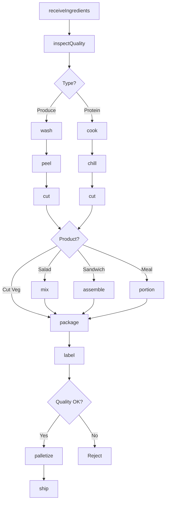
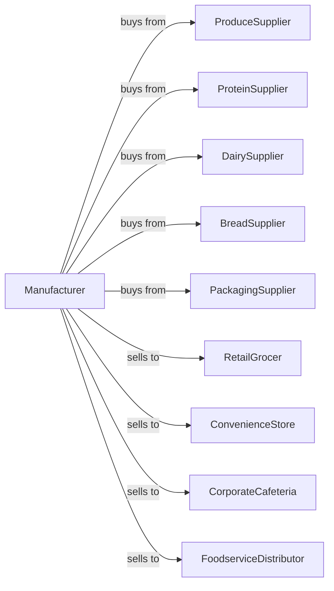

# Perishable Prepared Food Manufacturing

> Business-as-Code definition for perishable prepared food manufacturing. Models production of fresh salads, sandwiches, prepared meals, fresh pizza, and cut vegetables through assembly, packaging, and cold chain distribution.

## Overview

This U.S. industry comprises establishments primarily engaged in manufacturing perishable prepared foods, such as salads, sandwiches, prepared meals, fresh pizza, fresh pasta, and peeled or cut vegetables. This definition exposes actions for ingredient prep, assembly, packaging, and cold chain management.

## Actors

| Actor | Description |
|-------|-------------|
| ProduceSupplier | Provides fresh vegetables and fruits |
| ProteinSupplier | Supplies meats, poultry, and seafood |
| DairySupplier | Provides cheese, dressings, and dairy |
| BreadSupplier | Supplies breads and wraps |
| PackagingSupplier | Provides containers, films, and labels |
| RetailGrocer | Purchases grab-and-go items |
| ConvenienceStore | Stocks fresh prepared foods |
| CorporateCafeteria | Orders prepared meal components |
| FoodserviceDistributor | Distributes to multiple outlets |

## Roles

| Role | Description |
|------|-------------|
| PlantManager | Oversees daily production operations |
| ProductionSupervisor | Manages assembly line operations |
| PrepCook | Prepares ingredients and components |
| AssemblyOperator | Builds sandwiches and salads |
| PackagingOperator | Operates tray sealing equipment |
| QualityTechnician | Tests temperature and freshness |
| FoodSafetyManager | Ensures HACCP compliance |
| ColdChainManager | Monitors refrigerated storage and transport |

## Entities

| Entity | Description |
|--------|-------------|
| Ingredient | Raw component for prepared food |
| Salad | Fresh vegetable mix product |
| Sandwich | Assembled bread and filling product |
| PreparedMeal | Complete meal ready to heat |
| FreshPizza | Uncooked pizza ready to bake |
| CutVegetables | Peeled and portioned produce |
| FreshPasta | Refrigerated pasta product |
| Batch | Traceable production lot |
| UseByDate | Expiration for perishable product |
| ColdChain | Temperature-controlled distribution |

## Actions

| Action | Description |
|--------|-------------|
| receiveIngredients | Accept fresh ingredients |
| inspectQuality | Check freshness and temperature |
| wash | Clean produce thoroughly |
| peel | Remove skins from vegetables |
| cut | Portion ingredients to size |
| cook | Prepare proteins and components |
| chill | Rapidly cool cooked items |
| mix | Combine salad ingredients |
| assemble | Build sandwiches and meals |
| portion | Measure into serving sizes |
| package | Seal in modified atmosphere |
| label | Apply use-by dates |
| palletize | Stack for refrigerated storage |
| ship | Dispatch via cold chain |

## Events

| Event | Description |
|-------|-------------|
| ingredientsReceived | Fresh materials accepted |
| ingredientsInspected | Quality verified |
| produceWashed | Cleaning completed |
| ingredientsCut | Portioning completed |
| proteinCooked | Cooking completed |
| proteinChilled | Cooling completed |
| saladMixed | Salad assembled |
| productAssembled | Sandwich or meal built |
| productPackaged | Sealing completed |
| qualityApproved | Batch passed safety checks |
| orderShipped | Cold chain dispatch completed |

## Searches

| Search | Description |
|--------|-------------|
| getIngredients | Check fresh ingredient inventory |
| getProductionQueue | View assembly schedule |
| getInventory | Check finished goods stock |
| getOrders | Retrieve orders by customer |
| getExpiringStock | List products near use-by date |
| getTemperatureLog | View cold chain records |
| getRecipes | List product assembly specs |
| getShipmentStatus | Track outbound deliveries |

## Workflow



## Actor Relationships



## Usage

### Calling Actions

```typescript
import { manufacturePerishablePrepared } from '@headlessly/manufacture-perishable-prepared'

const plant = manufacturePerishablePrepared()

// Produce Caesar salad kits
const produce = await plant.receiveIngredients({
  supplier: 'fresh-farms',
  items: [
    { ingredient: 'romaine', quantity: 500, unit: 'pounds' },
    { ingredient: 'parmesan', quantity: 50, unit: 'pounds' },
    { ingredient: 'croutons', quantity: 100, unit: 'pounds' }
  ]
})

await plant.inspectQuality({
  batchId: produce.batchId,
  checks: ['temperature', 'freshness', 'visual']
})

await plant.wash({
  batchId: produce.batchId,
  method: 'triple-wash',
  sanitizer: 'chlorinated-water'
})

await plant.cut({
  batchId: produce.batchId,
  cutStyle: 'chopped',
  targetSize: 1,
  unit: 'inch'
})

await plant.mix({
  batchId: produce.batchId,
  recipe: 'caesar-salad-kit',
  components: ['romaine', 'parmesan', 'croutons']
})

await plant.package({
  batchId: produce.batchId,
  format: 'clamshell',
  atmosphere: 'modified',
  gasRatio: { o2: 3, co2: 7, n2: 90 }
})
```

### Event-Driven Automation

```typescript
// Auto-label with use-by date
plant.productPackaged(async ({ batchId, productType }) => {
  const shelfLife = getShelfLife(productType)

  await plant.label({
    batchId,
    useByDate: addDays(new Date(), shelfLife),
    lotCode: batchId
  })
})

// Auto-prioritize expiring inventory
plant.orderShipped(async () => {
  const expiring = await plant.getExpiringStock({
    withinDays: 2
  })

  if (expiring.length > 0) {
    await plant.alertSales({
      products: expiring,
      message: 'Products expiring soon - discount recommended'
    })
  }
})

// Temperature monitoring
plant.ingredientsReceived(async ({ batchId, temperature }) => {
  if (temperature > 41) {
    await plant.alertQuality({
      batchId,
      issue: `Temperature at ${temperature}F exceeds 41F limit`,
      action: 'evaluate-for-rejection'
    })
  }
})
```
