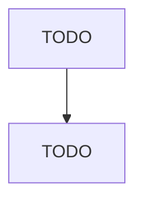

# All Other Miscellaneous Food Manufacturing

> TODO: Business-as-Code definition

## Overview

This U.S. industry comprises establishments primarily engaged in manufacturing food (except animal food; grain and oilseed milling; sugar and confectionery products; preserved fruits, vegetables, and specialties; dairy products; meat products; seafood products; bakeries and tortillas; snack foods; coffee and tea; flavoring syrups and concentrates; seasonings and dressings; and perishable prepared food). Included in this industry are establishments primarily engaged in mixing purchased dried and/

## Actors

| Actor | Description |
|-------|-------------|
| TODO | TODO |

## Roles

| Role | Description |
|------|-------------|
| TODO | TODO |

## Entities

| Entity | Description |
|--------|-------------|
| TODO | TODO |

## Actions

| Action | Description |
|--------|-------------|
| TODO | TODO |

## Events

| Event | Description |
|-------|-------------|
| TODO | TODO |

## Searches

| Search | Description |
|--------|-------------|
| TODO | TODO |

## Workflow

## Actor Relationships

