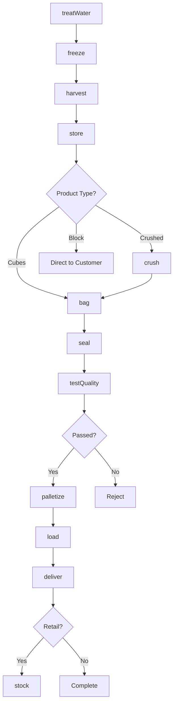
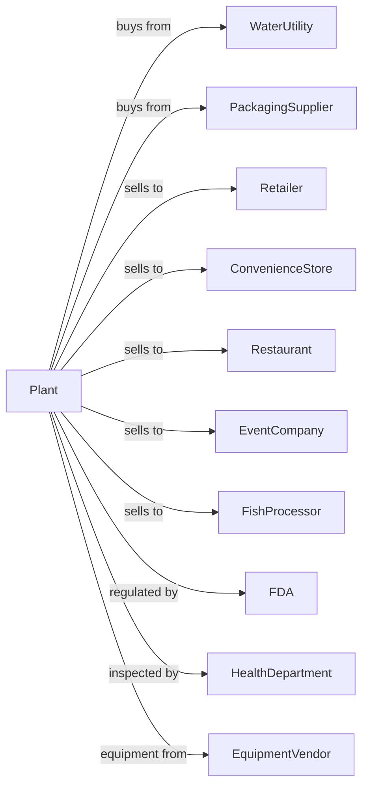

# Ice Manufacturing

> Business-as-Code definition for ice manufacturing operations. Models water purification, freezing, harvesting, and packaging of bagged ice, block ice, and specialty ice products for retail and foodservice markets.

## Overview

This U.S. industry comprises establishments primarily engaged in manufacturing ice. This definition exposes actions for water treatment, freezing, harvesting, crushing, bagging, and distribution of packaged ice products and bulk ice for industrial applications.

## Actors

| Actor | Description |
|-------|-------------|
| WaterUtility | Supplies municipal water for ice production |
| PackagingSupplier | Provides bags, twist ties, and packaging |
| Retailer | Operates ice merchandiser programs |
| ConvenienceStore | Sells bagged ice to consumers |
| Restaurant | Purchases ice for beverage service |
| EventCompany | Orders bulk ice for events and catering |
| FishProcessor | Uses ice for seafood preservation |
| FDA | Regulates food-grade ice production |
| HealthDepartment | Inspects ice plants for sanitation |
| EquipmentVendor | Supplies ice makers and packaging equipment |

## Roles

| Role | Description |
|------|-------------|
| PlantManager | Oversees ice production operations |
| QualityManager | Ensures ice safety and purity |
| FreezerOperator | Controls ice making equipment |
| BaggingOperator | Runs ice bagging lines |
| MaintenanceTech | Maintains refrigeration and equipment |
| RouteDriver | Delivers ice to retail accounts |
| WarehouseManager | Manages cold storage inventory |
| SalesManager | Manages customer accounts and orders |

## Entities

| Entity | Description |
|--------|-------------|
| TreatedWater | Purified water for ice production |
| CubeIce | Standard ice cubes for beverages |
| BlockIce | Large frozen blocks for cooling |
| CrushedIce | Broken ice pieces for displays and drinks |
| GourmetIce | Clear, slow-melting premium ice |
| BaggedIce | Consumer package of ice cubes |
| Batch | Traceable production lot |
| Freezer | Ice-making equipment |
| ColdStorage | Temperature-controlled warehouse |
| Merchandiser | Retail freezer for ice sales |

## Actions

| Action | Description |
|--------|-------------|
| treatWater | Filter and purify water for ice production |
| freeze | Convert water to ice in molds or plates |
| harvest | Release ice from freezing equipment |
| store | Hold ice in cold storage |
| crush | Break ice into smaller pieces |
| bag | Package ice into consumer bags |
| seal | Close and secure bags |
| palletize | Stack bagged ice for cold storage |
| load | Fill trucks with ice orders |
| deliver | Transport ice to customers |
| stock | Fill retail merchandisers |
| testQuality | Analyze ice for purity and clarity |
| sanitize | Clean equipment per food safety standards |
| maintain | Service refrigeration equipment |

## Events

| Event | Description |
|-------|-------------|
| waterTreated | Water purified for production |
| iceFrozen | Ice formed in freezer |
| iceHarvested | Ice released from equipment |
| iceStored | Ice placed in cold storage |
| iceCrushed | Ice broken into pieces |
| iceBagged | Ice packaged in bags |
| bagsSealed | Bags closed and secured |
| orderLoaded | Truck loaded with ice |
| orderDelivered | Ice delivered to customer |
| merchandiserStocked | Retail freezer filled |
| qualityApproved | Ice passed testing |
| qualityFailed | Ice failed testing |

## Searches

| Search | Description |
|--------|-------------|
| getInventory | Check ice stock by type and storage |
| findBatches | List batches by date or status |
| getOrders | Retrieve orders by customer or route |
| getRouteSchedule | View delivery routes and stops |
| getMerchandiserStatus | Check retail freezer inventory |
| getQualityReports | Retrieve test results |
| getEquipmentStatus | View freezer and equipment status |
| findCustomers | List customers by type or volume |

## Workflow



## Actor Relationships



## Usage

### Calling Actions

```typescript
import { brewIce } from '@headlessly/brew-ice'

const plant = brewIce()

// Treat water and produce ice
await plant.treatWater({
  source: 'municipal',
  filtration: 'carbon-uv',
  targetTDS: 30
})

const batch = await plant.freeze({
  freezerType: 'plate',
  cubeSize: 'standard',
  quantity: 5000,
  unit: 'pounds'
})

await plant.harvest({ batchId: batch.id })
await plant.store({
  batchId: batch.id,
  location: 'cold-storage-01',
  temperature: 10
})
```

### Event-Driven Automation

```typescript
// Auto-bag after harvest
plant.iceHarvested(async ({ batchId, iceType }) => {
  if (iceType === 'cube') {
    await plant.bag({
      batchId,
      bagSize: '10lb',
      quantity: 500
    })
  } else if (iceType === 'block') {
    await plant.store({ batchId })
  }
})

// Auto-route based on merchandiser levels
plant.merchandiserStocked(async ({ merchandiserId, fillLevel }) => {
  if (fillLevel < 30) {
    const route = await plant.getRouteSchedule({
      merchandiserId,
      nextDelivery: true
    })

    await plant.prioritizeStop({
      routeId: route.id,
      merchandiserId,
      priority: 'high'
    })
  }
})
```
