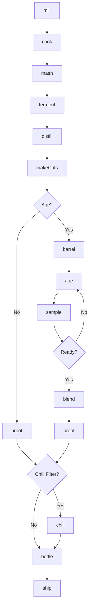
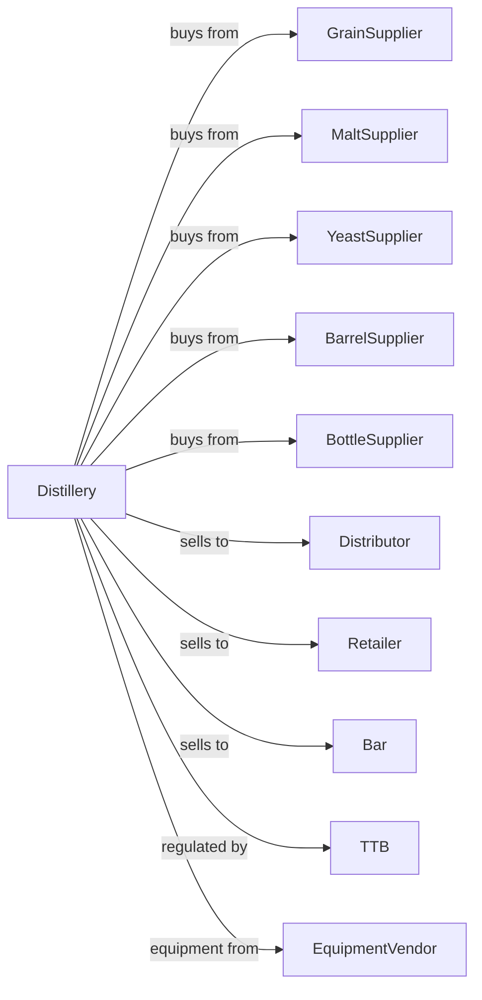

# Distilleries

> Business-as-Code definition for distillery operations. Models spirits production from mashing through fermentation, distillation, aging, and bottling of whiskey, vodka, gin, rum, and other liquors.

## Overview

This industry comprises establishments primarily engaged in distilling potable liquors (except brandies), distilling and blending liquors, and blending and mixing liquors and other ingredients. This definition exposes actions for mashing, fermenting, distilling, aging, blending, and bottling spirits.

## Actors

| Actor | Description |
|-------|-------------|
| GrainSupplier | Provides corn, rye, barley, and wheat |
| MaltSupplier | Supplies malted barley for enzymes |
| YeastSupplier | Provides distilling yeast strains |
| BarrelSupplier | Provides new and used oak barrels |
| BottleSupplier | Supplies bottles, closures, and packaging |
| Distributor | Warehouses and delivers to retailers |
| Retailer | Sells spirits to consumers |
| Bar | Purchases spirits for cocktails |
| TTB | Regulates spirits production and taxation |
| EquipmentVendor | Supplies stills and equipment |

## Roles

| Role | Description |
|------|-------------|
| MasterDistiller | Creates recipes and oversees production |
| HeadDistiller | Manages daily distillation operations |
| MashOperator | Controls grain cooking and fermentation |
| StillOperator | Runs stills and makes cuts |
| WarehouseManager | Manages barrel aging inventory |
| BlendingSpecialist | Creates consistent blended products |
| BottlingOperator | Runs packaging lines |
| ComplianceManager | Handles TTB reporting and bonded warehouse |

## Entities

| Entity | Description |
|--------|-------------|
| Mash | Cooked grain mixture for fermentation |
| Wash | Fermented mash ready for distillation |
| Distillate | Spirit collected from still |
| Heads | First fraction of distillation run |
| Hearts | Desirable middle fraction for aging |
| Tails | Last fraction with fusel alcohols |
| Barrel | Oak vessel for aging spirits |
| Spirit | Aged or unaged distilled alcohol |
| Batch | Traceable production lot |
| Mashbill | Grain recipe for specific spirit |

## Actions

| Action | Description |
|--------|-------------|
| mill | Grind grain for mashing |
| cook | Heat grain with water to convert starches |
| mash | Combine cooked grain with malt for enzymes |
| ferment | Convert sugars to alcohol with yeast |
| distill | Heat wash and collect alcohol vapor |
| makeCuts | Separate heads, hearts, and tails |
| barrel | Fill oak barrels with distillate |
| age | Store barrels in warehouse |
| sample | Test aging spirits for quality |
| blend | Combine barrels for consistency |
| proof | Dilute to target alcohol percentage |
| chill | Cold filter to remove haze |
| bottle | Fill, seal, and label bottles |
| ship | Dispatch to distributors and accounts |

## Events

| Event | Description |
|-------|-------------|
| grainMilled | Grain ground for cooking |
| mashCooked | Grain cooked and ready |
| fermentationComplete | Wash ready for distillation |
| distillationComplete | Spirit collected |
| cutsComplete | Hearts separated from heads and tails |
| barrelFilled | Spirit placed in barrel |
| barrelSampled | Aging progress evaluated |
| blendApproved | Final blend selected |
| spiritProofed | Alcohol adjusted to target |
| spiritBottled | Product packaged |
| qualityApproved | Spirit passed evaluation |
| orderShipped | Product dispatched |

## Searches

| Search | Description |
|--------|-------------|
| findBatches | List batches by mashbill, date, or status |
| getBarrelInventory | Check barrel locations and ages |
| getWarehouseMap | View barrel positions in rickhouse |
| getFermentationStatus | Monitor active fermentations |
| getBlends | Retrieve blend recipes and components |
| getInventory | Check bottled spirits stock |
| getOrders | Retrieve orders by customer or date |
| getProofData | View alcohol content by batch |

## Workflow



## Actor Relationships



## Usage

### Calling Actions

```typescript
import { brewDistilleries } from '@headlessly/brew-distilleries'

const distillery = brewDistilleries()

// Start a bourbon batch
const batch = await distillery.mill({
  mashbill: 'bourbon-standard',
  grains: [
    { type: 'corn', percentage: 75 },
    { type: 'rye', percentage: 13 },
    { type: 'malted-barley', percentage: 12 }
  ],
  quantity: 2000,
  unit: 'pounds'
})

await distillery.cook({
  batchId: batch.id,
  temperature: 200,
  duration: 90
})

await distillery.mash({
  batchId: batch.id,
  mashTemp: 148,
  duration: 60
})

await distillery.ferment({
  batchId: batch.id,
  yeast: 'bourbon-strain-7',
  duration: 72
})
```

### Event-Driven Automation

```typescript
// Auto-distill when fermentation complete
distillery.fermentationComplete(async ({ batchId, abv }) => {
  await distillery.distill({
    batchId,
    stillType: 'pot',
    runs: 2
  })
})

// Auto-barrel after cuts
distillery.cutsComplete(async ({ batchId, heartsVolume, proof }) => {
  await distillery.barrel({
    batchId,
    barrelType: 'new-american-oak',
    charLevel: 4,
    entryProof: Math.min(proof, 125)
  })
})

// Sample aging barrels periodically
distillery.barrelFilled(async ({ barrelId, fillDate }) => {
  // Schedule sampling at 2, 4, and 6 years
  for (const years of [2, 4, 6]) {
    await distillery.scheduleSample({
      barrelId,
      sampleDate: addYears(fillDate, years)
    })
  }
})
```
