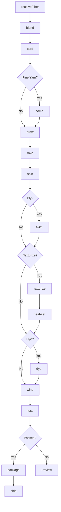
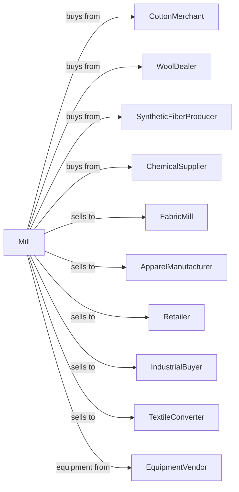

# Fiber, Yarn, and Thread Mills

> Business-as-Code definition for fiber, yarn, and thread manufacturing operations. Models spinning, texturizing, twisting, and winding of natural and synthetic fibers into yarns and threads for textile production.

## Overview

This industry comprises establishments primarily engaged in spinning yarn, manufacturing thread of any fiber, texturizing, throwing, twisting, and winding purchased yarn or manmade fibers and filaments, and producing hemp yarn and further processing into rope or bags. This definition exposes actions for fiber preparation, spinning, twisting, texturizing, and packaging.

## Actors

| Actor | Description |
|-------|-------------|
| CottonMerchant | Supplies raw cotton fiber |
| WoolDealer | Provides wool and animal fibers |
| SyntheticFiberProducer | Supplies polyester, nylon, and acrylic fibers |
| ChemicalSupplier | Provides dyes, lubricants, and processing chemicals |
| FabricMill | Purchases yarn for weaving and knitting |
| ApparelManufacturer | Uses yarn for direct-to-garment production |
| Retailer | Sells yarn to craft consumers |
| IndustrialBuyer | Uses thread for automotive and industrial applications |
| TextileConverter | Purchases yarn for further processing |
| EquipmentVendor | Supplies spinning and winding equipment |

## Roles

| Role | Description |
|------|-------------|
| MillManager | Oversees yarn production operations |
| QualityManager | Ensures yarn meets specifications |
| SpinningOperator | Controls spinning frames and equipment |
| WindingOperator | Runs winding and packaging machines |
| MaintenanceTech | Maintains spinning and twisting equipment |
| ColorTechnician | Manages dye formulation and matching |
| ProductionPlanner | Schedules production runs |
| WarehouseManager | Manages inventory and shipping |

## Entities

| Entity | Description |
|--------|-------------|
| Fiber | Raw material for yarn production |
| Roving | Prepared fiber strand before spinning |
| Yarn | Spun fiber strand of specific count |
| Thread | Fine yarn for sewing applications |
| Cone | Package of wound yarn |
| Spool | Small package of thread |
| Count | Yarn thickness measurement |
| Ply | Number of strands twisted together |
| Lot | Traceable production batch |
| Specification | Customer requirements for yarn properties |

## Actions

| Action | Description |
|--------|-------------|
| receiveFiber | Accept and test incoming fiber shipments |
| blend | Combine fibers for desired properties |
| card | Align and clean fibers |
| comb | Remove short fibers for finer yarn |
| draw | Elongate and parallelize fiber strands |
| rove | Create preliminary strand for spinning |
| spin | Twist fibers into yarn |
| twist | Combine multiple strands |
| texturize | Add bulk or stretch to synthetic yarn |
| heat-set | Stabilize yarn shape with heat |
| wind | Transfer yarn to cones or spools |
| dye | Apply color to yarn |
| test | Analyze strength, count, and quality |
| package | Prepare yarn for shipment |

## Events

| Event | Description |
|-------|-------------|
| fiberReceived | Fiber shipment tested and accepted |
| fiberBlended | Fibers combined to specification |
| fiberCarded | Fibers aligned and cleaned |
| rovingProduced | Preliminary strand created |
| yarnSpun | Yarn produced at target count |
| yarnTwisted | Plied yarn created |
| yarnTexturized | Bulk or stretch added |
| yarnDyed | Color applied to yarn |
| yarnWound | Yarn packaged on cones |
| qualityApproved | Yarn passed testing |
| qualityFailed | Yarn failed specifications |
| orderShipped | Yarn dispatched to customer |

## Searches

| Search | Description |
|--------|-------------|
| findFiberLots | List fiber inventory by type and grade |
| getYarnInventory | Check yarn stock by count and color |
| getOrders | Retrieve orders by customer or specification |
| getProductionSchedule | View spinning and winding schedule |
| getQualityReports | Retrieve test results by lot |
| findSpecifications | List yarn specifications by customer |
| getMachineStatus | View equipment availability |
| getDyeLots | Track color consistency across batches |

## Workflow



## Actor Relationships



## Usage

### Calling Actions

```typescript
import { millFiber } from '@headlessly/mill-fiber'

const mill = millFiber()

// Receive and blend fibers
const fiber = await mill.receiveFiber({
  type: 'cotton',
  grade: 'strict-middling',
  quantity: 10000,
  unit: 'pounds',
  stapleLength: 1.125
})

await mill.blend({
  components: [
    { lotId: fiber.lotId, percentage: 65 },
    { type: 'polyester', percentage: 35 }
  ]
})

// Spin yarn
await mill.card({ batchId: fiber.batchId })
await mill.draw({ batchId: fiber.batchId, drafting: 6 })
await mill.rove({ batchId: fiber.batchId })

const yarn = await mill.spin({
  batchId: fiber.batchId,
  targetCount: 30,
  twist: 18,
  direction: 'Z'
})
```

### Event-Driven Automation

```typescript
// Auto-twist for plied yarn orders
mill.yarnSpun(async ({ lotId, count }) => {
  const orders = await mill.getOrders({
    count,
    ply: 2,
    status: 'pending'
  })

  if (orders.length > 0) {
    await mill.twist({
      lotId,
      ply: 2,
      twistDirection: 'S'
    })
  }
})

// Auto-wind when dyed
mill.yarnDyed(async ({ lotId, color }) => {
  await mill.wind({
    lotId,
    packageType: 'cone',
    weight: 2.0
  })
})
```
