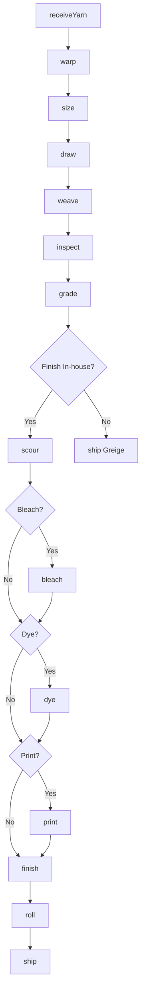
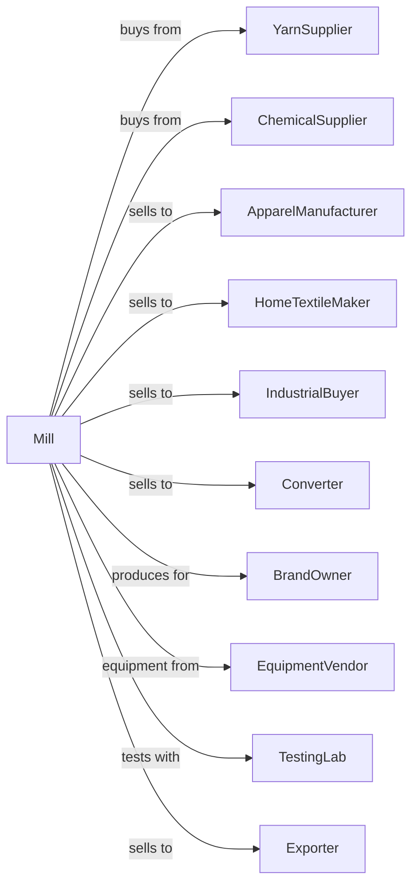

# Broadwoven Fabric Mills

> Business-as-Code definition for broadwoven fabric manufacturing operations. Models weaving of cotton, synthetic, and blended fabrics for apparel, home textiles, and industrial applications.

## Overview

This industry comprises establishments primarily engaged in weaving broadwoven fabrics and felts (except tire fabrics and rugs). Establishments in this industry may weave only, weave and finish, or weave, finish, and further fabricate fabric products. This definition exposes actions for warping, weaving, inspecting, and finishing broadwoven textiles.

## Actors

| Actor | Description |
|-------|-------------|
| YarnSupplier | Provides warp and weft yarns |
| ChemicalSupplier | Supplies sizing, dyes, and finishing agents |
| ApparelManufacturer | Purchases fabric for clothing production |
| HomeTextileMaker | Uses fabric for sheets, towels, and furnishings |
| IndustrialBuyer | Purchases technical and industrial fabrics |
| Converter | Buys greige fabric for finishing elsewhere |
| BrandOwner | Specifies fabric for private label products |
| EquipmentVendor | Supplies looms and weaving equipment |
| TestingLab | Provides fabric testing and certification |
| Exporter | Ships fabric to international markets |

## Roles

| Role | Description |
|------|-------------|
| MillManager | Oversees weaving operations |
| WeavingMaster | Manages loom setup and production |
| QualityManager | Ensures fabric meets specifications |
| WarpingOperator | Prepares warp beams for weaving |
| LoomOperator | Monitors and maintains weaving machines |
| InspectorGrader | Examines fabric for defects |
| FinishingOperator | Runs finishing equipment |
| ProductionPlanner | Schedules weaving runs |

## Entities

| Entity | Description |
|--------|-------------|
| Warp | Lengthwise yarns on loom |
| Weft | Crosswise yarns inserted during weaving |
| Beam | Spool holding warp yarns |
| Pattern | Weave structure and design |
| Greige | Unfinished fabric from loom |
| Fabric | Finished woven textile |
| Bolt | Roll of finished fabric |
| Defect | Flaw in fabric requiring grading |
| Specification | Customer requirements for fabric |
| Lot | Traceable production batch |

## Actions

| Action | Description |
|--------|-------------|
| receiveYarn | Accept and test incoming yarn |
| warp | Wind yarn onto warp beam |
| size | Apply sizing for weaving strength |
| draw | Thread warp through heddles |
| weave | Interlace warp and weft on loom |
| inspect | Check fabric for defects |
| grade | Classify fabric by quality level |
| scour | Remove sizing and impurities |
| bleach | Whiten fabric for dyeing |
| dye | Apply color to fabric |
| print | Add patterns with printing |
| finish | Apply final treatments |
| roll | Wind fabric onto bolts |
| ship | Dispatch to customers |

## Events

| Event | Description |
|-------|-------------|
| yarnReceived | Yarn shipment tested and accepted |
| warpPrepared | Warp beam ready for loom |
| fabricWoven | Greige fabric produced |
| fabricInspected | Defects identified and graded |
| fabricScoured | Sizing and impurities removed |
| fabricBleached | Fabric whitened |
| fabricDyed | Color applied |
| fabricPrinted | Pattern printed |
| fabricFinished | Final treatments applied |
| fabricRolled | Fabric wound onto bolts |
| qualityApproved | Fabric passed specifications |
| orderShipped | Fabric dispatched to customer |

## Searches

| Search | Description |
|--------|-------------|
| findYarnLots | List yarn inventory by type and color |
| getFabricInventory | Check fabric stock by style and grade |
| getOrders | Retrieve orders by customer or style |
| getLoomSchedule | View weaving machine assignments |
| getDefectReports | Retrieve inspection data by lot |
| getSpecifications | List fabric specifications |
| getProductionYields | View first-quality percentage |
| findPatterns | List available weave patterns |

## Workflow



## Actor Relationships



## Usage

### Calling Actions

```typescript
import { weaveBroadwovenFabric } from '@headlessly/weave-broadwoven-fabric'

const mill = weaveBroadwovenFabric()

// Prepare warp
const warp = await mill.warp({
  yarn: 'cotton-30s',
  endsPerInch: 80,
  width: 120,
  length: 5000,
  unit: 'yards'
})

await mill.size({
  beamId: warp.beamId,
  sizing: 'starch',
  addOn: 12
})

await mill.draw({
  beamId: warp.beamId,
  pattern: 'plain-weave',
  harnesses: 4
})

// Weave fabric
const fabric = await mill.weave({
  warpBeam: warp.beamId,
  weftYarn: 'cotton-30s',
  picksPerInch: 68,
  loom: 'airjet-12'
})
```

### Event-Driven Automation

```typescript
// Auto-inspect after weaving
mill.fabricWoven(async ({ lotId, style }) => {
  await mill.inspect({
    lotId,
    method: 'four-point',
    samplingRate: 10
  })
})

// Route based on customer specification
mill.fabricInspected(async ({ lotId, grade, defectsPerYard }) => {
  const orders = await mill.getOrders({ lotId })
  const spec = await mill.getSpecifications({ customerId: orders[0].customerId })

  if (spec.finishingRequired) {
    await mill.scour({ lotId })

    if (spec.color !== 'natural') {
      await mill.dye({
        lotId,
        color: spec.color,
        method: 'continuous'
      })
    }
  }
})
```
