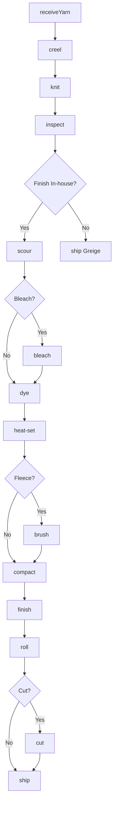
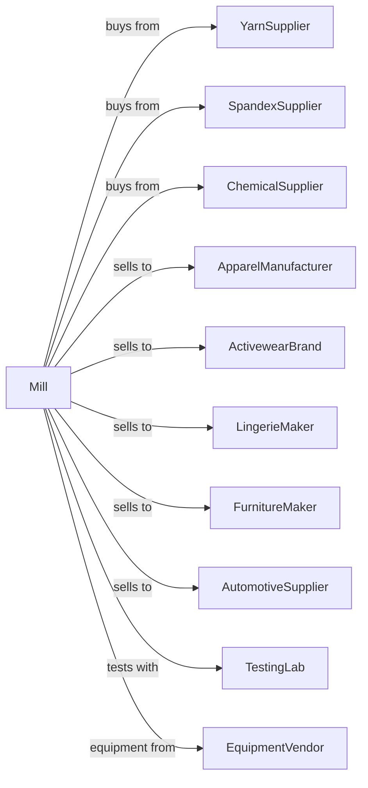

# Knit Fabric Mills

> Business-as-Code definition for knit fabric manufacturing operations. Models circular and warp knitting of jersey, interlock, rib, and specialty fabrics for apparel and industrial applications.

## Overview

This industry comprises establishments primarily engaged in knitting weft (circular) and warp (flat) fabric, knitting and finishing weft and warp fabric, manufacturing lace, or manufacturing, dyeing, and finishing lace and lace goods. This definition exposes actions for circular knitting, warp knitting, dyeing, and finishing.

## Actors

| Actor | Description |
|-------|-------------|
| YarnSupplier | Provides cotton, synthetic, and blended yarns |
| SpandexSupplier | Supplies stretch yarns and fibers |
| ChemicalSupplier | Provides dyes, finishes, and softeners |
| ApparelManufacturer | Purchases fabric for clothing production |
| ActivewearBrand | Uses performance knits for athletic apparel |
| LingerieMaker | Purchases stretch fabrics and lace |
| FurnitureMaker | Uses knit fabrics for upholstery |
| AutomotiveSupplier | Purchases knit materials for interiors |
| TestingLab | Provides fabric testing and certification |
| EquipmentVendor | Supplies knitting machines |

## Roles

| Role | Description |
|------|-------------|
| MillManager | Oversees knitting operations |
| KnittingMaster | Manages machine setup and production |
| QualityManager | Ensures fabric specifications |
| CircularKnitOperator | Runs circular knitting machines |
| WarpKnitOperator | Operates warp knitting equipment |
| DyeHouseManager | Oversees dyeing and finishing |
| LabTechnician | Tests fabric properties |
| PatternProgrammer | Develops knitting programs |

## Entities

| Entity | Description |
|--------|-------------|
| Jersey | Single knit fabric |
| Interlock | Double knit stable fabric |
| Rib | Stretch fabric with vertical lines |
| Fleece | Brushed or raised knit fabric |
| Tricot | Warp knit fabric for linings |
| Lace | Openwork decorative knit |
| Greige | Unfinished fabric from machine |
| Roll | Package of finished fabric |
| Specification | Customer requirements |
| Lot | Traceable production batch |

## Actions

| Action | Description |
|--------|-------------|
| receiveYarn | Accept and test incoming yarn |
| creel | Load yarn onto knitting machine |
| knit | Produce fabric on knitting machine |
| inspect | Check for defects and quality |
| scour | Remove oils and impurities |
| bleach | Whiten fabric for dyeing |
| dye | Apply color to fabric |
| heat-set | Stabilize fabric dimensions |
| brush | Raise surface for fleece |
| compact | Reduce shrinkage potential |
| finish | Apply final treatments |
| roll | Wind onto rolls for shipment |
| cut | Slit to customer widths |
| ship | Dispatch to customers |

## Events

| Event | Description |
|-------|-------------|
| yarnReceived | Yarn tested and accepted |
| machineCreeled | Machine loaded and ready |
| fabricKnit | Greige fabric produced |
| fabricInspected | Quality checked |
| fabricScoured | Impurities removed |
| fabricDyed | Color applied |
| fabricHeatSet | Dimensions stabilized |
| fabricBrushed | Surface raised |
| fabricFinished | Final treatments applied |
| qualityApproved | Fabric passed testing |
| qualityFailed | Fabric failed specifications |
| orderShipped | Fabric dispatched to customer |

## Searches

| Search | Description |
|--------|-------------|
| findYarnLots | List yarn inventory by type |
| getInventory | Check fabric stock by style |
| getOrders | Retrieve orders by customer |
| getMachineSchedule | View knitting machine assignments |
| getPatterns | List knitting patterns |
| getDyeSchedule | View dye house schedule |
| getQualityReports | Retrieve test results |
| getProductionSchedule | View planned production |

## Workflow



## Actor Relationships



## Usage

### Calling Actions

```typescript
import { weaveKnitFabric } from '@headlessly/weave-knit-fabric'

const mill = weaveKnitFabric()

// Set up circular knit jersey
await mill.creel({
  machine: 'circular-28',
  yarns: [
    { position: 'main', yarn: 'cotton-30s' },
    { position: 'plating', yarn: 'spandex-40d' }
  ]
})

const fabric = await mill.knit({
  machineId: 'circular-28',
  pattern: 'single-jersey',
  gauge: 28,
  width: 60,
  unit: 'inches'
})

// Dye and finish
await mill.scour({ lotId: fabric.lotId })
await mill.dye({
  lotId: fabric.lotId,
  color: 'navy-301',
  method: 'jet-dye'
})
```

### Event-Driven Automation

```typescript
// Auto-process based on fabric type
mill.fabricKnit(async ({ lotId, fabricType }) => {
  await mill.inspect({
    lotId,
    method: 'light-box',
    samplingRate: 10
  })

  if (fabricType === 'fleece') {
    await mill.scour({ lotId })
    await mill.brush({
      lotId,
      sides: 1,
      passes: 2
    })
  }
})

// Match to customer orders after finishing
mill.fabricFinished(async ({ lotId, color, weight }) => {
  const orders = await mill.getOrders({
    color,
    weight,
    status: 'pending'
  })

  if (orders.length > 0) {
    await mill.roll({
      lotId,
      rollSize: orders[0].rollSize
    })
  }
})
```
