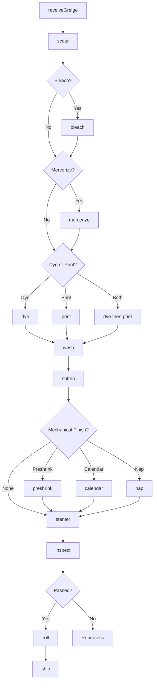
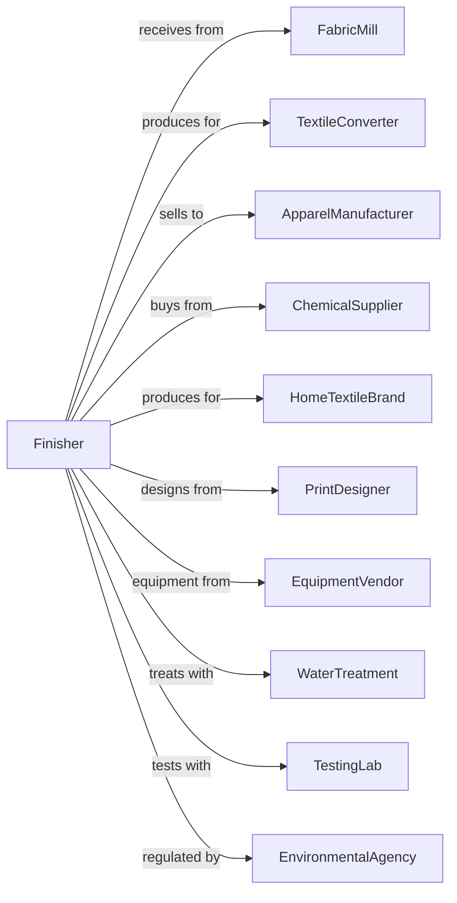

# Textile and Fabric Finishing Mills

> Business-as-Code definition for textile and fabric finishing operations. Models dyeing, printing, bleaching, and mechanical finishing services for woven, knit, and nonwoven fabrics.

## Overview

This industry comprises establishments primarily engaged in finishing textiles, fabrics, and apparel, and establishments of converters who buy fabric goods in the grey, have them finished on contract, and sell at wholesale. Finishing operations include bleaching, dyeing, printing, stonewashing, and other mechanical finishing. This definition exposes actions for scouring, dyeing, printing, and various finishing treatments.

## Actors

| Actor | Description |
|-------|-------------|
| FabricMill | Supplies greige fabric for finishing |
| TextileConverter | Contracts finishing and sells finished goods |
| ApparelManufacturer | Purchases finished fabric |
| ChemicalSupplier | Provides dyes, finishes, and chemicals |
| HomeTextileBrand | Specifies finishing for linens and towels |
| PrintDesigner | Creates print patterns and colorways |
| EquipmentVendor | Supplies finishing equipment |
| WaterTreatment | Manages wastewater processing |
| TestingLab | Provides colorfastness and quality testing |
| EnvironmentalAgency | Regulates discharge and emissions |

## Roles

| Role | Description |
|------|-------------|
| PlantManager | Oversees finishing operations |
| DyeHouseManager | Manages dyeing department |
| PrintManager | Oversees printing operations |
| ColorTechnician | Develops and matches colors |
| DyeingOperator | Runs dyeing equipment |
| PrintingOperator | Operates printing machines |
| FinishingOperator | Runs mechanical finishing equipment |
| QualityManager | Ensures specifications are met |
| LabTechnician | Tests color and performance |

## Entities

| Entity | Description |
|--------|-------------|
| GreigeFabric | Unfinished fabric for processing |
| DyeLot | Batch of fabric dyed together |
| ColorStandard | Reference for color matching |
| PrintScreen | Pattern for rotary or flat printing |
| Finish | Surface treatment or coating |
| Recipe | Formula for dye or finish application |
| Batch | Traceable production lot |
| Specification | Customer requirements |
| Swatch | Sample for approval |
| WasteStream | Effluent from processing |

## Actions

| Action | Description |
|--------|-------------|
| receiveGreige | Accept and inventory incoming fabric |
| scour | Remove sizing, oils, and impurities |
| bleach | Whiten fabric for consistent dyeing |
| mercerize | Treat cotton for luster and strength |
| dye | Apply color using various methods |
| print | Apply patterns using screen or digital |
| wash | Remove excess dye and chemicals |
| soften | Apply softening agents |
| preshrink | Reduce fabric shrinkage |
| calendar | Smooth and add sheen |
| nap | Raise fiber surface |
| stenter | Set width and heat-set fabric |
| inspect | Check color and quality |
| roll | Package finished fabric |

## Events

| Event | Description |
|-------|-------------|
| greigeReceived | Fabric received and inventoried |
| fabricScoured | Impurities removed |
| fabricBleached | Fabric whitened |
| fabricMercerized | Treatment applied |
| fabricDyed | Color applied |
| fabricPrinted | Pattern printed |
| fabricWashed | Excess chemicals removed |
| fabricSoftened | Softener applied |
| fabricPreshrunk | Shrinkage reduced |
| qualityApproved | Fabric passed inspection |
| qualityFailed | Fabric failed specifications |
| orderShipped | Fabric dispatched to customer |

## Searches

| Search | Description |
|--------|-------------|
| findGreigeLots | List incoming fabric inventory |
| getInventory | Check finished fabric stock |
| getOrders | Retrieve orders by customer |
| getDyeSchedule | View dyeing machine assignments |
| getPrintSchedule | View printing schedule |
| getColorRecipes | Retrieve dye formulas |
| getQualityReports | Retrieve test results |
| getWaterUsage | Monitor water and chemical consumption |

## Workflow



## Actor Relationships



## Usage

### Calling Actions

```typescript
import { finishTextileFabric } from '@headlessly/finish-textile-fabric'

const finisher = finishTextileFabric()

// Receive greige fabric
const fabric = await finisher.receiveGreige({
  source: 'mill-xyz',
  style: 'cotton-poplin',
  quantity: 5000,
  unit: 'yards'
})

// Prep and dye
await finisher.scour({ lotId: fabric.lotId })
await finisher.bleach({
  lotId: fabric.lotId,
  targetWhiteness: 80
})

await finisher.dye({
  lotId: fabric.lotId,
  color: 'royal-blue-142',
  method: 'jet',
  temperature: 130
})

await finisher.wash({ lotId: fabric.lotId })
await finisher.soften({ lotId: fabric.lotId, hand: 'medium' })
```

### Event-Driven Automation

```typescript
// Auto-process based on customer specification
finisher.greigeReceived(async ({ lotId, orderId }) => {
  const spec = await finisher.getSpecifications({ orderId })

  await finisher.scour({ lotId })

  if (spec.requiresBleach) {
    await finisher.bleach({ lotId })
  }

  if (spec.process === 'dyed') {
    await finisher.dye({
      lotId,
      color: spec.color,
      method: spec.dyeMethod
    })
  } else if (spec.process === 'printed') {
    await finisher.print({
      lotId,
      design: spec.printDesign,
      method: spec.printMethod
    })
  }
})

// Trigger reprocessing on quality failure
finisher.qualityFailed(async ({ lotId, failureReason }) => {
  if (failureReason === 'color-off-shade') {
    await finisher.dye({
      lotId,
      method: 'shade-adjust',
      correction: 'darker'
    })
  }
})
```
