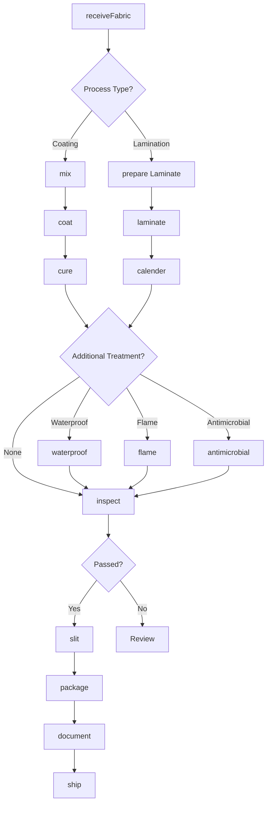
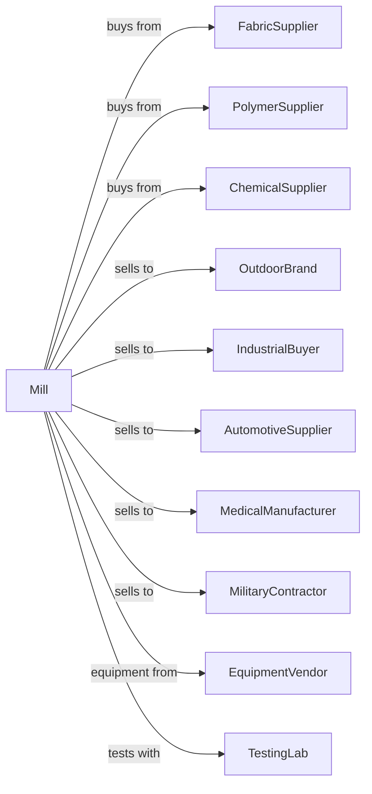

# Fabric Coating Mills

> Business-as-Code definition for fabric coating operations. Models laminating, coating, and treating fabrics with polymers, rubber, and specialty materials for waterproofing, flame resistance, and technical applications.

## Overview

This industry comprises establishments primarily engaged in coating, laminating, varnishing, waxing, and rubberizing textiles and apparel. This definition exposes actions for applying coatings, laminates, and functional treatments to fabrics for various technical and consumer applications.

## Actors

| Actor | Description |
|-------|-------------|
| FabricSupplier | Provides base fabrics for coating |
| PolymerSupplier | Supplies coating resins and adhesives |
| ChemicalSupplier | Provides specialty chemicals and additives |
| OutdoorBrand | Purchases waterproof and breathable fabrics |
| IndustrialBuyer | Uses coated fabrics for tarps and covers |
| AutomotiveSupplier | Purchases coated materials for interiors |
| MedicalManufacturer | Uses antimicrobial and barrier fabrics |
| MilitaryContractor | Specifies tactical and protective fabrics |
| EquipmentVendor | Supplies coating and laminating equipment |
| TestingLab | Provides performance testing |

## Roles

| Role | Description |
|------|-------------|
| PlantManager | Oversees coating operations |
| ProcessEngineer | Develops coating formulations and processes |
| QualityManager | Ensures product specifications |
| CoatingOperator | Runs knife-over-roll and other coaters |
| LaminatingOperator | Operates lamination equipment |
| MixingOperator | Prepares coating formulations |
| CuringOperator | Controls drying and curing ovens |
| LabTechnician | Tests coating performance |

## Entities

| Entity | Description |
|--------|-------------|
| Substrate | Base fabric for coating |
| Coating | Polymer or chemical layer applied |
| Laminate | Bonded multi-layer construction |
| Membrane | Breathable waterproof film |
| Adhesive | Bonding agent for lamination |
| Formulation | Recipe for coating mixture |
| Roll | Coated or laminated fabric roll |
| Specification | Performance requirements |
| Batch | Traceable production lot |
| TestResult | Performance test data |

## Actions

| Action | Description |
|--------|-------------|
| receiveFabric | Accept and inspect base fabric |
| mix | Prepare coating formulation |
| coat | Apply coating to fabric surface |
| laminate | Bond film or membrane to fabric |
| calender | Apply pressure and heat for bonding |
| cure | Dry and crosslink coating |
| flame | Apply flame-retardant treatment |
| waterproof | Apply water-repellent finish |
| antimicrobial | Apply antimicrobial treatment |
| slit | Cut to specified widths |
| inspect | Test performance properties |
| package | Prepare rolls for shipment |
| document | Record batch data and test results |
| ship | Dispatch to customers |

## Events

| Event | Description |
|-------|-------------|
| fabricReceived | Base fabric inspected and accepted |
| formulationMixed | Coating prepared |
| coatingApplied | Coating layer added |
| laminateCompleted | Layers bonded |
| coatingCured | Drying and crosslinking complete |
| treatmentApplied | Specialty finish added |
| fabricSlit | Rolls cut to width |
| qualityApproved | Product passed testing |
| qualityFailed | Product failed specifications |
| batchDocumented | Records completed |
| orderShipped | Product dispatched |

## Searches

| Search | Description |
|--------|-------------|
| findSubstrates | List base fabric inventory |
| getInventory | Check coated fabric stock |
| getFormulations | Retrieve coating recipes |
| getOrders | Retrieve orders by customer |
| getLineSchedule | View coating line assignments |
| getTestResults | Retrieve performance data |
| getMaterialSafety | Access SDS for chemicals |
| getProductionSchedule | View planned runs |

## Workflow



## Actor Relationships



## Usage

### Calling Actions

```typescript
import { finishFabricCoating } from '@headlessly/finish-fabric-coating'

const coater = finishFabricCoating()

// Receive base fabric
const fabric = await coater.receiveFabric({
  type: 'nylon-ripstop',
  weight: 70,
  unit: 'gsm',
  quantity: 10000,
  unitLength: 'meters'
})

// Prepare and apply PU coating
const formulation = await coater.mix({
  base: 'polyurethane',
  additives: ['hydrolysis-stabilizer', 'uv-stabilizer'],
  solids: 45
})

await coater.coat({
  substrateId: fabric.lotId,
  formulationId: formulation.id,
  coatWeight: 30,
  method: 'knife-over-roll'
})

await coater.cure({
  lotId: fabric.lotId,
  temperature: 150,
  duration: 2,
  unit: 'minutes'
})
```

### Event-Driven Automation

```typescript
// Auto-apply treatments based on specification
coater.coatingCured(async ({ lotId, orderId }) => {
  const spec = await coater.getSpecifications({ orderId })

  if (spec.waterproofRating) {
    await coater.waterproof({
      lotId,
      targetRating: spec.waterproofRating,
      method: 'DWR'
    })
  }

  if (spec.flameRetardant) {
    await coater.flame({
      lotId,
      standard: spec.flameStandard
    })
  }
})

// Document and ship when quality approved
coater.qualityApproved(async ({ lotId, testResults }) => {
  await coater.document({
    lotId,
    testResults,
    certificates: ['waterproof', 'flame-test']
  })

  const orders = await coater.getOrders({ lotId })

  await coater.slit({
    lotId,
    widths: orders[0].rollWidths
  })
})
```
