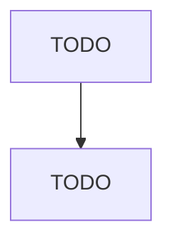

# Carpet and Rug Mills

> TODO: Business-as-Code definition

## Overview

This industry comprises establishments primarily engaged in (1) manufacturing woven, tufted, and other carpets and rugs, such as art squares, floor mattings, needlepunch carpeting, and door mats and mattings, from textile materials or from twisted paper, grasses, reeds, sisal, jute, or rags and/or (2) finishing carpets and rugs.

## Actors

| Actor | Description |
|-------|-------------|
| TODO | TODO |

## Roles

| Role | Description |
|------|-------------|
| TODO | TODO |

## Entities

| Entity | Description |
|--------|-------------|
| TODO | TODO |

## Actions

| Action | Description |
|--------|-------------|
| TODO | TODO |

## Events

| Event | Description |
|-------|-------------|
| TODO | TODO |

## Searches

| Search | Description |
|--------|-------------|
| TODO | TODO |

## Workflow

## Actor Relationships

