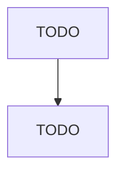

# Curtain and Linen Mills

> TODO: Business-as-Code definition

## Overview

This industry comprises establishments primarily engaged in manufacturing household textile products, such as curtains, draperies, linens, bedspreads, sheets, tablecloths, towels, and shower curtains, from purchased materials. The household textile products may be made on a stock or custom basis for sale to individual retail customers. Cross-References. Establishments primarily engaged in--

## Actors

| Actor | Description |
|-------|-------------|
| TODO | TODO |

## Roles

| Role | Description |
|------|-------------|
| TODO | TODO |

## Entities

| Entity | Description |
|--------|-------------|
| TODO | TODO |

## Actions

| Action | Description |
|--------|-------------|
| TODO | TODO |

## Events

| Event | Description |
|-------|-------------|
| TODO | TODO |

## Searches

| Search | Description |
|--------|-------------|
| TODO | TODO |

## Workflow

## Actor Relationships

