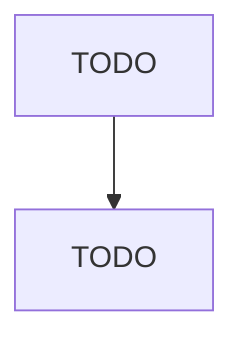

# Textile Bag and Canvas Mills

> TODO: Business-as-Code definition

## Overview

This industry comprises establishments primarily engaged in manufacturing textile bags (except luggage) or other canvas and canvas-like products, such as awnings, sails, tarpaulins, and tents from purchased textile fabrics or yarns. Illustrative Examples: Covers (e.g., boat, swimming pool, truck) made from purchased fabrics Laundry bags made from purchased woven or knitted materials Seed bags made from purchased woven or knitted materials Textile bags made from purchased woven or knitted materia

## Actors

| Actor | Description |
|-------|-------------|
| TODO | TODO |

## Roles

| Role | Description |
|------|-------------|
| TODO | TODO |

## Entities

| Entity | Description |
|--------|-------------|
| TODO | TODO |

## Actions

| Action | Description |
|--------|-------------|
| TODO | TODO |

## Events

| Event | Description |
|-------|-------------|
| TODO | TODO |

## Searches

| Search | Description |
|--------|-------------|
| TODO | TODO |

## Workflow

## Actor Relationships

