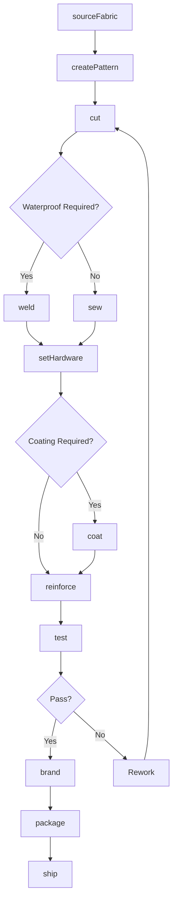
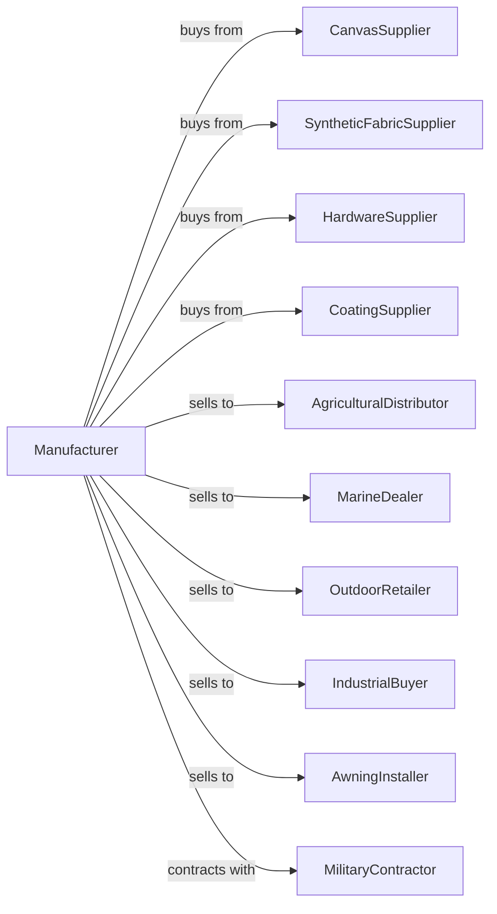

# Textile Bag and Canvas Mills

> Business-as-Code definition for textile bag and canvas product manufacturing. Models the complete production lifecycle from fabric sourcing through finished industrial and consumer products.

## Overview

This industry comprises establishments primarily engaged in manufacturing textile bags (except luggage) or other canvas and canvas-like products, such as awnings, sails, tarpaulins, and tents from purchased textile fabrics or yarns. Illustrative Examples: Covers (e.g., boat, swimming pool, truck) made from purchased fabrics, laundry bags, seed bags, and textile bags made from purchased woven or knitted materials.

## Actors

| Actor | Description |
|-------|-------------|
| CanvasSupplier | Provides woven canvas and duck fabrics |
| SyntheticFabricSupplier | Supplies nylon, polyester, and specialty technical fabrics |
| HardwareSupplier | Provides grommets, buckles, zippers, and fasteners |
| CoatingSupplier | Supplies waterproofing and UV-resistant treatments |
| AgriculturalDistributor | Purchases seed bags and agricultural covers |
| MarineDealer | Buys boat covers, sails, and marine products |
| OutdoorRetailer | Sells tents, tarps, and camping products |
| IndustrialBuyer | Purchases bulk bags and industrial covers |
| AwningInstaller | Buys awning fabric and components |
| MilitaryContractor | Procures tents and tactical textile products |

## Roles

| Role | Description |
|------|-------------|
| ProductionManager | Oversees manufacturing operations and scheduling |
| CuttingOperator | Operates cutting equipment for fabric and materials |
| SewingOperator | Assembles products using heavy-duty sewing equipment |
| WelderOperator | Uses RF or heat welding for waterproof seams |
| GrommetSetter | Installs grommets, rings, and metal hardware |
| PatternMaker | Develops patterns for new and custom products |
| QualityInspector | Tests products for strength, waterproofing, and durability |
| CustomFabricator | Produces made-to-order items to customer specifications |

## Entities

| Entity | Description |
|--------|-------------|
| TextileBag | Fabric container for bulk materials or goods |
| Tarpaulin | Heavy-duty waterproof covering sheet |
| Tent | Portable fabric shelter structure |
| Awning | Exterior shade covering for buildings |
| Sail | Wind-catching fabric for marine vessels |
| BoatCover | Protective covering for watercraft |
| Canvas | Heavy woven fabric used for durable products |
| Grommet | Metal ring reinforcement for tie-down points |
| Pattern | Template for cutting and assembly |
| Seam | Joined edge requiring strength and weather resistance |

## Actions

| Action | Description |
|--------|-------------|
| sourceFabric | Procure canvas, synthetic, and specialty fabrics |
| createPattern | Develop cutting and assembly specifications |
| cut | Cut fabric using automated or die-cutting equipment |
| sew | Assemble components using industrial sewing machines |
| weld | Join seams using RF or heat welding for waterproofing |
| setHardware | Install grommets, buckles, and fastening hardware |
| coat | Apply waterproof, UV-resistant, or flame-retardant treatments |
| reinforce | Add webbing, binding, or stress patches |
| test | Verify strength, waterproofing, and durability |
| brand | Apply logos and identification markings |
| package | Prepare products for shipping |
| customFabricate | Manufacture products to customer specifications |

## Events

| Event | Description |
|-------|-------------|
| fabricReceived | Raw materials delivered to facility |
| patternApproved | New product pattern finalized |
| batchCut | Cutting operation completed |
| assemblyCompleted | Sewing and welding finished |
| hardwareInstalled | Grommets and fasteners attached |
| coatingApplied | Protective treatment completed |
| testPassed | Product met quality specifications |
| testFailed | Product did not meet specifications |
| orderReceived | Customer purchase order placed |
| customOrderSubmitted | Special fabrication request received |
| orderShipped | Products dispatched to customer |

## Searches

| Search | Description |
|--------|-------------|
| findProducts | List products by type, size, or material |
| getInventory | Check stock levels by product and location |
| findOrders | List orders by customer, status, or date |
| getFabricStock | Check raw material inventory |
| findCustomJobs | List pending custom fabrication orders |
| getCapacity | View available production capacity |
| findSuppliers | List approved material vendors |
| getSpecifications | Retrieve product technical specifications |

## Workflow



## Actor Relationships



## Usage

### Calling Actions

```typescript
import { millTextileBag } from '@headlessly/mill-textile-bag'

const mill = millTextileBag()

// Produce custom boat cover
const fabric = await mill.sourceFabric({
  supplier: 'marine-fabrics-inc',
  material: 'sunbrella-marine',
  color: 'pacific-blue',
  quantity: 500,
  unit: 'yards'
})

await mill.createPattern({
  productType: 'boat-cover',
  boatModel: 'bowrider-22',
  features: ['console-cutout', 'windshield-wrap', 'motor-cover']
})

await mill.cut({
  batchId: fabric.batchId,
  pattern: 'bowrider-22-cover',
  method: 'cnc-cutter'
})

await mill.sew({
  batchId: fabric.batchId,
  thread: 'v-92-polyester',
  seamType: 'double-stitched'
})

await mill.setHardware({
  batchId: fabric.batchId,
  grommets: { type: 'brass', spacing: 12, unit: 'inches' },
  straps: { type: 'quick-release', quantity: 8 }
})
```

### Event-Driven Automation

```typescript
// Auto-coat after assembly
mill.assemblyCompleted(async ({ batchId, productType }) => {
  if (productType === 'tarpaulin' || productType === 'tent') {
    await mill.coat({
      batchId,
      treatment: 'waterproof-pu',
      uvResistance: true
    })
  }
})

// Auto-test after coating
mill.coatingApplied(async ({ batchId }) => {
  await mill.test({
    batchId,
    tests: ['water-column', 'tensile-strength', 'uv-degradation']
  })
})

// Handle custom orders
mill.customOrderSubmitted(async ({ orderId, specs, customer }) => {
  await mill.customFabricate({
    orderId,
    dimensions: specs.dimensions,
    material: specs.material,
    features: specs.features,
    deliveryDate: specs.deliveryDate
  })
})

// Alert on test failure
mill.testFailed(async ({ batchId, test, result, threshold }) => {
  await mill.alertQuality({
    batchId,
    issue: `${test} failed: ${result} vs threshold ${threshold}`,
    action: 'hold-for-engineering-review'
  })
})
```
