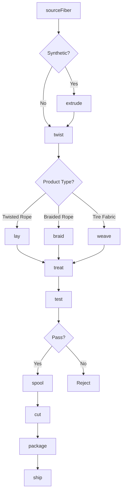
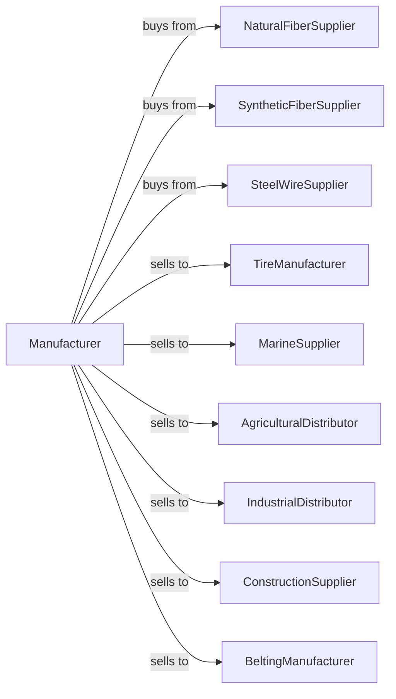

# Rope, Cordage, Twine, Tire Cord, and Tire Fabric Mills

> Business-as-Code definition for rope, cordage, twine, and tire reinforcement manufacturing. Models the complete production lifecycle from fiber sourcing through industrial and consumer product distribution.

## Overview

This U.S. industry comprises establishments primarily engaged in (1) manufacturing rope, cable, cordage, twine, and related products from all materials (e.g., abaca, sisal, henequen, cotton, paper, jute, flax, manmade fibers including glass) and/or (2) manufacturing cord and fabric of polyester, rayon, cotton, glass, steel, or other materials for use in reinforcing rubber tires, industrial belting, and similar uses.

## Actors

| Actor | Description |
|-------|-------------|
| NaturalFiberSupplier | Provides sisal, manila, hemp, and jute fibers |
| SyntheticFiberSupplier | Supplies nylon, polyester, and polypropylene |
| SteelWireSupplier | Provides steel cord for tire reinforcement |
| TireManufacturer | Purchases tire cord and fabric for tire production |
| MarineSupplier | Buys rope and cordage for maritime applications |
| AgriculturalDistributor | Purchases baler twine and agricultural rope |
| IndustrialDistributor | Sells rope and cable to industrial end users |
| ConstructionSupplier | Buys rope and rigging for construction sites |
| RecreationalRetailer | Sells rope products to consumer markets |
| BeltingManufacturer | Purchases reinforcement materials for conveyor belts |

## Roles

| Role | Description |
|------|-------------|
| PlantManager | Oversees manufacturing operations and production |
| TwistingOperator | Operates strand twisting and rope laying equipment |
| BraidingOperator | Runs braiding machines for braided rope products |
| ExtrusionOperator | Operates fiber extrusion equipment for synthetic fibers |
| WeavingOperator | Produces woven tire fabric on industrial looms |
| QualityTester | Tests tensile strength, elongation, and fatigue resistance |
| SpoolOperator | Winds finished rope and cord onto spools and reels |
| MaintenanceTechnician | Maintains and repairs production machinery |

## Entities

| Entity | Description |
|--------|-------------|
| Rope | Twisted or braided fiber product for lifting and securing |
| Cordage | General category of rope and cord products |
| Twine | Light-duty twisted fiber product |
| TireCord | High-strength reinforcement for tire construction |
| TireFabric | Woven material for tire carcass reinforcement |
| Fiber | Raw material strand for rope construction |
| Strand | Bundled fibers forming rope component |
| Spool | Wound package of finished product |
| Braid | Interlaced rope construction pattern |
| TensileStrength | Load capacity specification for products |

## Actions

| Action | Description |
|--------|-------------|
| sourceFiber | Procure natural or synthetic fibers from suppliers |
| extrude | Produce synthetic fiber filaments through extrusion |
| twist | Combine fibers into strands using twisting machinery |
| lay | Combine strands into finished rope structure |
| braid | Interlace strands to create braided rope |
| weave | Produce woven fabric for tire reinforcement |
| treat | Apply coatings for UV resistance, rot resistance, or adhesion |
| test | Measure tensile strength, elongation, and durability |
| spool | Wind finished products onto reels and spools |
| splice | Create loops and terminations in rope products |
| cut | Cut rope to specified lengths |
| package | Prepare products for shipping and retail |

## Events

| Event | Description |
|-------|-------------|
| fiberReceived | Raw fiber materials delivered |
| extrusionCompleted | Synthetic fiber production finished |
| strandsTwisted | Twisting operation completed |
| ropeLaid | Rope laying operation finished |
| braidingCompleted | Braided rope production finished |
| fabricWoven | Tire fabric weaving completed |
| treatmentApplied | Protective coating applied |
| testPassed | Product met strength specifications |
| testFailed | Product did not meet specifications |
| orderReceived | Customer purchase order entered |
| orderShipped | Products dispatched to customer |
| inventoryLow | Stock below reorder threshold |

## Searches

| Search | Description |
|--------|-------------|
| findProducts | List products by type, material, or diameter |
| getInventory | Check stock levels by product and location |
| findOrders | List orders by customer, status, or date |
| getSpecifications | Retrieve technical specifications for products |
| findSuppliers | List approved fiber and material vendors |
| getTestResults | Retrieve quality test data for production lots |
| findTireCordOrders | List tire manufacturer orders and schedules |
| getProductionSchedule | View scheduled manufacturing runs |

## Workflow



## Actor Relationships



## Usage

### Calling Actions

```typescript
import { millRope } from '@headlessly/mill-rope'

const mill = millRope()

// Produce marine-grade twisted nylon rope
const fiber = await mill.sourceFiber({
  supplier: 'synthetic-fibers-inc',
  material: 'nylon-6',
  denier: 1260,
  quantity: 10000,
  unit: 'pounds'
})

await mill.extrude({
  batchId: fiber.batchId,
  filamentCount: 210,
  temperature: 280,
  unit: 'celsius'
})

await mill.twist({
  batchId: fiber.batchId,
  twistsPerInch: 6,
  direction: 'z-twist',
  strandsPerYarn: 3
})

await mill.lay({
  batchId: fiber.batchId,
  construction: '3-strand',
  diameter: 0.75,
  unit: 'inches',
  layDirection: 's-lay'
})

await mill.treat({
  batchId: fiber.batchId,
  treatment: 'marine-grade',
  uvResistance: true,
  rotResistance: true
})
```

### Event-Driven Automation

```typescript
// Auto-test after laying
mill.ropeLaid(async ({ batchId, diameter, material }) => {
  const minStrength = calculateMinStrength(diameter, material)

  await mill.test({
    batchId,
    tests: ['tensile-strength', 'elongation', 'abrasion-resistance'],
    minTensileStrength: minStrength,
    unit: 'pounds'
  })
})

// Auto-spool after passing tests
mill.testPassed(async ({ batchId, productType }) => {
  const spoolSize = productType === 'twine' ? 10 : 600

  await mill.spool({
    batchId,
    spoolLength: spoolSize,
    unit: 'feet',
    windPattern: 'level-wind'
  })
})

// Alert on test failure
mill.testFailed(async ({ batchId, test, result, minSpec }) => {
  await mill.alertQuality({
    batchId,
    issue: `${test}: ${result} below minimum ${minSpec}`,
    action: 'quarantine-for-downgrade'
  })
})

// Reorder fiber when inventory low
mill.inventoryLow(async ({ material, currentStock, reorderPoint }) => {
  await mill.sourceFiber({
    material,
    quantity: reorderPoint * 2,
    priority: 'expedite'
  })
})
```
