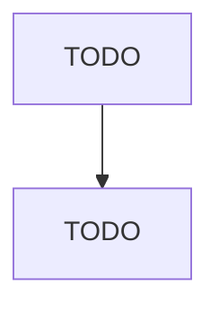

# Rope, Cordage, Twine, Tire Cord, and Tire Fabric Mills

> TODO: Business-as-Code definition

## Overview

This U.S. industry comprises establishments primarily engaged in (1) manufacturing rope, cable, cordage, twine, and related products from all materials (e.g., abaca, sisal, henequen, cotton, paper, jute, flax, manmade fibers including glass) and/or (2) manufacturing cord and fabric of polyester, rayon, cotton, glass, steel, or other materials for use in reinforcing rubber tires, industrial belting, and similar uses. Cross-References.

## Actors

| Actor | Description |
|-------|-------------|
| TODO | TODO |

## Roles

| Role | Description |
|------|-------------|
| TODO | TODO |

## Entities

| Entity | Description |
|--------|-------------|
| TODO | TODO |

## Actions

| Action | Description |
|--------|-------------|
| TODO | TODO |

## Events

| Event | Description |
|-------|-------------|
| TODO | TODO |

## Searches

| Search | Description |
|--------|-------------|
| TODO | TODO |

## Workflow

## Actor Relationships

