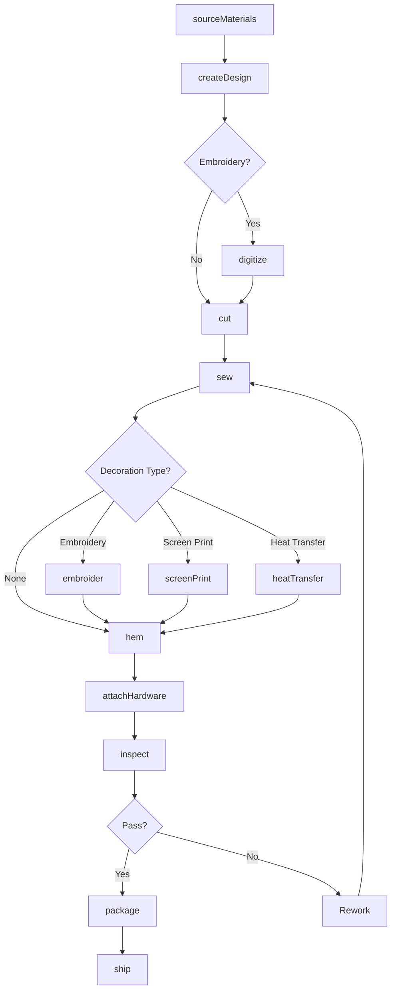
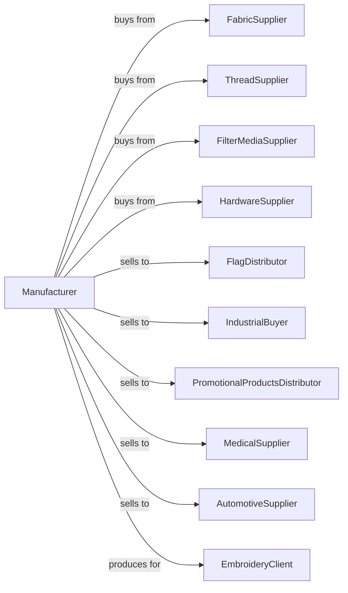

# All Other Miscellaneous Textile Product Mills

> Business-as-Code definition for miscellaneous textile product manufacturing. Models the complete production lifecycle for specialty textile items including flags, banners, filters, and embellished products.

## Overview

This U.S. industry comprises establishments primarily engaged in manufacturing textile products (except carpets and rugs; curtains and linens; textile bags and canvas products; rope, cordage, and twine; and tire cords and tire fabrics) from purchased materials. These establishments may further embellish the textile products they manufacture with decorative stitching. Establishments primarily engaged in adding decorative stitching such as embroidery or other art needlework on textile products are included.

## Actors

| Actor | Description |
|-------|-------------|
| FabricSupplier | Provides woven, knit, and nonwoven base fabrics |
| ThreadSupplier | Supplies embroidery threads and specialty yarns |
| FilterMediaSupplier | Provides specialty filtration fabrics and materials |
| HardwareSupplier | Supplies poles, mounts, and attachment hardware |
| FlagDistributor | Purchases flags and banners for resale |
| IndustrialBuyer | Procures filter media and technical textiles |
| PromotionalProductsDistributor | Buys branded and promotional textile items |
| MedicalSupplier | Purchases medical textile products |
| AutomotiveSupplier | Buys textile components for vehicle interiors |
| EmbroideryClient | Commissions custom embroidered products |

## Roles

| Role | Description |
|------|-------------|
| ProductionManager | Oversees manufacturing operations and scheduling |
| CuttingOperator | Operates cutting equipment for fabric preparation |
| SewingOperator | Assembles textile products using industrial equipment |
| EmbroideryOperator | Operates computerized embroidery machines |
| ScreenPrintOperator | Applies graphics using screen printing methods |
| QualityInspector | Examines products for defects and specifications |
| DigitizingSpecialist | Converts artwork to embroidery machine files |
| PackagingWorker | Prepares finished products for shipment |

## Entities

| Entity | Description |
|--------|-------------|
| Flag | National, state, or organizational banner product |
| Banner | Promotional or decorative hanging textile |
| FilterMedia | Textile material for air or liquid filtration |
| Emblem | Embroidered or woven patch product |
| Pennant | Triangular flag or decorative product |
| Dust Cloth | Cleaning textile product |
| Padding | Cushioning textile material |
| Binding | Edge finishing material |
| Artwork | Design file for printing or embroidery |
| ProductionRun | Batch of manufactured items |

## Actions

| Action | Description |
|--------|-------------|
| sourceMaterials | Procure fabrics, threads, and components |
| createDesign | Develop artwork and production specifications |
| digitize | Convert artwork to embroidery machine format |
| cut | Cut fabric to pattern specifications |
| sew | Assemble product components |
| embroider | Apply decorative stitching using embroidery machines |
| screenPrint | Apply graphics using screen printing |
| heatTransfer | Apply graphics using heat transfer methods |
| hem | Finish edges with appropriate techniques |
| attachHardware | Add grommets, poles, or mounting components |
| inspect | Examine products for quality compliance |
| package | Prepare products for shipping |

## Events

| Event | Description |
|-------|-------------|
| materialsReceived | Raw materials delivered to facility |
| designApproved | Artwork and specifications finalized |
| digitizingCompleted | Embroidery file ready for production |
| cuttingCompleted | Fabric cutting operation finished |
| sewingCompleted | Assembly operation finished |
| embroideryCompleted | Decorative stitching applied |
| printingCompleted | Graphics application finished |
| inspectionPassed | Product met quality standards |
| inspectionFailed | Product did not meet standards |
| orderReceived | Customer purchase order entered |
| orderShipped | Products dispatched to customer |

## Searches

| Search | Description |
|--------|-------------|
| findProducts | List products by category, size, or type |
| getInventory | Check stock levels by product and location |
| findOrders | List orders by customer, status, or date |
| getDesignFiles | Retrieve artwork and digitized files |
| findCustomJobs | List pending custom order jobs |
| getProductionSchedule | View scheduled manufacturing runs |
| findSuppliers | List approved material vendors |
| getCapacity | Check available production capacity |

## Workflow



## Actor Relationships



## Usage

### Calling Actions

```typescript
import { millTextileProduct } from '@headlessly/mill-textile-product'

const mill = millTextileProduct()

// Produce custom corporate flags
const materials = await mill.sourceMaterials({
  fabric: { type: 'nylon-200d', color: 'white', quantity: 500, unit: 'yards' },
  thread: { type: 'polyester-embroidery', colors: ['navy', 'gold'] }
})

await mill.createDesign({
  productType: 'flag',
  size: { width: 3, height: 5, unit: 'feet' },
  artwork: 'corporate-logo.ai',
  printMethod: 'dye-sublimation'
})

await mill.digitize({
  designId: 'corporate-logo',
  stitchDensity: 4.5,
  unit: 'stitches-per-mm',
  colorSequence: ['navy', 'gold']
})

await mill.cut({
  batchId: materials.batchId,
  pattern: 'flag-3x5',
  quantity: 200
})

await mill.embroider({
  batchId: materials.batchId,
  design: 'corporate-logo',
  placement: 'center',
  hoopSize: '12x14'
})

await mill.attachHardware({
  batchId: materials.batchId,
  grommets: { type: 'brass', quantity: 4, spacing: 18, unit: 'inches' },
  headerTape: true
})
```

### Event-Driven Automation

```typescript
// Auto-digitize after design approval
mill.designApproved(async ({ designId, productType }) => {
  if (productType === 'emblem' || productType === 'flag') {
    await mill.digitize({
      designId,
      stitchDensity: productType === 'emblem' ? 5.5 : 4.0,
      unit: 'stitches-per-mm'
    })
  }
})

// Auto-hem and hardware after decoration
mill.embroideryCompleted(async ({ batchId, productType }) => {
  await mill.hem({
    batchId,
    method: productType === 'flag' ? 'double-fold' : 'merrow'
  })
})

// Auto-package after inspection
mill.inspectionPassed(async ({ batchId, customer }) => {
  await mill.package({
    batchId,
    method: customer.includes('retail') ? 'poly-bag-header' : 'bulk-box',
    labeling: 'customer-sku'
  })
})

// Handle custom embroidery orders
mill.orderReceived(async ({ orderId, specs }) => {
  if (specs.customDesign) {
    await mill.createDesign({
      orderId,
      artwork: specs.artworkFile,
      placement: specs.placement,
      quantity: specs.quantity
    })
  }
})
```
