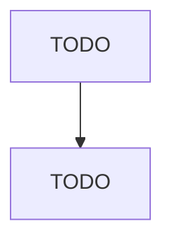

# All Other Miscellaneous Textile Product Mills

> TODO: Business-as-Code definition

## Overview

This U.S. industry comprises establishments primarily engaged in manufacturing textile products (except carpets and rugs; curtains and linens; textile bags and canvas products; rope, cordage, and twine; and tire cords and tire fabrics) from purchased materials. These establishments may further embellish the textile products they manufacture with decorative stitching. Establishments primarily engaged in adding decorative stitching such as embroidery or other art needlework on textile products, in

## Actors

| Actor | Description |
|-------|-------------|
| TODO | TODO |

## Roles

| Role | Description |
|------|-------------|
| TODO | TODO |

## Entities

| Entity | Description |
|--------|-------------|
| TODO | TODO |

## Actions

| Action | Description |
|--------|-------------|
| TODO | TODO |

## Events

| Event | Description |
|-------|-------------|
| TODO | TODO |

## Searches

| Search | Description |
|--------|-------------|
| TODO | TODO |

## Workflow

## Actor Relationships

