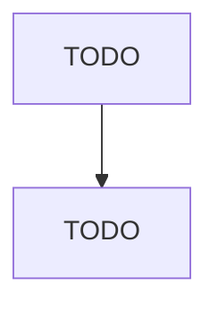

# Cut and Sew Apparel Contractors

> TODO: Business-as-Code definition

## Overview

This industry comprises establishments commonly referred to as contractors primarily engaged in (1) cutting materials owned by others for apparel and accessories and/or (2) sewing materials owned by others for apparel and accessories. Cross-References. Establishments primarily engaged in--

## Actors

| Actor | Description |
|-------|-------------|
| TODO | TODO |

## Roles

| Role | Description |
|------|-------------|
| TODO | TODO |

## Entities

| Entity | Description |
|--------|-------------|
| TODO | TODO |

## Actions

| Action | Description |
|--------|-------------|
| TODO | TODO |

## Events

| Event | Description |
|-------|-------------|
| TODO | TODO |

## Searches

| Search | Description |
|--------|-------------|
| TODO | TODO |

## Workflow

## Actor Relationships

