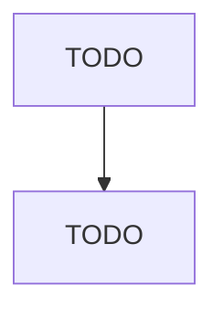

# Cut and Sew Apparel Manufacturing (except Contractors)

> TODO: Business-as-Code definition

## Overview

This industry comprises establishments primarily engaged in manufacturing cut and sew apparel from purchased fabric. Clothing jobbers, who perform entrepreneurial functions involved in apparel manufacture, including buying raw materials, designing and preparing samples, arranging for apparel to be made from their materials, and marketing finished apparel, are included. Cross-References. Establishments primarily engaged in--

## Actors

| Actor | Description |
|-------|-------------|
| TODO | TODO |

## Roles

| Role | Description |
|------|-------------|
| TODO | TODO |

## Entities

| Entity | Description |
|--------|-------------|
| TODO | TODO |

## Actions

| Action | Description |
|--------|-------------|
| TODO | TODO |

## Events

| Event | Description |
|-------|-------------|
| TODO | TODO |

## Searches

| Search | Description |
|--------|-------------|
| TODO | TODO |

## Workflow

## Actor Relationships

