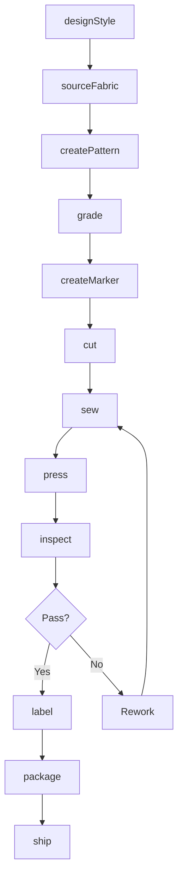
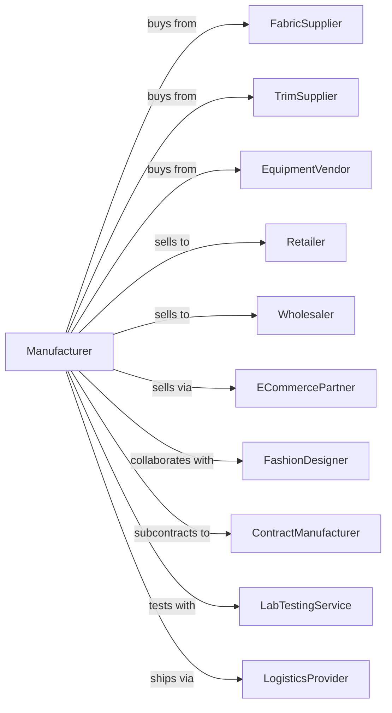

# Cut and Sew Apparel Manufacturing (except Contractors)

> Business-as-Code definition for cut and sew apparel manufacturing operations. Models the complete production lifecycle from fabric purchasing through finished garment distribution.

## Overview

This industry comprises establishments primarily engaged in manufacturing cut and sew apparel from purchased fabric. Clothing jobbers, who perform entrepreneurial functions involved in apparel manufacture, including buying raw materials, designing and preparing samples, arranging for apparel to be made from their materials, and marketing finished apparel, are included.

## Actors

| Actor | Description |
|-------|-------------|
| FabricSupplier | Provides woven and knit fabrics for garment production |
| TrimSupplier | Supplies buttons, zippers, thread, and finishing materials |
| EquipmentVendor | Sells and services cutting and sewing machinery |
| Retailer | Department stores and specialty retailers purchasing apparel |
| Wholesaler | Distributes apparel to regional retail markets |
| ECommercePartner | Online platforms selling finished apparel |
| FashionDesigner | Creates designs for production |
| ContractManufacturer | Provides overflow production capacity |
| LabTestingService | Tests fabrics and garments for compliance |
| LogisticsProvider | Handles warehousing and distribution |

## Roles

| Role | Description |
|------|-------------|
| ProductionManager | Oversees manufacturing operations and schedules |
| MerchandiseManager | Plans product lines and manages inventory |
| PatternMaker | Creates production patterns from designs |
| GradingSpecialist | Adjusts patterns for size range |
| CuttingOperator | Operates automated or manual cutting equipment |
| SewingOperator | Assembles garments on industrial sewing machines |
| QualityInspector | Examines garments for defects and specifications |
| SampleMaker | Produces prototype garments for approval |

## Entities

| Entity | Description |
|--------|-------------|
| Style | Design specification for a garment |
| Fabric | Base material for garment construction |
| Pattern | Template for cutting garment pieces |
| Garment | Finished apparel item ready for sale |
| Marker | Cutting layout optimizing fabric yield |
| Bundle | Grouped cut parts for sewing |
| Sample | Prototype garment for approval and sales |
| Season | Collection period for product planning |
| SKU | Individual product variant by size and color |
| Order | Customer purchase specification |

## Actions

| Action | Description |
|--------|-------------|
| designStyle | Create design specifications for new garments |
| sourceFabric | Select and purchase fabrics for production |
| createPattern | Develop production patterns from designs |
| grade | Adjust patterns across size range |
| createMarker | Develop cutting layouts for optimal fabric use |
| cut | Cut fabric into garment components |
| sew | Assemble garments using production sewing methods |
| press | Shape and finish garments with steam and heat |
| inspect | Examine garments for quality compliance |
| label | Attach brand labels, care labels, and hang tags |
| package | Prepare garments for shipping and retail |
| ship | Deliver finished goods to customers |
| sample | Produce prototype garments for sales and approval |

## Events

| Event | Description |
|-------|-------------|
| designApproved | Style specification finalized |
| fabricPurchased | Fabric order placed with supplier |
| fabricReceived | Fabric delivered to facility |
| patternCreated | Production pattern completed |
| markerCompleted | Cutting layout finalized |
| cuttingCompleted | Fabric cut into garment pieces |
| sewingCompleted | Garment assembly finished |
| inspectionPassed | Quality control approved |
| inspectionFailed | Defects identified |
| productionCompleted | All units finished |
| orderReceived | Customer purchase order entered |
| orderShipped | Finished goods dispatched |

## Searches

| Search | Description |
|--------|-------------|
| findStyles | List styles by category, season, or status |
| getInventory | Check stock levels by SKU and location |
| findOrders | List orders by customer, status, or date |
| getFabricStock | Check fabric inventory by type |
| getProductionStatus | View work-in-progress by style |
| findSuppliers | List approved fabric and trim vendors |
| getSalesHistory | Retrieve sales data by style and customer |
| getCapacity | Check available production capacity |

## Workflow



## Actor Relationships



## Usage

### Calling Actions

```typescript
import { manufactureCutSew } from '@headlessly/manufacture-cut-sew'

const manufacturer = manufactureCutSew()

// Design and produce seasonal blouse collection
await manufacturer.designStyle({
  styleNumber: 'BL-2024-001',
  category: 'blouse',
  season: 'spring-2024',
  sizes: ['XS', 'S', 'M', 'L', 'XL'],
  colors: ['ivory', 'blush', 'navy']
})

const fabric = await manufacturer.sourceFabric({
  styleNumber: 'BL-2024-001',
  fabrics: [
    { type: 'silk-crepe', color: 'ivory', quantity: 800, unit: 'yards' },
    { type: 'silk-crepe', color: 'blush', quantity: 600, unit: 'yards' },
    { type: 'silk-crepe', color: 'navy', quantity: 400, unit: 'yards' }
  ]
})

await manufacturer.createPattern({
  styleNumber: 'BL-2024-001',
  baseSize: 'M',
  pieces: ['front', 'back', 'sleeve', 'collar', 'cuff']
})

await manufacturer.grade({
  styleNumber: 'BL-2024-001',
  gradeRules: 'womens-woven',
  sizeRange: ['XS', 'S', 'M', 'L', 'XL']
})

await manufacturer.createMarker({
  styleNumber: 'BL-2024-001',
  fabricWidth: 54,
  unit: 'inches',
  targetEfficiency: 88
})
```

### Event-Driven Automation

```typescript
// Auto-cut after marker completion
manufacturer.markerCompleted(async ({ styleNumber, fabricBatch }) => {
  await manufacturer.cut({
    styleNumber,
    batchId: fabricBatch,
    method: 'automated',
    plies: 50
  })
})

// Auto-assign to sewing
manufacturer.cuttingCompleted(async ({ styleNumber, bundles }) => {
  await manufacturer.sew({
    styleNumber,
    bundles,
    lineAssignment: 'line-3',
    methodSheet: 'BL-2024-001-ops'
  })
})

// Auto-label and package after inspection
manufacturer.inspectionPassed(async ({ styleNumber, batchId }) => {
  await manufacturer.label({
    batchId,
    labels: ['brand', 'care', 'size', 'country-origin'],
    hangTag: 'seasonal-spring'
  })

  await manufacturer.package({
    batchId,
    method: 'individual-poly-bag',
    cartonPack: 12
  })
})

// Create samples for sales
manufacturer.designApproved(async ({ styleNumber }) => {
  await manufacturer.sample({
    styleNumber,
    quantity: 6,
    sizes: ['S', 'M'],
    destination: 'sales-showroom'
  })
})
```
