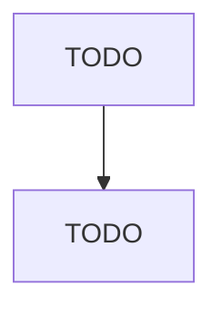

# Apparel Accessories and Other Apparel Manufacturing

> TODO: Business-as-Code definition

## Overview

This industry comprises establishments primarily engaged in manufacturing apparel and accessories (except apparel knitting mills, cut and sew apparel contractors, and cut and sew apparel manufacturing (except contractors)). Jobbers, who perform entrepreneurial functions involved in apparel accessories manufacture, including buying raw materials, designing and preparing samples, arranging for apparel accessories to be made from their materials, and marketing finished apparel accessories, are incl

## Actors

| Actor | Description |
|-------|-------------|
| TODO | TODO |

## Roles

| Role | Description |
|------|-------------|
| TODO | TODO |

## Entities

| Entity | Description |
|--------|-------------|
| TODO | TODO |

## Actions

| Action | Description |
|--------|-------------|
| TODO | TODO |

## Events

| Event | Description |
|-------|-------------|
| TODO | TODO |

## Searches

| Search | Description |
|--------|-------------|
| TODO | TODO |

## Workflow

## Actor Relationships

