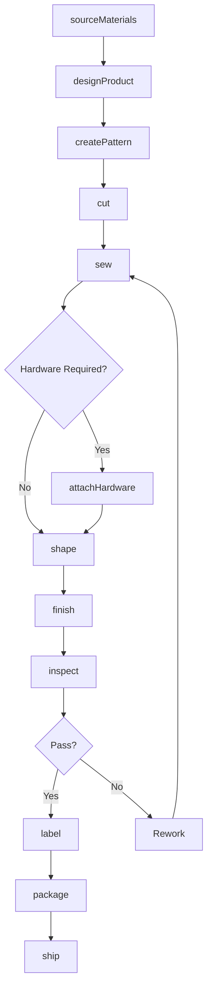
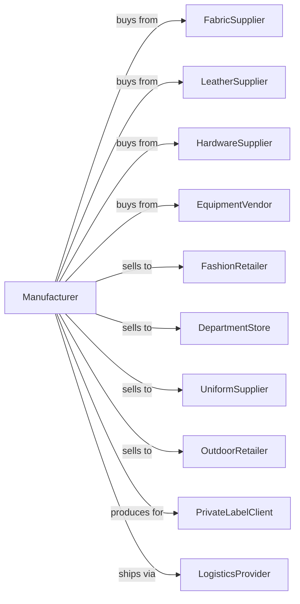

# Apparel Accessories and Other Apparel Manufacturing

> Business-as-Code definition for apparel accessories and specialty apparel manufacturing. Models the complete production lifecycle from material sourcing through finished accessory product distribution.

## Overview

This industry comprises establishments primarily engaged in manufacturing apparel and accessories (except apparel knitting mills, cut and sew apparel contractors, and cut and sew apparel manufacturing (except contractors)). Jobbers, who perform entrepreneurial functions involved in apparel accessories manufacture, including buying raw materials, designing and preparing samples, arranging for apparel accessories to be made from their materials, and marketing finished apparel accessories, are included.

## Actors

| Actor | Description |
|-------|-------------|
| FabricSupplier | Provides specialty fabrics for accessory production |
| LeatherSupplier | Supplies leather and synthetic leather materials |
| HardwareSupplier | Provides buckles, clasps, rings, and metal components |
| EquipmentVendor | Sells and services production machinery |
| FashionRetailer | Stores purchasing accessories for resale |
| DepartmentStore | Large retailers with accessory departments |
| UniformSupplier | Companies purchasing work gloves and accessories |
| OutdoorRetailer | Sporting goods stores selling performance accessories |
| PrivateLabelClient | Brands requiring contract manufacturing |
| LogisticsProvider | Handles warehousing and distribution |

## Roles

| Role | Description |
|------|-------------|
| ProductionManager | Oversees daily manufacturing operations |
| PatternMaker | Creates patterns for hats, gloves, and accessories |
| CuttingOperator | Cuts materials using dies or automated equipment |
| SewingOperator | Assembles accessory components |
| AssemblyWorker | Attaches hardware and completes finishing |
| QualityInspector | Examines products for defects and specifications |
| ProductDesigner | Develops new accessory styles and designs |
| SampleMaker | Creates prototype products for approval |

## Entities

| Entity | Description |
|--------|-------------|
| Hat | Headwear product including caps, beanies, and dress hats |
| Glove | Hand covering for fashion, work, or sport |
| Scarf | Neck accessory in various materials and styles |
| Belt | Waist accessory in leather, fabric, or synthetic materials |
| Tie | Neckwear accessory including ties and bowties |
| Suspenders | Trouser support accessory |
| Handkerchief | Pocket square or utility cloth |
| Earmuff | Ear covering for warmth |
| Pattern | Template for cutting accessory components |
| Hardware | Metal buckles, clips, and fasteners |

## Actions

| Action | Description |
|--------|-------------|
| sourceMaterials | Procure fabrics, leather, and hardware components |
| designProduct | Create new accessory designs and specifications |
| createPattern | Develop cutting patterns for production |
| cut | Cut materials using dies, lasers, or manual methods |
| sew | Assemble components using appropriate techniques |
| attachHardware | Install buckles, clasps, and metal components |
| shape | Form and block hats and structured accessories |
| finish | Complete edge finishing and detail work |
| inspect | Examine products for quality compliance |
| label | Attach brand labels and care instructions |
| package | Prepare products for retail or shipping |
| ship | Deliver finished goods to customers |

## Events

| Event | Description |
|-------|-------------|
| materialsReceived | Raw materials delivered to facility |
| designApproved | New product design finalized |
| patternCreated | Production pattern completed |
| cuttingCompleted | Materials cut for production run |
| sewingCompleted | Assembly operation finished |
| hardwareAttached | Metal components installed |
| finishingCompleted | Product finishing done |
| inspectionPassed | Quality control approved |
| inspectionFailed | Defects identified |
| orderReceived | Customer purchase order entered |
| sampleApproved | Prototype accepted by customer |
| orderShipped | Finished goods dispatched |

## Searches

| Search | Description |
|--------|-------------|
| findProducts | List products by category, style, or material |
| getInventory | Check stock levels by product and location |
| findOrders | List orders by customer, status, or date |
| getMaterialStock | Check raw material inventory |
| getProductionSchedule | View scheduled manufacturing runs |
| findSuppliers | List approved material vendors |
| getQualityMetrics | Retrieve defect rates and inspection data |
| getSalesData | View sales history by product and customer |

## Workflow

## Actor Relationships

