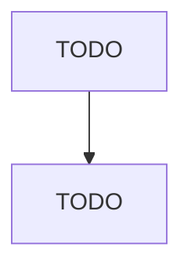

# Leather and Hide Tanning and Finishing

> TODO: Business-as-Code definition

## Overview

This industry comprises establishments primarily engaged in one or more of the following: (1) tanning, currying, and finishing hides and skins; (2) having others process hides and skins on a contract basis; and (3) dyeing or dressing furs.

## Actors

| Actor | Description |
|-------|-------------|
| TODO | TODO |

## Roles

| Role | Description |
|------|-------------|
| TODO | TODO |

## Entities

| Entity | Description |
|--------|-------------|
| TODO | TODO |

## Actions

| Action | Description |
|--------|-------------|
| TODO | TODO |

## Events

| Event | Description |
|-------|-------------|
| TODO | TODO |

## Searches

| Search | Description |
|--------|-------------|
| TODO | TODO |

## Workflow

## Actor Relationships

