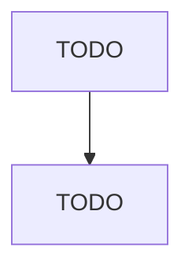

# Footwear Manufacturing

> TODO: Business-as-Code definition

## Overview

This industry comprises establishments primarily engaged in manufacturing footwear (except orthopedic extension footwear). Illustrative Examples: Athletic shoes manufacturing Ballet slippers manufacturing Cleated athletic shoes manufacturing Shoes, children's and infants' (except orthopedic extension), manufacturing Shoes, men's (except orthopedic extension), manufacturing Shoes, women's (except orthopedic extension), manufacturing Cross-References.

## Actors

| Actor | Description |
|-------|-------------|
| TODO | TODO |

## Roles

| Role | Description |
|------|-------------|
| TODO | TODO |

## Entities

| Entity | Description |
|--------|-------------|
| TODO | TODO |

## Actions

| Action | Description |
|--------|-------------|
| TODO | TODO |

## Events

| Event | Description |
|-------|-------------|
| TODO | TODO |

## Searches

| Search | Description |
|--------|-------------|
| TODO | TODO |

## Workflow

## Actor Relationships

