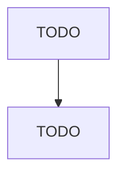

# Other Leather and Allied Product Manufacturing

> TODO: Business-as-Code definition

## Overview

This industry comprises establishments primarily engaged in manufacturing leather products (except footwear and apparel) from purchased leather or leather substitutes (e.g., fabric, plastics). Illustrative Examples: Billfolds, all materials, manufacturing Boot and shoe cut stock and findings, leather, manufacturing Dog furnishings (e.g., collars, harnesses, leashes, muzzles), manufacturing Luggage, all materials, manufacturing Shoe soles, leather, manufacturing Purses, women's, all materials (ex

## Actors

| Actor | Description |
|-------|-------------|
| TODO | TODO |

## Roles

| Role | Description |
|------|-------------|
| TODO | TODO |

## Entities

| Entity | Description |
|--------|-------------|
| TODO | TODO |

## Actions

| Action | Description |
|--------|-------------|
| TODO | TODO |

## Events

| Event | Description |
|-------|-------------|
| TODO | TODO |

## Searches

| Search | Description |
|--------|-------------|
| TODO | TODO |

## Workflow

## Actor Relationships

