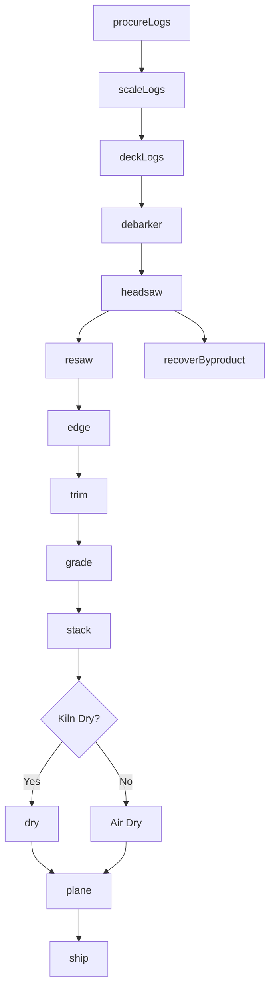
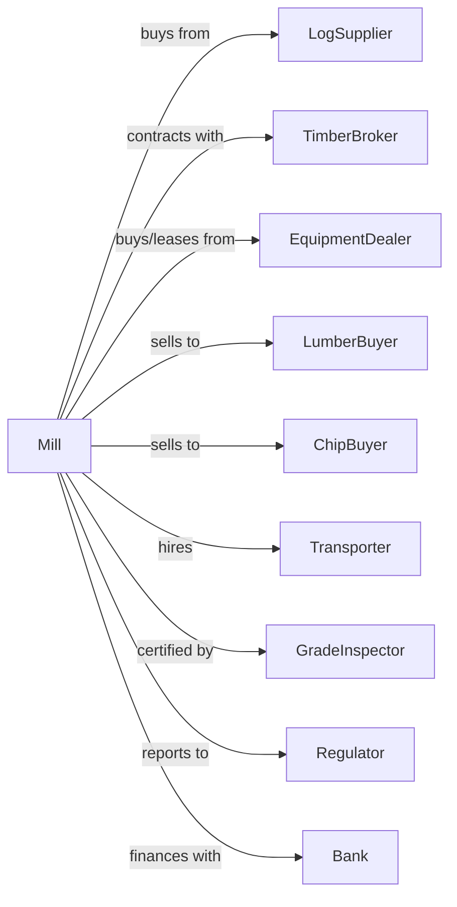

# Sawmills

> Business-as-Code definition for sawmill operations. Models the complete lumber production lifecycle from log procurement through dimensional lumber sales and byproduct recovery.

## Overview

This U.S. industry comprises establishments primarily engaged in sawing dimension lumber, boards, beams, timbers, poles, ties, shingles, shakes, siding, and wood chips from logs or bolts. Sawmills may plane the rough lumber that they make with a planing machine to achieve smoothness and uniformity of size. Cross-References. Establishments primarily engaged in--

## Actors

| Actor | Description |
|-------|-------------|
| LogSupplier | Provides raw logs from timber harvesting operations |
| TimberBroker | Facilitates log purchases and manages timber contracts |
| EquipmentDealer | Sells and services sawmill machinery and blades |
| LumberBuyer | Purchases dimensional lumber for construction or resale |
| ChipBuyer | Purchases wood chips and sawdust for pulp or fuel |
| Transporter | Hauls logs to mill and finished lumber to customers |
| GradeInspector | Certifies lumber grades per industry standards |
| Regulator | Oversees environmental compliance and safety standards |
| Bank | Provides capital financing and operating credit |

## Roles

| Role | Description |
|------|-------------|
| MillOwner | Owns facility and makes strategic business decisions |
| MillManager | Oversees daily operations and production scheduling |
| SawOperator | Operates primary and secondary breakdown saws |
| GreenChainWorker | Sorts and stacks lumber by grade and dimension |
| MaintenanceTech | Maintains and repairs mill equipment and blades |
| YardForeman | Manages log inventory and lumber storage |
| QualityInspector | Grades lumber and ensures specification compliance |

## Entities

| Entity | Description |
|--------|-------------|
| Log | Raw timber input with species, grade, and diameter |
| Lumber | Dimensional output with size, grade, and moisture |
| Cant | Squared log ready for secondary breakdown |
| Board | Flat lumber piece with thickness under 2 inches |
| Timber | Large dimensional lumber for structural use |
| Chip | Byproduct wood pieces for pulp or fuel |
| Sawdust | Fine wood particles from cutting operations |
| Blade | Saw component requiring regular maintenance |
| Kiln | Drying chamber for moisture reduction |
| Grade | Quality classification per NHLA or other standards |

## Actions

| Action | Description |
|--------|-------------|
| procureLogs | Purchase logs from suppliers based on species and grade |
| scaleLogs | Measure log volume for payment and yield tracking |
| deckLogs | Store and organize logs in the yard by species |
| debarker | Remove bark from logs before primary breakdown |
| headsaw | Make initial cuts to produce cants and boards |
| resaw | Secondary breakdown of cants into dimensional lumber |
| edge | Remove irregular edges to create straight boards |
| trim | Cut boards to standard lengths |
| grade | Classify lumber by quality and defect criteria |
| stack | Organize lumber for air or kiln drying |
| dry | Reduce moisture content to target levels |
| plane | Surface lumber to final dimensions and smoothness |
| ship | Load and dispatch lumber to customers |
| recoverByproduct | Collect and process chips, sawdust, and bark |

## Events

| Event | Description |
|-------|-------------|
| logsProcured | Log purchase order completed |
| logsScaled | Volume measurement recorded |
| logsDecked | Logs organized in yard storage |
| logsDebarked | Bark removed and ready for sawing |
| cantProduced | Primary breakdown completed |
| lumberSawn | Secondary breakdown finished |
| lumberGraded | Quality grade assigned to lumber |
| lumberStacked | Lumber organized for drying |
| lumberDried | Target moisture content achieved |
| lumberPlaned | Surface finishing completed |
| lumberShipped | Order dispatched to customer |
| byproductSold | Chips or sawdust sold to buyer |

## Searches

| Search | Description |
|--------|-------------|
| findLogs | List available logs by species, grade, and diameter |
| getInventory | Retrieve current lumber inventory by dimension and grade |
| checkMoisture | Get moisture readings for drying lumber |
| findBuyers | List potential lumber buyers and current prices |
| getYield | Calculate recovery percentage from log to lumber |
| getOrders | Retrieve pending customer orders and delivery dates |
| getMaintenanceSchedule | List equipment maintenance needs and blade changes |

## Workflow



## Actor Relationships



## Usage

### Calling Actions

```typescript
import { millSawmills } from '@headlessly/mill-sawmills'

const mill = millSawmills()

// Procure logs from supplier
const logOrder = await mill.procureLogs({
  species: 'douglas-fir',
  grade: 'sawlog',
  minDiameter: 12,
  quantity: 500,
  deliveryDate: '2024-03-15'
})

// Scale incoming logs
const scaled = await mill.scaleLogs({
  loadId: logOrder.loadId,
  method: 'scribner',
  measurementPoint: 'small-end'
})

// Process through headsaw
await mill.headsaw({
  logId: scaled.logs[0].id,
  targetProducts: ['2x4', '2x6', '2x8'],
  optimizeFor: 'recovery'
})
```

### Event-Driven Automation

```typescript
// Auto-grade lumber after sawing
mill.lumberSawn(async ({ lumberId, dimension, species }) => {
  const grade = await mill.grade({
    lumberId,
    standard: 'NHLA',
    inspectionPoints: ['knots', 'wane', 'splits']
  })

  await mill.stack({
    lumberId,
    location: `${grade.grade}-${dimension}-bay`,
    orientation: 'stickered'
  })
})

// Auto-ship when moisture target reached
mill.lumberDried(async ({ lotId, moistureContent }) => {
  if (moistureContent <= 19) {
    const orders = await mill.getOrders({ status: 'pending' })
    const matchingOrder = orders.find(o => o.lotId === lotId)

    if (matchingOrder) {
      await mill.plane({ lotId, finish: 'S4S' })
      await mill.ship({
        lotId,
        orderId: matchingOrder.id,
        carrier: matchingOrder.preferredCarrier
      })
    }
  }
})
```
