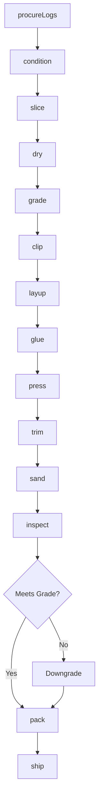
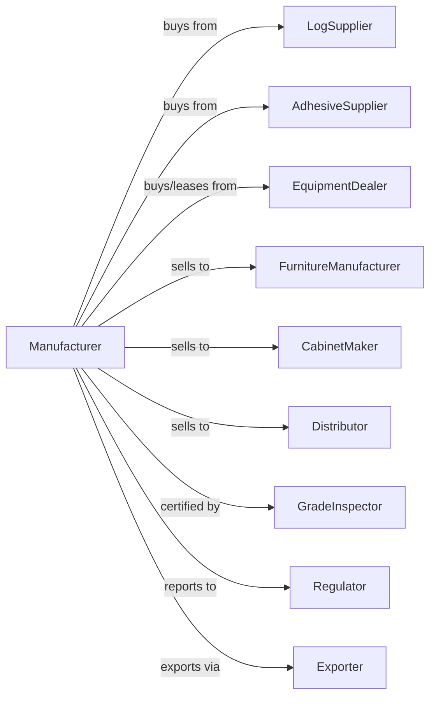

# Hardwood Veneer and Plywood Manufacturing

> Business-as-Code definition for hardwood veneer and plywood manufacturing operations. Models the complete production process from log procurement through veneer slicing, panel layup, and quality grading.

## Overview

This U.S. industry comprises establishments primarily engaged in manufacturing hardwood veneer and/or hardwood plywood. Cross-References. Establishments primarily engaged in--

## Actors

| Actor | Description |
|-------|-------------|
| LogSupplier | Provides hardwood logs of oak, maple, walnut, cherry |
| AdhesiveSupplier | Provides glues and resins for panel bonding |
| EquipmentDealer | Sells and services lathes, slicers, and presses |
| FurnitureManufacturer | Purchases decorative veneer for furniture |
| CabinetMaker | Buys plywood panels for cabinet construction |
| Distributor | Wholesales veneer and plywood products |
| GradeInspector | Certifies veneer and plywood quality grades |
| Regulator | Oversees formaldehyde emissions and safety |
| Exporter | Handles international sales and shipping |

## Roles

| Role | Description |
|------|-------------|
| PlantOwner | Owns facility and sets business direction |
| PlantManager | Oversees daily production operations |
| VeneerOperator | Operates lathes and slicers for veneer production |
| PressOperator | Manages hot press operations for panel bonding |
| GradeSelector | Evaluates and grades veneer sheets by appearance |
| MaintenanceTech | Maintains equipment and sharpens knives |
| QualityManager | Ensures product meets grade specifications |

## Entities

| Entity | Description |
|--------|-------------|
| Log | Hardwood log input with species and grade |
| Flitch | Half log prepared for slicing |
| Veneer | Thin wood sheet produced by slicing or peeling |
| Core | Inner plywood layer providing thickness |
| Panel | Finished plywood product with multiple layers |
| Adhesive | Bonding agent for laminating layers |
| Grade | Quality classification for appearance and defects |
| Press | Hot press equipment for panel bonding |
| Knife | Cutting tool for lathe or slicer |
| Moisture | Water content affecting processing and bonding |

## Actions

| Action | Description |
|--------|-------------|
| procureLogs | Purchase hardwood logs by species and grade |
| condition | Steam or soak logs to soften for cutting |
| slice | Cut veneer sheets using flat or rotary slicer |
| dry | Reduce veneer moisture for proper bonding |
| grade | Classify veneer by appearance and defects |
| clip | Trim veneer sheets to standard dimensions |
| layup | Arrange veneer and core layers for pressing |
| glue | Apply adhesive between panel layers |
| press | Bond layers under heat and pressure |
| trim | Cut panels to final dimensions |
| sand | Surface panels to specified smoothness |
| inspect | Verify panel quality and grade compliance |
| pack | Bundle and prepare products for shipment |
| ship | Deliver products to customers |

## Events

| Event | Description |
|-------|-------------|
| logsProcured | Hardwood logs purchased and received |
| logsConditioned | Logs softened and ready for slicing |
| veneerSliced | Veneer sheets cut from flitch |
| veneerDried | Moisture reduced to target level |
| veneerGraded | Quality grade assigned to veneer |
| panelLaidUp | Layers arranged for pressing |
| panelPressed | Bonding completed under heat and pressure |
| panelTrimmed | Panel cut to final size |
| panelSanded | Surface finishing completed |
| panelInspected | Quality verification completed |
| orderShipped | Products delivered to customer |

## Searches

| Search | Description |
|--------|-------------|
| findLogs | List available hardwood logs by species |
| getVeneerInventory | Retrieve veneer stock by species and grade |
| getPanelInventory | Retrieve plywood inventory by size and grade |
| findBuyers | List potential customers with requirements |
| getOrders | Retrieve pending orders and delivery schedules |
| getYield | Calculate veneer recovery from logs |
| getGradeDistribution | Analyze grade output percentages |

## Workflow



## Actor Relationships



## Usage

### Calling Actions

```typescript
import { manufactureHardwoodVeneer } from '@headlessly/manufacture-hardwood-veneer'

const plant = manufactureHardwoodVeneer()

// Procure premium hardwood logs
const logs = await plant.procureLogs({
  species: 'walnut',
  grade: 'prime',
  minDiameter: 16,
  quantity: 100
})

// Condition logs for slicing
await plant.condition({
  logIds: logs.ids,
  method: 'steam',
  temperature: 180,
  duration: 48
})

// Slice veneer sheets
const veneer = await plant.slice({
  logId: logs.ids[0],
  method: 'flat-sliced',
  thickness: 0.028,
  keepSequence: true
})
```

### Event-Driven Automation

```typescript
// Auto-grade after drying
plant.veneerDried(async ({ veneerSheetIds, moistureContent }) => {
  if (moistureContent <= 8) {
    for (const sheetId of veneerSheetIds) {
      await plant.grade({
        sheetId,
        criteria: ['color', 'figure', 'defects'],
        standard: 'HPVA'
      })
    }
  }
})

// Auto-ship premium orders
plant.panelInspected(async ({ panelId, grade, thickness }) => {
  if (grade === 'A-1') {
    const orders = await plant.getOrders({
      gradeRequired: 'A-1',
      thickness,
      status: 'pending'
    })

    if (orders.length > 0) {
      await plant.pack({ panelId, orderId: orders[0].id })
      await plant.ship({ orderId: orders[0].id })
    }
  }
})
```
