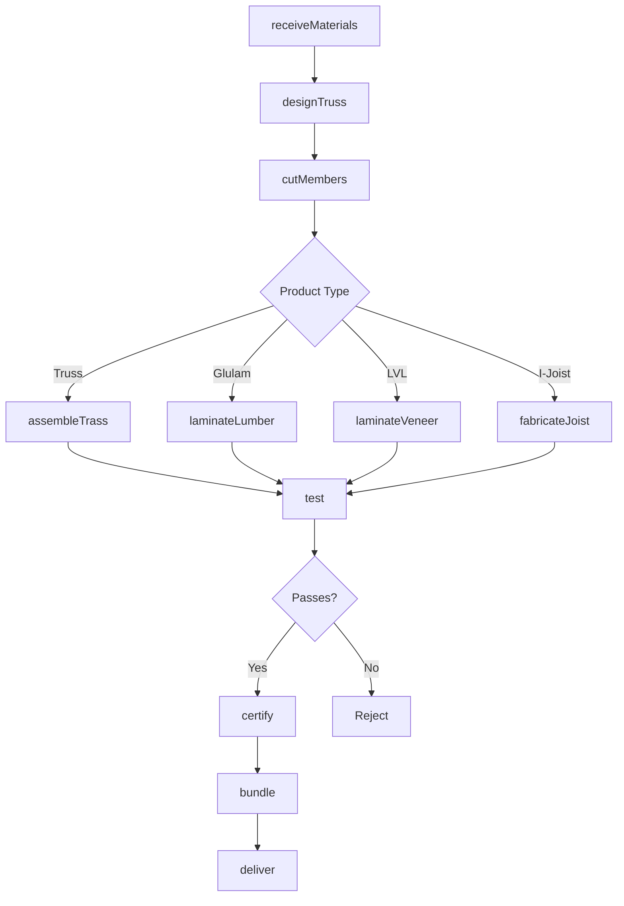
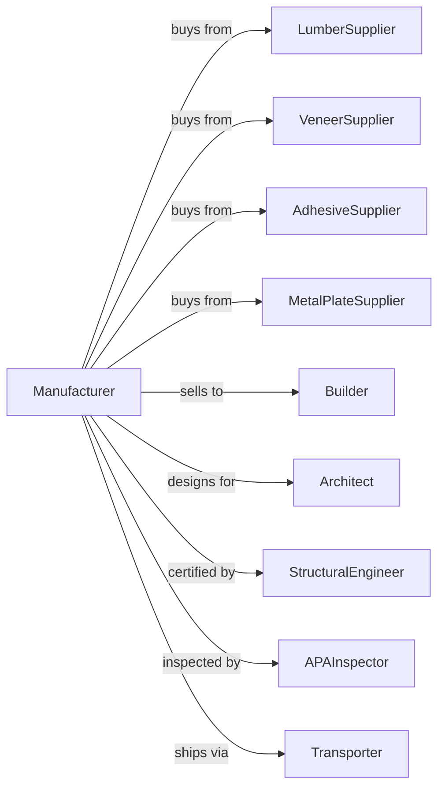

# Engineered Wood Member Manufacturing

> Business-as-Code definition for engineered wood member manufacturing operations. Models the complete production process from lumber and veneer procurement through lamination, truss fabrication, and structural certification.

## Overview

This U.S. industry comprises establishments primarily engaged in manufacturing fabricated or laminated wood arches, wood roof and floor trusses, and/or other fabricated or laminated wood structural members. Illustrative Examples: Finger joint lumber manufacturing I-joists, wood, fabricating Laminated veneer lumber (LVL) manufacturing Parallel strand lumber manufacturing Timbers, structural, glue laminated or pre-engineered wood, manufacturing Trusses, wood roof or floor, manufacturing Cross-Refe

## Actors

| Actor | Description |
|-------|-------------|
| LumberSupplier | Provides dimension lumber for truss and glulam |
| VeneerSupplier | Provides veneer for LVL and PSL production |
| AdhesiveSupplier | Provides structural adhesives and resins |
| MetalPlateSupplier | Provides connector plates for truss assembly |
| Builder | Purchases trusses and beams for construction |
| Architect | Specifies engineered members for designs |
| StructuralEngineer | Designs and certifies load-bearing members |
| APAInspector | Certifies products to performance standards |
| Transporter | Handles delivery of large structural members |

## Roles

| Role | Description |
|------|-------------|
| PlantOwner | Owns facility and directs business strategy |
| PlantManager | Oversees daily operations and scheduling |
| TrussDesigner | Creates truss designs using engineering software |
| AssemblyWorker | Assembles trusses with plates and lumber |
| PressOperator | Operates presses for laminated beam production |
| QualityInspector | Verifies structural integrity and specifications |
| DeliveryCoordinator | Schedules shipments and jobsite delivery |

## Entities

| Entity | Description |
|--------|-------------|
| Lumber | Dimension lumber input for trusses and glulam |
| Veneer | Wood sheets for LVL production |
| Truss | Prefabricated roof or floor structural frame |
| Glulam | Glue-laminated timber beam |
| LVL | Laminated veneer lumber beam |
| IJoist | Engineered floor joist with OSB web |
| ConnectorPlate | Metal plate joining truss members |
| Design | Engineering drawing with load specifications |
| SpanTable | Reference for allowable spans and loads |
| Camber | Intentional upward curve in beams |

## Actions

| Action | Description |
|--------|-------------|
| receiveMaterials | Accept lumber, veneer, and supplies |
| designTruss | Create truss layout from building plans |
| cutMembers | Cut lumber to required lengths and angles |
| assembleTrass | Join members with connector plates |
| laminateLumber | Glue and press lumber layers for glulam |
| laminateVeneer | Glue and press veneer for LVL |
| fabricateJoist | Assemble I-joist from flanges and web |
| cure | Allow adhesive to reach full strength |
| test | Verify structural capacity and quality |
| certify | Apply grade stamp and certification |
| bundle | Package products for transport |
| deliver | Transport to jobsite with crane unload |
| install | Support placement and connection on site |

## Events

| Event | Description |
|-------|-------------|
| materialsReceived | Lumber and supplies accepted |
| trussDesigned | Engineering design completed |
| membersCut | Lumber cut to specification |
| trussAssembled | Truss fabrication completed |
| beamLaminated | Glulam or LVL pressing completed |
| joistFabricated | I-joist assembly completed |
| productCured | Adhesive reached full strength |
| productTested | Quality testing completed |
| productCertified | Grade stamp applied |
| orderBundled | Products packaged for shipment |
| orderDelivered | Products delivered to jobsite |

## Searches

| Search | Description |
|--------|-------------|
| findMaterials | List available lumber and veneer inventory |
| getDesigns | Retrieve truss designs by project |
| getOrders | List pending orders by delivery date |
| getCapacity | Check production capacity and scheduling |
| findProjects | List active construction projects |
| getSpanData | Retrieve allowable spans for member types |
| getCertifications | Get product certification records |

## Workflow



## Actor Relationships



## Usage

### Calling Actions

```typescript
import { manufactureEngineeredWood } from '@headlessly/manufacture-engineered-wood'

const plant = manufactureEngineeredWood()

// Design roof truss from plans
const design = await plant.designTruss({
  projectId: 'proj-2024-001',
  span: 32,
  pitch: '4/12',
  spacing: 24,
  loadRequirements: {
    dead: 10,
    live: 20,
    snow: 30
  }
})

// Cut members for assembly
const members = await plant.cutMembers({
  designId: design.id,
  lumberGrade: 'MSR-2100f',
  quantity: 24
})

// Assemble trusses
await plant.assembleTrass({
  designId: design.id,
  memberIds: members.ids,
  plateType: 'galvanized-20ga'
})
```

### Event-Driven Automation

```typescript
// Auto-test after assembly
plant.trussAssembled(async ({ trussId, designId }) => {
  const design = await plant.getDesigns({ designId })

  await plant.test({
    trussId,
    testType: 'proof-load',
    loadFactor: 1.5,
    designLoad: design.totalLoad
  })
})

// Auto-deliver when certified
plant.productCertified(async ({ productId, projectId, productType }) => {
  const project = await plant.findProjects({ projectId })

  if (project.readyForDelivery) {
    await plant.bundle({
      productIds: [productId],
      projectId,
      deliverySequence: project.installSequence
    })

    await plant.deliver({
      projectId,
      address: project.siteAddress,
      craneRequired: productType === 'glulam'
    })
  }
})
```
