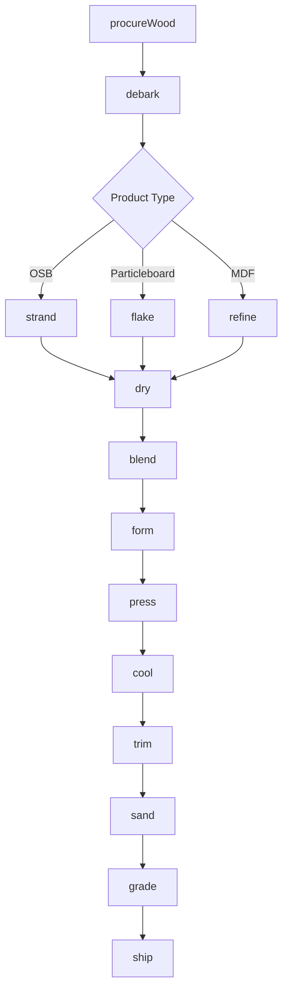
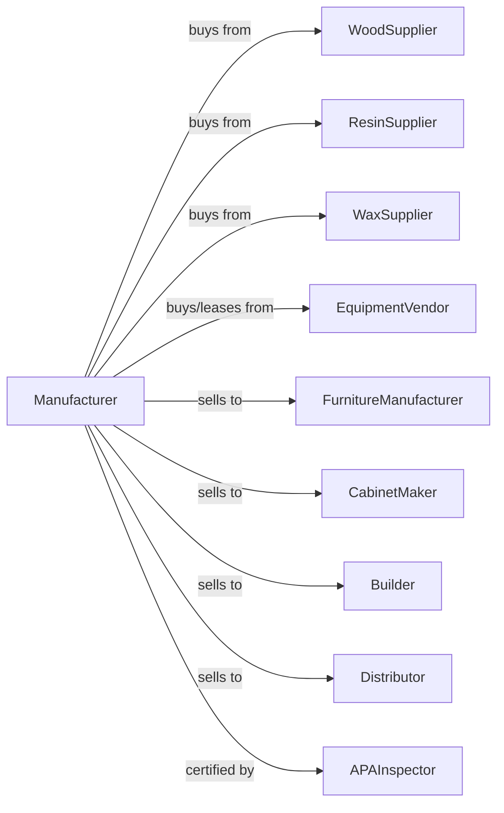

# Reconstituted Wood Product Manufacturing

> Business-as-Code definition for reconstituted wood product manufacturing operations. Models the complete production process from wood fiber procurement through particle formation, mat forming, pressing, and panel finishing.

## Overview

This U.S. industry comprises establishments primarily engaged in manufacturing reconstituted wood sheets and boards. Illustrative Examples: Medium density fiberboard (MDF) manufacturing Oriented strandboard (OSB) manufacturing Particleboard manufacturing Reconstituted wood sheets and boards manufacturing Waferboard manufacturing Cross-References. Establishments primarily engaged in--

## Actors

| Actor | Description |
|-------|-------------|
| WoodSupplier | Provides logs, chips, and residuals for fiber |
| ResinSupplier | Provides urea-formaldehyde and MDI adhesives |
| WaxSupplier | Provides water-resistant wax emulsions |
| EquipmentVendor | Sells and services formers, presses, and refiners |
| FurnitureManufacturer | Purchases MDF and particleboard for furniture |
| CabinetMaker | Buys panels for cabinet and millwork |
| Builder | Purchases OSB for structural sheathing |
| Distributor | Wholesales panel products |
| APAInspector | Certifies structural performance of OSB |

## Roles

| Role | Description |
|------|-------------|
| PlantOwner | Owns facility and directs capital investment |
| PlantManager | Manages daily production operations |
| FiberOperator | Operates stranders, flakers, and refiners |
| FormerOperator | Controls mat forming and distribution |
| PressOperator | Manages continuous or multi-opening press |
| QualityTech | Tests density, strength, and thickness |
| MaintenanceTech | Maintains equipment and knife systems |

## Entities

| Entity | Description |
|--------|-------------|
| Log | Raw wood input for fiber production |
| Chip | Wood chips from sawmill residuals |
| Strand | Oriented wood strand for OSB |
| Fiber | Refined wood fiber for MDF |
| Particle | Wood particle for particleboard |
| Resin | Adhesive binder for panel formation |
| Mat | Formed layer of fiber and resin before pressing |
| Panel | Finished reconstituted wood product |
| Density | Mass per volume affecting strength and use |
| Thickness | Panel dimension from 1/4 to 1-1/8 inch |

## Actions

| Action | Description |
|--------|-------------|
| procureWood | Purchase logs, chips, or residuals |
| debark | Remove bark from logs |
| strand | Cut logs into oriented strands for OSB |
| flake | Cut wood into particles for particleboard |
| refine | Process chips into fiber for MDF |
| dry | Reduce fiber moisture for resin adhesion |
| blend | Mix fiber with resin, wax, and additives |
| form | Distribute blended material into mat |
| press | Compress mat under heat and pressure |
| cool | Reduce panel temperature after pressing |
| trim | Cut panels to standard dimensions |
| sand | Surface panels to specified thickness |
| grade | Classify panels by density and quality |
| ship | Deliver products to customers |

## Events

| Event | Description |
|-------|-------------|
| woodProcured | Raw material received and inventoried |
| logsDebarked | Bark removed for processing |
| fiberProduced | Strands, particles, or fiber created |
| fiberDried | Moisture reduced to target level |
| fiberBlended | Resin and additives mixed |
| matFormed | Material distributed into continuous mat |
| panelPressed | Compression and curing completed |
| panelCooled | Temperature stabilized |
| panelTrimmed | Cut to final dimensions |
| panelSanded | Surface calibrated to thickness |
| panelGraded | Quality classification assigned |
| orderShipped | Products delivered to customer |

## Searches

| Search | Description |
|--------|-------------|
| findWood | List available raw material sources |
| getFiberInventory | Retrieve fiber stock by type |
| getPanelInventory | Retrieve panel inventory by product type |
| getOrders | List pending orders by specification |
| getProductionRate | Monitor line speed and tonnage |
| getDensityProfile | Analyze density distribution across panels |
| getEmissionsData | Track formaldehyde and VOC levels |

## Workflow



## Actor Relationships



## Usage

### Calling Actions

```typescript
import { manufactureReconstitutedWood } from '@headlessly/manufacture-reconstituted-wood'

const plant = manufactureReconstitutedWood()

// Procure raw material
const wood = await plant.procureWood({
  type: 'aspen-logs',
  quantity: 500,
  moistureContent: 45,
  deliveryDate: '2024-03-15'
})

// Process into strands for OSB
const fiber = await plant.strand({
  logIds: wood.ids,
  strandLength: 4.5,
  strandWidth: 0.75,
  thickness: 0.025
})

// Form continuous mat
await plant.form({
  fiberId: fiber.id,
  resinContent: 3.5,
  waxContent: 1.0,
  targetWeight: 45,
  orientation: 'cross-directional'
})
```

### Event-Driven Automation

```typescript
// Auto-press when mat formed
plant.matFormed(async ({ matId, targetDensity, productType }) => {
  const pressProfile = getProfile(productType, targetDensity)

  await plant.press({
    matId,
    temperature: pressProfile.temperature,
    pressure: pressProfile.pressure,
    time: pressProfile.cycleTime
  })
})

// Auto-grade after sanding
plant.panelSanded(async ({ panelId, thickness, productType }) => {
  const testResults = await plant.testPanel({
    panelId,
    tests: ['density', 'IB', 'MOR', 'thickness']
  })

  await plant.grade({
    panelId,
    results: testResults,
    standard: productType === 'OSB' ? 'PS2' : 'ANSI-A208'
  })
})
```
