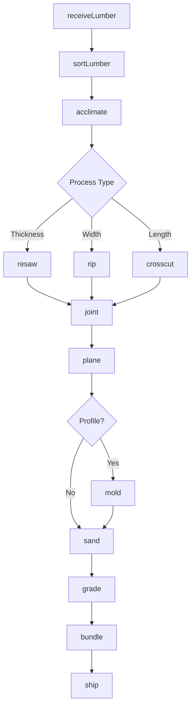
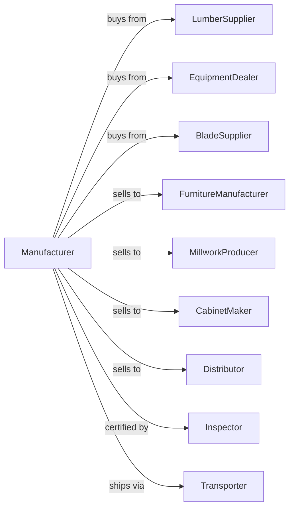

# Cut Stock, Resawing Lumber, and Planing

> Business-as-Code definition for cut stock, resawing, and planing operations. Models the complete secondary lumber processing lifecycle from rough lumber procurement through dimension cutting, resawing, planing, and distribution.

## Overview

This U.S. industry comprises establishments primarily engaged in one or more of the following: (1) manufacturing dimension lumber from purchased lumber; (2) manufacturing dimension stock (i.e., shapes) or cut stock; (3) resawing the output of sawmills; and (4) planing purchased lumber. These establishments generally use woodworking machinery, such as jointers, planers, lathes, and routers to shape wood. Cross-References. Establishments primarily engaged in--

## Actors

| Actor | Description |
|-------|-------------|
| LumberSupplier | Provides rough-sawn lumber for secondary processing |
| EquipmentDealer | Sells and services planers, molders, and resaws |
| BladeSupplier | Provides cutting tools, knives, and abrasives |
| FurnitureManufacturer | Purchases dimension stock for furniture production |
| MillworkProducer | Buys planed lumber for window and door manufacturing |
| CabinetMaker | Purchases cut stock for cabinet components |
| Distributor | Wholesales processed lumber products |
| Inspector | Grades processed lumber to quality standards |
| Transporter | Handles shipping of processed products |

## Roles

| Role | Description |
|------|-------------|
| PlantOwner | Owns facility and directs business strategy |
| ProductionManager | Oversees daily processing operations |
| ResawOperator | Operates resaw equipment for thickness reduction |
| PlanerOperator | Runs planing and surfacing equipment |
| RouterOperator | Creates profiles and shapes on CNC or manual routers |
| GradeSelector | Sorts and grades processed lumber |
| MaintenanceTech | Maintains equipment and sharpens cutting tools |

## Entities

| Entity | Description |
|--------|-------------|
| RoughLumber | Unfinished lumber input from sawmills |
| DimensionStock | Cut lumber with specific size and shape |
| CutStock | Pre-cut components for manufacturing |
| PlanedLumber | Surfaced lumber with smooth finish |
| Profile | Shaped lumber with specific cross-section |
| Knife | Cutting tool for planer and molder |
| Grade | Quality classification for processed lumber |
| Moisture | Water content affecting processing and use |
| Thickness | Lumber dimension after processing |
| Defect | Quality issue affecting grade or use |

## Actions

| Action | Description |
|--------|-------------|
| receiveLumber | Accept rough lumber shipments |
| sortLumber | Organize by species, grade, and dimension |
| acclimate | Allow lumber to reach target moisture content |
| resaw | Cut lumber to thinner dimensions |
| rip | Cut lumber to narrower widths |
| crosscut | Cut lumber to specific lengths |
| joint | Create flat reference surface on edge |
| plane | Surface lumber to uniform thickness |
| mold | Create decorative or functional profiles |
| sand | Smooth surfaces to specified finish |
| grade | Classify by quality and defect criteria |
| bundle | Package processed products for shipping |
| ship | Deliver products to customers |

## Events

| Event | Description |
|-------|-------------|
| lumberReceived | Rough lumber accepted and inventoried |
| lumberSorted | Material organized for processing |
| lumberAcclimated | Target moisture content achieved |
| lumberResawn | Thickness reduction completed |
| lumberRipped | Width reduction completed |
| lumberCrosscut | Length cutting completed |
| lumberJointed | Reference edge created |
| lumberPlaned | Surface finishing completed |
| profileMolded | Decorative shape created |
| productGraded | Quality classification assigned |
| orderBundled | Products packaged for shipment |
| orderShipped | Products delivered to customer |

## Searches

| Search | Description |
|--------|-------------|
| findLumber | List available rough lumber inventory |
| getInventory | Retrieve processed stock by dimension |
| checkMoisture | Get moisture readings for lumber lots |
| findOrders | List pending customer orders |
| getYield | Calculate recovery from rough to finished |
| getCapacity | Check equipment availability and scheduling |
| getKnifeStatus | Monitor cutting tool condition |

## Workflow



## Actor Relationships



## Usage

### Calling Actions

```typescript
import { manufactureCutStock } from '@headlessly/manufacture-cut-stock'

const plant = manufactureCutStock()

// Receive rough lumber
const lumber = await plant.receiveLumber({
  supplierId: 'sawmill-pacific',
  species: 'red-oak',
  thickness: '8/4',
  grade: 'FAS',
  quantity: 5000
})

// Resaw to thinner dimension
const resawn = await plant.resaw({
  lumberIds: lumber.ids,
  targetThickness: 0.75,
  bladeKerf: 0.125
})

// Plane to final dimension
await plant.plane({
  lumberIds: resawn.ids,
  targetThickness: 0.625,
  finish: 'S4S',
  tolerance: 0.005
})
```

### Event-Driven Automation

```typescript
// Auto-plane after acclimation
plant.lumberAcclimated(async ({ lumberIds, moistureContent }) => {
  if (moistureContent >= 6 && moistureContent <= 8) {
    await plant.joint({
      lumberIds,
      referenceEdge: 'best-face'
    })

    await plant.plane({
      lumberIds,
      targetThickness: 'order-spec',
      finish: 'S2S'
    })
  }
})

// Auto-ship when graded
plant.productGraded(async ({ productId, grade, dimension }) => {
  const orders = await plant.findOrders({
    species: 'red-oak',
    grade,
    dimension,
    status: 'pending'
  })

  if (orders.length > 0) {
    await plant.bundle({
      productIds: [productId],
      orderId: orders[0].id,
      unitSize: 500
    })
  }
})
```
